# (PART\*) Alternate Tutorials {-}

# Week 2 Practical Alternate: Using AGOL for Population Mapping {-}

For this week’s Practical Alternate, we’ll be using ArcGIS Online.The instructions below outline how to complete the same processing as the Q-GIS practical conducts. It is also includes the all extra information included in the Q-GIS tutorial about **Attribute Joins** and **Classification Schemes**.

**One thing I would recommend is to watch the two videos within the practical: a short introduction to Q-GIS and an introduction to Attribute Tables and Properties. These are not included within this practical.**

### A short introduction to ArcGIS Online {-}

*Feel free to skip this part and head straight to the [Sign Up to ArcGIS Online] section.*

#### What is ArcGIS Online? {-}

ArcGIS Online (AGO) is Esri’s “Software-as-a-service” GIS offering, that enables you to conduct some basic (as well as some quite advanced!) spatial analysis, as well as create interactive maps for sharing with others.

It has some very similar features to Esri’s GIS Desktop software (ArcMap and ArcPro) discussed in last week’s lecture, but it does not have all of their capabilities, for example, it is not a tool I would use to create paper maps/ones for use in publication. In contrast, it does offer a lot of web interactivity, as we’ll see when we share our maps with one another at the end of the practical. It also has some really useful analysis tools that are quick and easy to use, in compared to their counterparts in the Desktop software, such as creating something called “drive-time” or “network” buffers – we’ll have a look at these next week when looking at spatial properties.

##### The Esri Ecosystem {-}

AGO is just one of the may additional tools Esri offers. Their entire ecosystem of products is huge - you can see their list of products [here]( https://www.esri.com/en-us/arcgis/products/index). 

Whilst many of the products and/or extensions are created for specific industries and purposes, there are other web-based tools that I can recommend you looking into during your time on this course, to at least be aware of the capabilities moving forward. 

The first would be ArcGIS StoryMaps, where you can create a webpage a bit like the ones you are using for these workshops, but also integrate any maps you make within the page as well! 

In addition to StoryMaps, Esri has its own survey collector application – ArcGIS Survey123. Within this application, you can create online forms to collect spatial and non-spatial data – which can then be directly used as inputs within AGO or StoryMap applications. 

You might see why I call this an “ecosystem” – Esri have constructed their software, tools and applications to work well together and sync across their respective platforms (e.g. web, desktop and mobile)! You just need to be able to afford the license to use them in the first place – we have an educational license which enables ArcMap usage, whilst Esri (as you’ll see) offers AGO for free for non-commercial purposes.

**Using ArcGIS Online – limitations to be aware of!**

AGO is a very useful solution to conducting GIS and spatial analysis within the Esri ecosystem when you, as an analyst, are in a scenario where computing resources may be restrictive (and therefore downloading Q-GIS, or Esri's ArcMap or ArcPro is not a good idea) but internet access is ok – or if, for example, you own a Mac and do not want to split your hard drive to install a Windows operating system, or, finally, when Virtual Machine alternatives may not meet your needs.

One thing to flag before we get started with AGO though, is that the platform does simplify some aspects of the traditional GIS workflow – for example, defining your Coordinate Reference Systems and Projection Systems (CRS/PS). This will be an issue in next week's practical - but I will address this in more detail then. 

Another aspect of using AGO instead of Desktop software is that your data is ultimately hosted on the AGO server, rather than on your hard drive. One critical aspect of GIS is to practice good file management, including establishing a good use of folders and data storage protocols, so you know where to access your data and where your outputs from any analysis are stored. Normally in Desktop GIS, or even in R-Studio, you would establish a project folder, and within this folder create folders for your data, scripts and outputs (e.g. maps, figures). With ArcGIS specifically, you can use geodatabases to store any spatial data you use or create, whilst R-Studio can create a project in which your work will be saved. QGIS in comparison will rely primarily on your use of folders. For AGO, your data and layers will be managed in their server, under your content page - so in a way you still need to organise your files somewhat.

### Sign Up to ArcGIS Online {-}

With all of this in mind, let’s get ourselves set up to continue with the practical! 

First head to: https://learn.arcgis.com/en/become-a-member/ and fill in your details as below:
 
```{r echo=FALSE,  fig.align='center', cache=TRUE}
knitr::include_graphics('images/w2/ago/signup.png')
```
<br>
By signing up here, you will become part of the Learn ArcGIS organisation, which Esri has created to help support teaching of GIS online for non-commercial purposes, i.e. what we’re doing here!

Once you’ve clicked on **Join**, you’ll need to go authorise your account from your UCL email. The sign-up box may not disappear (it did not for me), but check your emails first before clicking on Join again!

Once you’ve authorised your account, you’ll be taken to the ArcGIS online home screen – feel free to navigate around the website yourself before starting the practical.

### Practical Instructions {-}

1. Open your ArcGIS Online (AGO) home webpage and click on the **Map** tab. 
    + This is the main interface we will use to import and analyse our data and is a *light* version of a traditional Desktop GUI-GIS.
    + Save your map as **Population Change in London**. 
    + You can add as many tags as you like – I used: population | London | analysis.

Let's go ahead and start adding data to our map.

2. Click on the **Add** button and select **Add Layer from File**:

```{r echo=FALSE, out.width = "250pt", fig.align='center', cache=TRUE}
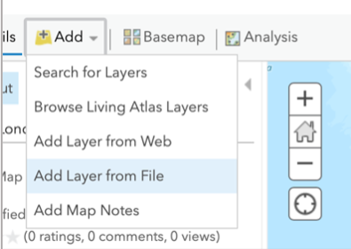
```
<br>
3. You should then see the following pop-up:

```{r echo=FALSE, out.width = "550pt", fig.align='center', cache=TRUE}
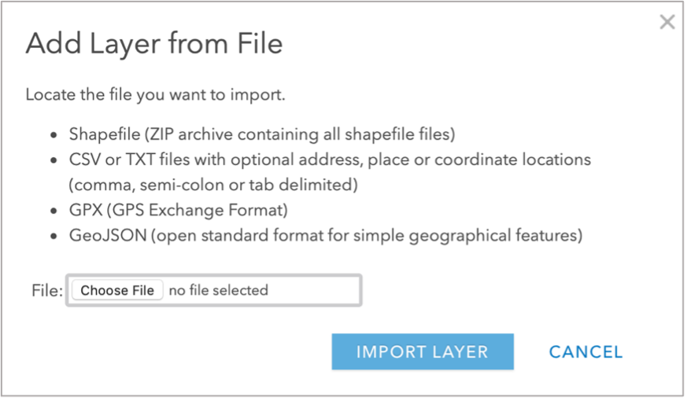
```
<br>
As you can see from the instructions, AGO requires the shapefile to be provided in the zipfile format, rather than the individual files. As a result, what we need to do is navigate to our `raw` data folder and **compress** our `ward `London_ward` shapefile to create a zipped version.

4. For now, close down the pop-up.

5. Navigate to your `boundaries` folder in your file management system and then to `2011` folder. Select **all** files related to the `London_ward` shapefile and right-click and select **compress** or **archive** (depending on your Operating System):

```{r echo=FALSE, out.width = "550pt", fig.align='center', cache=TRUE}
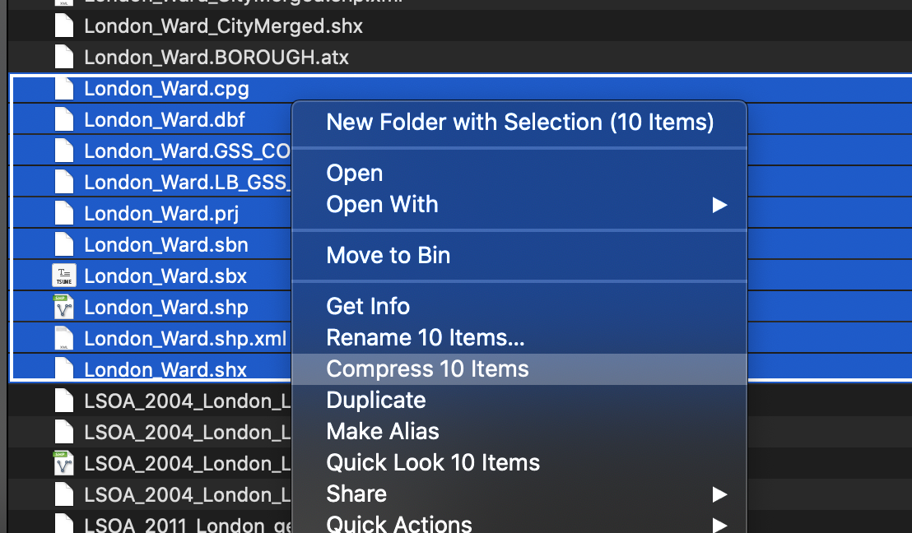
```
<br>
6. Back in AGO, click back on the **Add** button and select **Add Layer from File**. Navigate to your `London_ward` zipfile and select this as your file to import. 
    + Click the option to **‘Keep original features’** and then import the layer. 
    
You should see the data appear on your map as such:

```{r echo=FALSE, out.width = "750pt", fig.align='center', cache=TRUE}
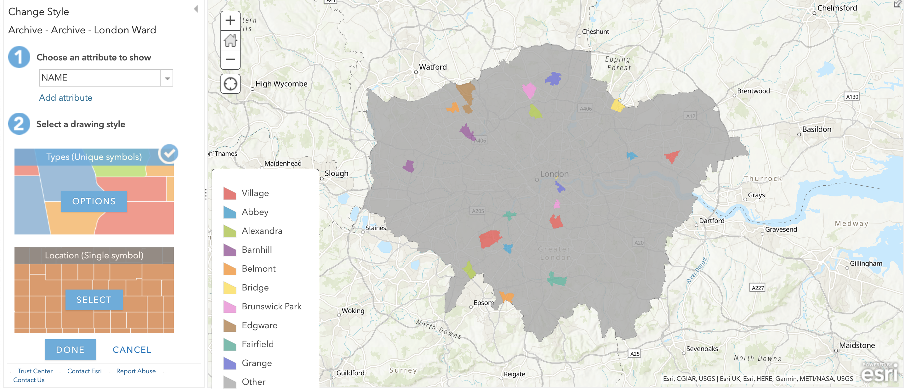
```
<br>
The data is current styled according to the different names in our **Name** field. Before we go ahead and import our population data, let's first change the symbolisation of our dataset to only a **Single Symbol**.

7. In the **Change Style** option appearing on the left of the screen, select the option to show the **Location** (Single symbol).
    + All of your wards should now be displayed in a single colour – but we would prefer to see them as simple grey polygons with a black outline. 
    + Click on the **Options** button hovering over the **Single Location** box that should have appeared.
    + Click on the blue **Symbols** button –  for FILL, select a light grey colour, for OUTLINE, choose a colour of your choice and make sure to reduce the transparency of your lines.
    + Once you are happy with your symbolisation, click through (i.e. click the OKs and DONEs) until you are presented with the main screen.

You should now see your Ward data in the main map canvas of AGO - you should also see what looks like a table of contents on the left-hand side which now contains the layers for the `London_Ward` data and the base map.

```{r echo=FALSE, out.width = "750pt", fig.align='center', cache=TRUE}
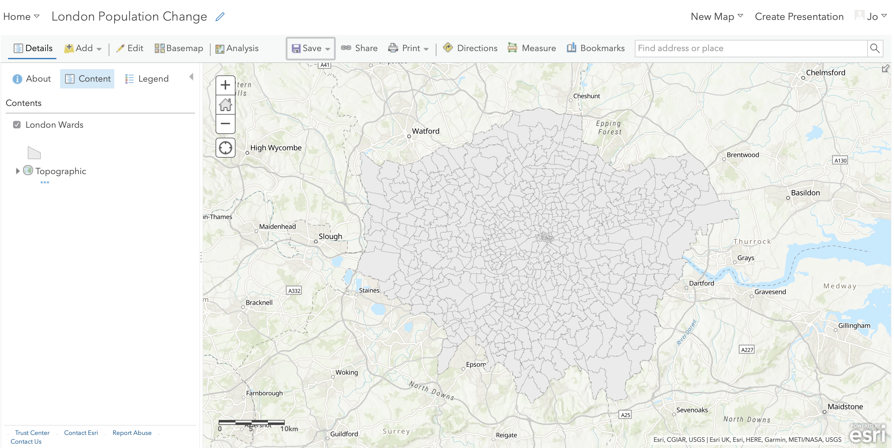
```
<br>
If you hover over the layer, you'll see the various options we have through AGO to interact with our dataset. 

```{r echo=FALSE, out.width = "250pt", fig.align='center', cache=TRUE}
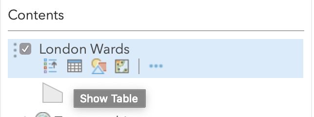
```
<br>
These options include:

* Displaying the legend (i.e. how the data is symbolised)
* Show table (i.e. displaying the Attribute Table)
* Change style (i.e. return to the Symbology options you were just using)
* Perform analysis (i.e. what we'll use to perform different types of analysis on our layers, including our attribute join)
* More options (i.e. other tools you might want to use, such as zooming to a layer or saving your content)

We'll utilise a few of these options over the practical.

:::fyi
**Turning layers on/off & drawing orders**<br><br>
The main strength of a GUI GIS system is that is really helps us understand how we can visualise spatial data. Even with just these two shapefiles loaded, we can understand two key concepts of using spatial data within GIS.

The first, and this is only really relevant to GUI GIS systems, is that each layer can either be turned on or off, to make it visible or not (try clicking the tick box to the left of each layer). This is probably a feature you’re used to working with if you’ve played with interactive web mapping applications before!

The second concept is the order in which your layers are drawn – and this is relevant for both GUI GIS and when using plotting libraries such as ggplot2 in R-Studio. Your layers will be drawn depending on the order in which your layers are either tabled (as in a GUI GIS) or ‘called’ in your function in code.

Being aware of this need for “order” is important when we shift to using R-Studio and ggoplot2 to plot our maps, as if you do not layer your data correctly in your code, your map will end up not looking as you hoped!

For us using AGO right now, the layers will be drawn from bottom to top. At the moment, we only have one layer loaded, so we do not need to worry about our order right now - but as we add in our 2015 and 2018 ward files, it is useful to know about this order as we'll need to display them individually to export them at the end.
:::

**Joining our population data to our ward shapefile**

We're now going to join our **2011 population data** to our **2011 ward shapefile** to create our **Ward Population dataset.**

To do this, we need to add the **2011 population data** to our map.

1. In AGO, import the 2011 population `csv` from your `working` folder by using the **Add data** button as before. 
    + Note for csvs, the population data can be imported as the original file and there is no need to zip it. 
    + For the csvs, add the layer just **as a table**.

```{r echo=FALSE, out.width = "350pt", fig.align='center', cache=TRUE}
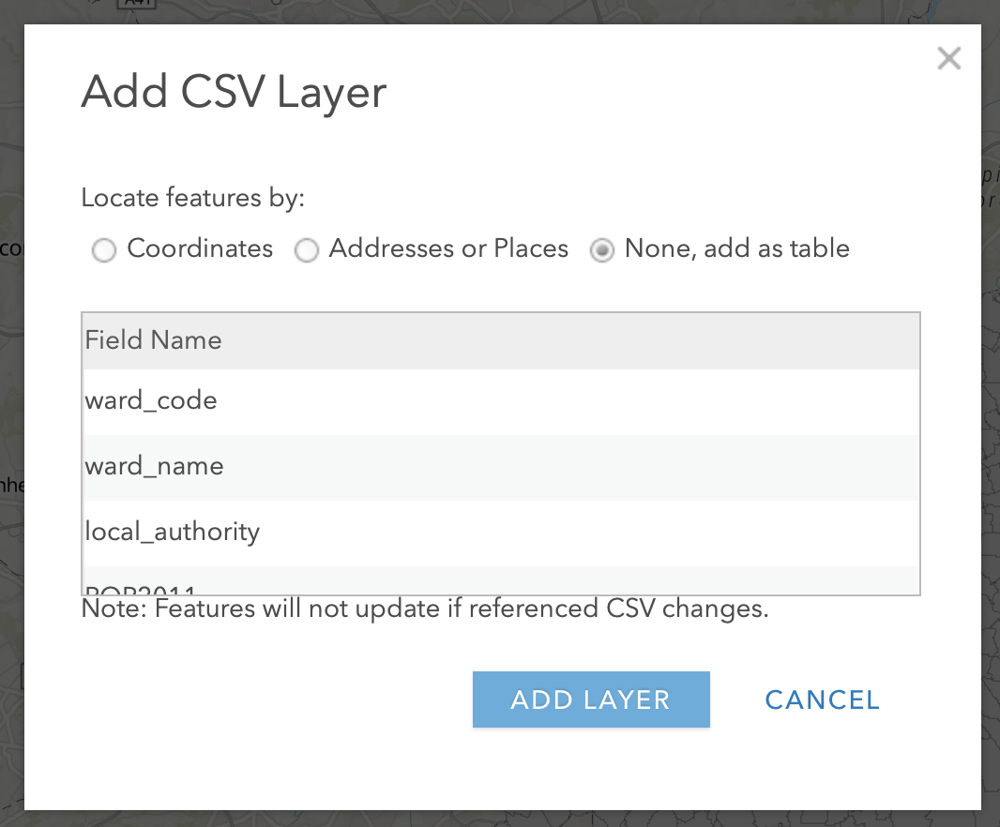
```
<br>
Now we have it loaded on our map, we can now join this table data to our spatial data using an **Attribute Join**.
    
:::codetime
**What is an Attribute Join?**<br>

An attribute join is one of two types of data joins you will use in spatial analysis (the other is a spatial join, which we’ll look at later on in the module). 

An attribute join essentially allows you to join two datasets together, as long as they share a common attribute to facilitate the ‘matching’ of rows:

```{r echo=FALSE, out.width = "550pt", fig.align='center', cache=TRUE}
knitr::include_graphics('images/w2/attribute_joins.png')
```
<center>*Figure from Esri documentation on Attribute Joins*</center><br>
<br>
Essentially you need a **single identifying ID** field for your records within both datasets: this can be a code, a name or any other string of information.

In spatial analysis, we always **join our table data to our shape data** (I like to think about it as putting the table data into each shape). 

As a result, your target layer is always the shapefile (or spatial data) whereas your join layer is the table data. These are known as the left- and right-side tables when working with code. 

**To make a join work, you need to make sure your ID field is correct across both datasets**, i.e. no typos or spelling mistakes. Computers can only follow instructions, so they won’t know that St. Thomas in one dataset is that same as St Thomas in another, or even Saint Thomas! It will be looking for an exact match! 

As a result, whilst in our datasets we have kept both the name and code for both the boundary data and the population data, **when creating the join, we will always prefer to use the CODE over their names**. 

Unlike names, codes reduce the likelihood of error and mismatch because they do not rely on understanding spelling! 

Common errors, such as adding in spaces or using 0 instead O (and vice versa) can still happen – but it is less likely. 
:::

To make our join work therefore, we need to check that we have a matching **UID** across both our datasets. We therefore need to look at the tables of both datasets and check what attributes we have that could be used for this possible match.

2. Open up the Attribute Tables of each layer and check what fields we have that could be used for the join.
      + Use the **Show Table** option to open the **Attribute Tables** for both the **Ward** and **Population** data layers.
      + We can see that both our respective `*_Code` fields have the same codes so we can use these to create our joins.
      
3. To create an **Attribute Join** in AGO, you need to click on the **Perform Analysis** button when hovering over the `London_Ward` dataset and then open the **Summarise Data** drop-down to find the **Join Features** tool. 

5.	Click on the **Join Features** tool and add the appropriate inputs for each step (again make sure you get your target and join layer and their respective fields correct and also select to **keep all target features**):

```{r 02b-screen_rece, warnings=FALSE, message=FALSE, echo=FALSE, cache=TRUE}
library(vembedr)
embed_msstream('0870d086-1048-4d41-95e5-992dbb9e8b53a') %>% use_align('center')
```
<br>
6.	Click **Run Analysis**! AGO will then return to the original layer screen and create your new layer!

<center>*It might take a little time for AGO to create this join - just be patient. But, if, after ten minutes, your join has still not worked, you may download the complete 2011 ward population dataset [here](https://liveuclac-my.sharepoint.com/:u:/g/personal/ucfailk_ucl_ac_uk/Ea2e2u1W4j9NvA00mG15NdoBWr6QVrM6uNjXhnngHDXmPQ?e=XvyjEe). It is provided as a zipfile, which you'll then need to add/upload to your AGO map.*</center><br>

Once AGO has finished processing, the next thing we would like to do with this dataset is to style it by our newly added **Population** field to show population distribution around London.

8.	Hover over your new layer, and then click the **Symbology** button.

9.	Next in **Choose an attribute to show** choose our **POP2011** (population) field. 

AGO will automatically style your data for you as **Counts and Amounts (Size)**, which is a useful way to view our dataset. This approach is also known as **Proportional Symbols**.

```{r echo=FALSE, out.width = "750pt", fig.align='center', cache=TRUE}
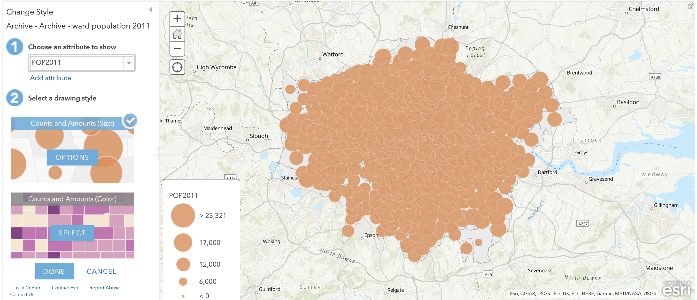
```
<br>
We can see from just this initial styling that there are some differences in population size across our wards. 

You can click on the **Options** button to find more ways of altering how your data is currently styled. 

This also provides you with a histogram of the data (even though it is on its side!) to see how our data is distributed. 

```{r echo=FALSE, out.width = "250pt", fig.align='center', cache=TRUE}
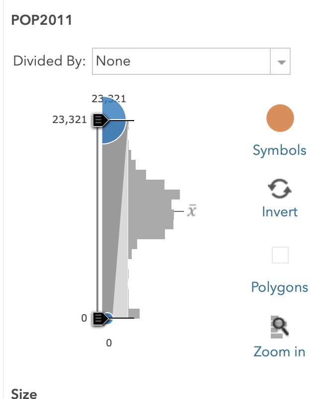
```
<br>
As we can see, our dataset shows a normal Gaussian distribution.

Understanding our data’s distribution is really important when it comes to thinking about how to style and visualise our data as well as understanding what sort of analysis techniques we can apply to our data – more on this next week.

Alternatively to the Size option, you can also create a choropleth map from our dataset.

10.	Navigate back to the **Change Style** menu of the **Symbology** tab (this may involve clicking done to exit the previous menus).

11.	Click on **Counts and Amounts (Color)** – you’ll see the map change automatically to a choropleth map.

12.	We can change the colour scheme of our map, as well as the way in which AGO displays the data either via the **Theme** dropdown or by clicking the **Classify Data** box. 

The latter provides you with more control over the data’s classification scheme and details the different types of classification schemes you can use with your data: 

```{r echo=FALSE, out.width = "250pt", fig.align='center', cache=TRUE}
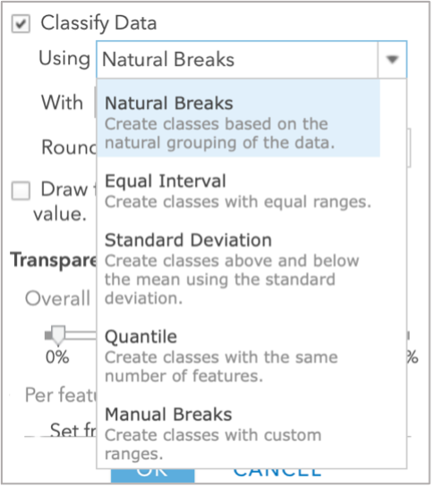
```
<br>
We'll be looking at this in more detail next week, but for now, we'll use the **Natural Breaks** option. 

13. Click on **Natural Breaks** and change it to **7** classes. You may also want to reduce the transparency. Then click **OK** and then **DONE**.

```{r echo=FALSE, out.width = "250pt", fig.align='center', cache=TRUE}
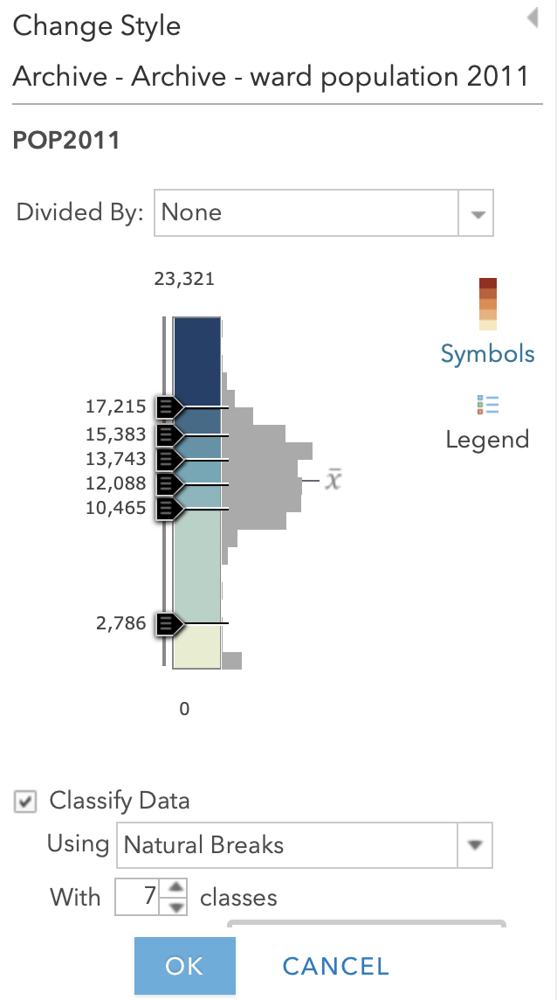
```
<br>
:::note
**A little note on classification schemes**<br><br>
Understanding what classification is appropriate to visualise your data is an important step within spatial analysis and visualisation, and something you will learn more about in the following weeks. Overall, they should be determined by understanding your data's distribution and match your visualisation accordingly.

Feel free to explore using the different options with your dataset at the moment – the results are almost instantaneous using AGO, which makes it a good playground to see how certain parameters or settings can change your output.
:::

You should now be looking at something like this:

```{r echo=FALSE, out.width = "750pt", fig.align='center', cache=TRUE}
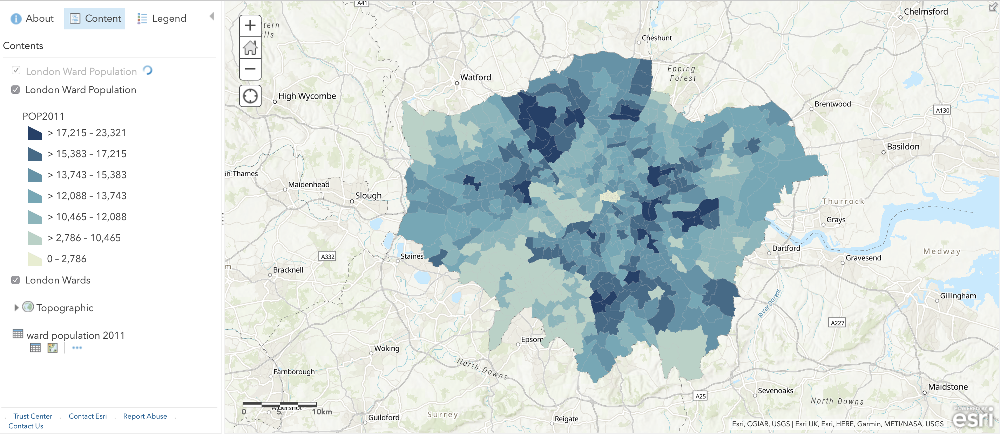
```
<br>
You'll be able to see that we have **some** missing data - and this is for several wards within the City of London. 

This is because census data is **only recorded for 8 out of the 25 wards** and therefore we have **no data** for the remaining wards. As a result, these wards are left blank, i.e. white, to represent a **NODATA** value. 

One thing to flag is that **NODATA** means no data - whereas 0, particularly in a scenario like this, would be an actual numeric value. It's important to remember this when processing and visualising data, to make sure you do not represent a NODATA value incorrectly.

```{r echo=FALSE, out.width = "250pt", fig.align='center', cache=TRUE}
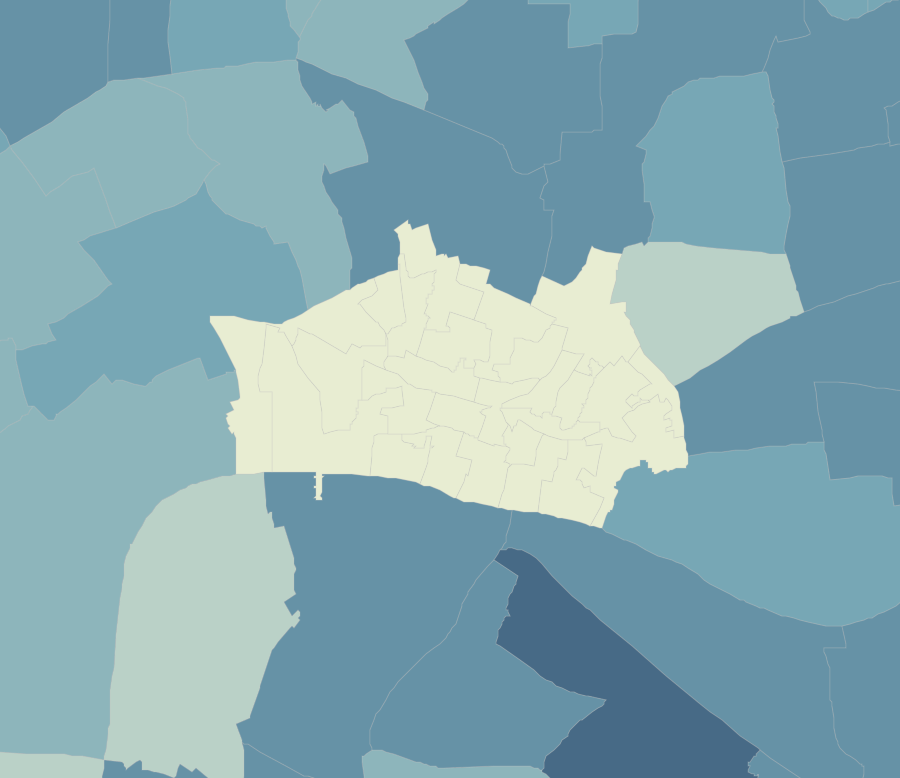
```
<center>*Empty wards in the City of London*</center>
<br>
In our Q-GIS tutorial, we would now go through the steps to exporting the data. When using AGO, we do not need to worry about this at the moment - make sure you save your map, and if you would like you can save your final **Layer** to your AGO content. To do this:

14. Click on the **More Options** button when hovering your item and select **Save Layer**.
    + Name your layer `London_Ward_Population_2011` and add a few tags.
    + Click **create item**. This layer should then appear in your AGO content.
    + When looking at your layer in the AGO Content page (not the Map page we have been using), if you **publish** your layer, you will created a **hosted** layer than you can then download as a **Shapefile** for use within Desktop software etc from the AGO website.
    
```{r echo=FALSE, out.width = "750pt", fig.align='center', cache=TRUE}
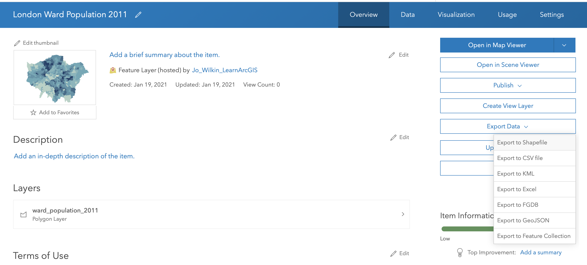
```
<br>

**Next Steps: Joining our 2014/2015 and 2018/2019 data**

You now need to **repeat this whole process** for your 2015 and 2019 datasets. Remember, you need to:

* Zip/compress the respective Ward dataset prior to adding it to AGO

* Add the respective Ward dataset as the zipped file

* Load the respective Population csv

* Join the two datasets together using the Join Features tool.

* Style your data appropriately.

* Save your joined dataset as a layer within your AGO content.

To then make accurate visual comparisions against our three datasets, theorectically we would need to standardise the breaks at which our classification schemes are set at. 

This can be a little fiddly with AGO, so for now, if you want, you can leave your symbolisation to the default settings.

Alternatively, if you would like to standardise your classification breaks, you'll need to return to the **Classify Data** option within the **Symbology** tab and manually change your breaks here.

If you have any issues with AGO and joining your datasets (i.e. the processing takes longer than 10 minutes each), you can download the remaining pre-joined files [here](https://liveuclac-my.sharepoint.com/:u:/g/personal/ucfailk_ucl_ac_uk/EWlUv7LfP5NGjTuTVzOXhJ8BOiwIdu5sfo5K7YdG3_q-fw?e=3l8Igi).

You will need to download, then upload these datasets to style them appropriately for the next step.

#### Exporting our maps for visual analysis {-}

To export each of your maps (as is) to submit to our Powerpoint from AGO:

* Click on **Print --> Map with Legend** and either take a screenshot or use the **File** --> **Export as PDF** and then trim your PDF to the map. 
    + Remember to save your final map outputs in your `maps` folder. 
    + You may want to create a folder for these maps titled `w2`.

Next week, we'll look at how to style our maps using the main map conventions (adding North Arrows, Scale Bars and Legends) but for now a simple picture will do.

To get a picture of each of your different layers, remember to turn on and off each layer (using the check box).

Finally, remember to save your project!

:::assignment
**Assignment 3: Submit your final maps and a brief write-up**<br><br>
Your final assignment for this week's practical is to submit your maps to the second part of the Powerpoint presentation in your seminar's folder.

In addition to your maps, I would like you to write 1-3 bullet points summarising the changing spatial distributions of population (and population growth) in London at the ward level.

You can find the Powerpoint [here](https://liveuclac-my.sharepoint.com/:f:/g/personal/ucfailk_ucl_ac_uk/Eg85j1kdr8JNpCvyZyPLvB4BiPEu2pgb9CZpJx4cyuB0Tg?e=ppFjrC) with an example template.

Please make sure to submit your maps prior to your seminar in Week 4.
:::

And that's it for this week's practical!

Whilst this has been a relatively straight-forward practical to introduce you to a) spatial data and b) ArcGIS Online, it is really important for you to reflect on the many practical, technical and conceptual ideas you’ve come across in this practical. We’ll delve into some of these in more detail in our discussion on Friday, but it would also be great for you to come to the seminar equipped with questions that might have arisen during this practical.

I really want to make sure these concepts are clear to you will be really important as we move forward with using R-Studio and the Command Line Interface for our spatial analysis and as we add in more technical requirements, such as thinking about projection systems, as well as a higher complexity of analysis techniques.

***
#### Extension: Population as a Raster Dataset {-}

<!-- This short extension task will show you how population can be represented as a raster dataset, i.e. in a grid format. We have completed the pre-processing of the datasets for you, which you'll be able to download shortly. -->
<!-- We will look at rasters and raster analysis in Week 8 - but hopefully this has shown to you that the raster data format does have some significant advantages over vector datasets for specific purposes. We however can't really use this dataset for any future data analysis (e.g. normalisation purposes) as the majority of the data we'll use in the coming weeks is provided using Administrative Geographies. -->
This Extension Task will be updated at the end of Week 2.

***

:::sds
**Learning Objectives**<br><br>
You should now hopefully be able to:

* Understand how we represent geographical phenomena and processes digitally within GIScience
* Explain the differences between discrete (object) and continuous (field) spatial data models
* Explain the differences between raster and vector spatial data formats and recognise their respective file types
* Know how to manage and import different vector and table data into a GIS software
* Learn how to use attributes to join table data to vector data
* Know a little more about *Administrative Geographies* within London.
* Symbolise a map in Q-GIS using graduated symbolisation.
:::
