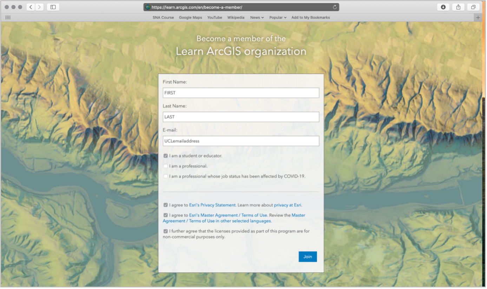

# (PART\*) Alternate Tutorials {-}

# Week 2 Practical Alternate: Using AGOL for Population Mapping {-}

For this week’s Practical Alternate, we’ll be using ArcGIS Online. 

### A short introduction to ArcGIS Online

*Feel free to skip this part and head straight to the [Sign Up for ArcGIS Online] section.

#### What is ArcGIS Online?

ArcGIS Online (AGO) is Esri’s “Software-as-a-service” GIS offering, that enables you to conduct some basic (as well as some quite advanced!) spatial analysis, as well as create interactive maps for sharing with others.

It has some very similar features to Esri’s GIS Desktop software (ArcMap and ArcPro) discussed in last week’s lecture, but it does not have all of their capabilities, for example, it is not a tool I would use to create paper maps/ones for use in publication. In contrast, it does offer a lot of web interactivity, as we’ll see when we share our maps with one another at the end of the practical. It also has some really useful analysis tools that are quick and easy to use, in compared to their counterparts in the Desktop software, such as creating something called “drive-time” or “network” buffers – we’ll have a look at these next week when looking at spatial properties.

#####The Esri Ecosystem

AGO is just one of the may additional tools Esri offers. Their entire ecosystem of products is huge - you can see their list of products [here]( https://www.esri.com/en-us/arcgis/products/index). 

Whilst many of the products and/or extensions are created for specific industries and purposes, there are other web-based tools that I can recommend you looking into during your time on this course, to at least be aware of the capabilities moving forward. 

The first would be ArcGIS StoryMaps, where you can create a webpage a bit like the ones you are using for these workshops, but also integrate any maps you make within the page as well! 

In addition to StoryMaps, Esri has its own survey collector application – ArcGIS Survey123. Within this application, you can create online forms to collect spatial and non-spatial data – which can then be directly used as inputs within AGO or StoryMap applications. 

You might see why I call this an “ecosystem” – Esri have constructed their software, tools and applications to work well together and sync across their respective platforms (e.g. web, desktop and mobile)! You just need to be able to afford the license to use them in the first place – we have an educational license which enables ArcMap usage, whilst Esri (as you’ll see) offers AGO for free for non-commercial purposes.

**Using ArcGIS Online – limitations to be aware of!**

AGO is a very useful solution to conducting GIS and spatial analysis within the Esri ecosystem when you, as an analyst, are in a scenario where computing resources may be (and therefore downloading ArcMap or ArcPro is not a good idea) but internet access is ok – or if, for example, you own a Mac and do not want to split your hard drive to install a Windows operating system, or, finally, when Virtual Machine alternatives may not be up to the needs .

One thing to flag before we get started with AGO though, is that the platform does simplify some aspects of the traditional GIS workflow – for example, defining your Coordinate Reference Systems and Projection System (CRS/PS). This will be an issue in next week's practical - but I will address this in more detail then. 

Another aspect of using AGO instead of Desktop software is that your data is ultimately hosted on the AGO server, rather than on your hard drive. One critical aspect of GIS is to practice good file management, including establishing a good use of folders and data storage protocols, so you know where to access your data and where your outputs from any analysis are stored. Normally in Desktop GIS, or even in R-Studio, you would establish a project folder, and within this folder create folders for your data, scripts and outputs (e.g. maps, figures). With ArcGIS specifically, you can use geodatabases to store any spatial data you use or create, whilst R-Studio can create a project in which your work will be saved. QGIS in comparison will rely primarily on your use of folders. For AGO, your data and layers will be managed in their server, under your content page - so in a way you still need to organise your files somewhat.

### Signing Up to ArcGIS Online

With all of this in mind, let’s get ourselves set up to continue with the practical! 

First head to: https://learn.arcgis.com/en/become-a-member/ and fill in your details as below:
 
```{r echo=FALSE,  fig.align='center', cache=TRUE}

```

By signing up here, you will become part of the Learn ArcGIS organisation, which Esri has created to help support teaching of GIS online for non-commercial purposes, i.e. what we’re doing here!

Once you’ve clicked on Join, you’ll need to go authorise your account from your UCL email. The sign-up box may not disappear (it did not for me), but check your emails first before clicking on Join again!

Once you’ve authorised your account, you’ll be taken to the ArcGIS online home screen – feel free to navigate around the website yourself before starting the practical.


### Practical Instructions

In Progress.


:::assignment
**Assignment 3: Submit your final maps and a brief write-up**<br><br>
Your final assignment for this week's practical is to submit your maps to the second part of the Powerpoint presentation in your seminar's folder.

In addition to your maps, I would like you to write 1-3 bullet points summarising the changing spatial distributions of population (and population growth) in London at the ward level.

You can find the Powerpoint [here](https://liveuclac-my.sharepoint.com/:f:/g/personal/ucfailk_ucl_ac_uk/Eg85j1kdr8JNpCvyZyPLvB4BiPEu2pgb9CZpJx4cyuB0Tg?e=ppFjrC) with an example template.

Please make sure to submit your maps prior to your seminar in Week 4.
:::


And that's it for this week's practical!

Whilst this has been a relatively straight-forward practical to introduce you to a) spatial data and b) ArcGIS Online, it is really important for you to reflect on the many practical, technical and conceptual ideas you’ve come across in this practical. We’ll delve into some of these in more detail in our discussion on Friday, but it would also be great for you to come to the seminar equipped with questions that might have arisen during this practical.

I really want to make sure these concepts are clear to you will be really important as we move forward with using R-Studio and the Command Line Interface for our spatial analysis and as we add in more technical requirements, such as thinking about projection systems, as well as a higher complexity of analysis techniques.

***
#### Extension: Population as a Raster Dataset {-}

<!-- This short extension task will show you how population can be represented as a raster dataset, i.e. in a grid format. We have completed the pre-processing of the datasets for you, which you'll be able to download shortly. -->
<!-- We will look at rasters and raster analysis in Week 8 - but hopefully this has shown to you that the raster data format does have some significant advantages over vector datasets for specific purposes. We however can't really use this dataset for any future data analysis (e.g. normalisation purposes) as the majority of the data we'll use in the coming weeks is provided using Administrative Geographies. -->
This Extension Task will be updated at the end of Week 2.

***

:::sds
**Learning Objectives**<br><br>
You should now hopefully be able to:

* Understand how we represent geographical phenomena and processes digitally within GIScience
* Explain the differences between discrete (object) and continuous (field) spatial data models
* Explain the differences between raster and vector spatial data formats and recognise their respective file types
* Know how to manage and import different vector and table data into a GIS software
* Learn how to use attributes to join table data to vector data
* Know a little more about *Administrative Geographies* within London.
* Symbolise a map in Q-GIS using graduated symbolisation.
:::
