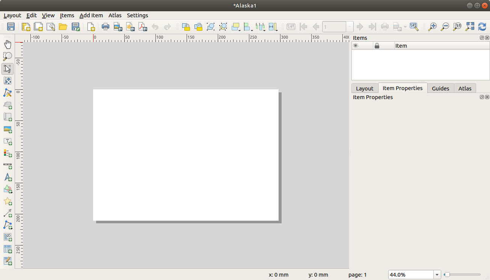

# Cartography and Visualisation I

Welcome to Week 3 in Geocomputation! 

Well done on making it through Week 2 - and welcome to what is a more practical introduction to GIScience where we will be focusing on: **how to make a good map**.

It's not quite as "light" as promised, but this and the previous week will hold you in good stead as you come to learn about more technical analytical techniques after Reading Week.

As always, we have broken the content into smaller chunks to help you take breaks and come back to it as and when you can over the next week.

:::note
*If you do not get through everything this week, do not worry. Week 4* **will** *be shorter in content, therefore you will have time to catch up after the seminars at the start of Week 4. The seminar will go through aspects of this week's work, so it will still be incredibly useful if you do not manage to complete everything we outline in this workshop.*
:::

### Week 3 in Geocomp {-}

```{r 03-welcome, warnings=FALSE, message=FALSE, echo=FALSE, cache=TRUE}
library(vembedr)
embed_msstream('3f3eb33f-b756-40af-82e3-4bff21f998e8') %>% use_align('center')
```
<center>[Video on Stream](https://web.microsoftstream.com/video/3f3eb33f-b756-40af-82e3-4bff21f998e8)</center><br>

This week's content introduces you to foundational concepts associated with **Cartography and Visualisation**, where we have three areas of work to focus on:

1. Map Projections
2. Data Visualisation
3. The Modifiable Areal Unit

This week's content is split into **4** parts:

1. [Coordinate Systems and Map Projections] (40 minutes)
2. [Effective Data Visualisation] (40 minutes)
3. [The Modifiable Areal Unit Problem] (20 minutes)
4. [Practical 2: Mapping Crime Across London Wards and Boroughs] (1 hour)

**Videos** can be found in **Parts 1-3**, alongisde **Key** and **Suggested Reading**. 

This week, your **1 assignment** is creating the final output from our practical.

**Part 4** is our Practical for this week, where you will be introduced to using the Map Composer with **Q-GIS** and apply the knowledge gained in the previous parts from Parts 1-3 in a practical setting. 

If you have been unable to download Q-GIS or cannot access it via Desktop\@UCL Anywhere, we have provided an alternative browser-based practical but we recommend reading through the Q-GIS practical as unfortunately we are unable to repeat everything within the AGOL practical.

:::puzzle
**Learning Objectives**<br><br>
By the end of this week, you should be able to:

* Explain what a Geographic Coordinate System and a Projected Coordinate System is and their differences.
* Understand the limitations of different PCSs and recognise when to use each for specific anlaysis.
* Know what to include - and what not to include - on a map.
* Know how to represent different types of spatial data on a map.
* Explain what the Modifiable Areal Unit Problem is and why poses issues for spatial analysis.
* Map event data using a 'best-practice' approach.
* Produce a map of publishable quality.
:::

We will build on the data analysis we completed last week and create accurate maps that show changes in crime across our London wards.

***

### Coordinate Systems and Map Projections {-}

Maps, as we saw last week, are representations of reality. But not only are they are designed to represent features, processes and pheonomena in their 'form', they also need to represent, with fidelity, their location, shape and spatial arrangement.

To be able to locate, integrate and visualise spatial data accurately within a GIS system or digtal map, spatial data needs to have two things:

**1. A coordinate reference system** *(often written as CRS)*

**2. An associated map projection**

A CRS is a **reference system** that is used to represent the **locations of the relevant spatial data within a common geographic framework**. It enables spatial datasets to use common locations for co-location, integration and visualisation.

Each coordinate system is defined by:

* Its measurement framework
* Unit of measurement (typically either decimal degrees or feet/metres, depending on the framework)
* Other measurement system properties such as a spheroid of reference, a datum, and projection parameters 

Its measurement framework will be one of two types:

* **Geographic**: in which spherical coordinates are measured from the earth's center
* **Planimetric**: in which the earth's coordinates are projected onto a two-dimensional planar surface.

For planimetric CRS, a **map projection** is required. This projection details the mathematical transformation to project the globe's three-dimensional surface onto a flat map.

As a result, there are **two common types** of coordinate systems that you will come across when using spatial data:

**1. Geographic Coordinate Systems (GCS)**: a global or spherical coordinate system such as latitude-longitude.

**2. Projected Coordinate System (PCS)**: a CRS which has the mechanisms to project maps of the earth's spherical surface onto a two-dimensional Cartesian coordinate plane. These PCS are sometimes reference to as **map projections**, although combine both location **and** the projection in their use.

##### Understanding Coordinate Systems {-}
```{r 03-coordinate-systems, warnings=FALSE, message=FALSE, echo=FALSE, cache=TRUE}
library(vembedr)
embed_msstream('2635dc14-5c0f-4ea4-b3ff-527c6e4ae5d3') %>% use_align('center')
```
<center>[Slides](https://liveuclac-my.sharepoint.com/:b:/g/personal/ucfailk_ucl_ac_uk/EcNliVzRaY5FuQLLpNO61QsBbJxVjrLvGUNjOQko8XulJQ?e=gAB6GP) | [Video on Stream](https://web.microsoftstream.com/video/2635dc14-5c0f-4ea4-b3ff-527c6e4ae5d3)</center>
<br>

In summary, a GCS defines where the data is located on the earth’s surface, whereas a a PCS tells the data how to draw on a flat surface, like on a paper map or a computer screen.

As a result, a GCS is spherical, and so records locations in angular units (usually degrees). Conversely, a PCS is flat, so it records locations in linear units (usually meters):

```{r echo=FALSE, out.width = "550pt", fig.align='center', cache=TRUE}
knitr::include_graphics('images/w3/grid2.png')
```
<center>*Visualising the differences between a GCS and a PCS. Image: Esri*</center><br>

For a GCS, graticules are used as the referencing system, which are tied directly to the Earth's ellipsoidal shape. 

In comparison, within a PCS, a grid is a network of perpendicular lines are used, much like graph paper, which are then superimposed on a flat paper map to provide relative referencing from some fixed point as origin.

Your data must have a GCS before it knows where it is on earth. But, whilst theoretically projecting your data is optional, projecting your map is not. Maps are flat, so **your map will have a PCS in order accurately draw the data**.

In most GIS systems, **a default projection will be used to draw the map** and therefore the system will project your data to match this projection.

For example, if you do not specify the projection of the map or data, both ArcGIS and Q-GIS will draw your map and corresponding data using a pseudo Plate Carrée or 'geographic' projection.

:::fyi
**The Plate Carrée Projection**<br><br>
This projection is actually just latitude and longitude represented as a simple grid of squares and called pseudo because it is measured in angular units (degrees) rather than linear units (meters). It is easy to understand and easy to compute, but it also distorts all areas, angles, and distances, so it is senseless to use it for analysis and measurement and as a result, before you start your work, you should choose a different PCS!
:::

**Which CS you will choose will depend on where you are mapping:** most often, you will not need to choose a GCS as the data you are using was already collected and/or stored in a pre-selected system.

*For example, all GPS receivers collect data using only one datum or coordinate system, which is WGS84. Therefore any GPS data you use will be provided in the WGS84 GCS.*

**However, you will often need to choose your PCS**: which PCS you use depends on where you are mapping, but also the nature of your map — for example, should you distort area to preserve angles, or vice versa? 

*For example, if you are using GPS data from the U.K, it is likely that you will transform this data into British National Grid (a PCS).*

#### Understanding Map Projections {-}

Either CS provides a framework for defining real-world locations - however, **when it comes to much of GIScience and spatial analysis work, we will use a PCS to help locate, project, analyse and visualise our data in 2D.**

To locate, project, analyse and visualise our data in 2D, the PCS has, through mathematical transformations known as **map projections**, transformed the surface of our three-dimensional earth into a two-dimensional map canvas (whether paper or digital).
<br><br>
<center>**This ability to create a flat surface from a 3D sphere is however not so simple!**</center><br>

From a classic geographical metaphor, the easiest way to think about this is to think about peeling an orange - how could you peel an orange to ultimately result in a flat (preferably square/rectangular - computers really like squares!) shape?

Well, luckily, you don't need to think too hard about it - as Esri's resident cartographer **John Nelson** (another [Twitter](https://twitter.com/John_M_Nelson?ref_src=twsrc%5Egoogle%7Ctwcamp%5Eserp%7Ctwgr%5Eauthor) recommendation) has done it for us:<br><br>

```{r echo=FALSE, out.width = "750pt", fig.align='center', cache=TRUE}

```
<br><center>*Trying to flatten an orange - our earth - into a flat map. Images: John Nelson, Esri*</center><br>

As he shows, to create just a *flat* version of our earth from the spheriod itself, it takes some very interesting shapes and direction maniuplation - let alone achieving a rectangle! 
<br>(You can see the original blog post these images are taken from [here](https://www.esri.com/arcgis-blog/products/arcgis-pro/education/earth-peel/).)

To create a classic square or rectangular map that we are so used to seeing, we have to use other geometric shapes that can be flattened without stretching their surface to help determine our projection.

These shapes are called **developable** surfaces and consist of three types: 

* **Cylindrical**
* **Conical** 
* **Plane** 

<br>

```{r echo=FALSE, out.width = "650pt", fig.align='center', cache=TRUE}
knitr::include_graphics('images/w3/projection_families.png')
```
<br><center>*The three types of projection families: cyclindrical, conical and plane. Image: QGIS*</center><br>

However when any of using these shapes to representing the earth's surface in two dimensions, there is always some sort of distortion in the shape, area, distance, or direction of the data.

This distortion is explained through Vox's excellent video:

<center>**Why all world maps are wrong**</center>
```{r 03-vox-video, warnings=FALSE, message=FALSE, echo=FALSE, cache=TRUE}
library(vembedr)
embed_youtube('kIID5FDi2JQ') %>% use_align('center')
```

We can actually test out this distortion ourselves.

You can head to **The True Size** (https://thetruesize.com) and see how our use of the **Web Mercator** has skewed our understanding of the **size** of countries in respect to one another.

In addition, I highly recommend looking through this short (2 minutes!) blog post where a keen mapper got creative with his own orange peel:

:::sugreading
**Blog post:** Visualising the distortion of web mercator maps with an orange peel, Chris M. Whong, Online [here](https://medium.com/@chris.m.whong/visualizing-the-distortion-of-webmercator-maps-with-an-orange-peel-cb04460b6415)
:::

Different projections can therefore cause different types of distortions. Some projections are designed to minimize the distortion of one or two of the data's characteristics. A projection could, for example, maintain the area of a feature but alter its shape.

Our second short lecture explains how to think through choosing a map projection:

#### Choosing a Map Projection {-}
```{r 03-map-projections, warnings=FALSE, message=FALSE, echo=FALSE, cache=TRUE}
library(vembedr)
embed_msstream('8f611285-6a6c-4ca5-8c24-ae2c28184174') %>% use_align('center')
```
<center>[Slides](https://liveuclac-my.sharepoint.com/:b:/g/personal/ucfailk_ucl_ac_uk/EYzaTaOU43JBvoFQoYvDot4BSRcMbODbFluD7EeVY8RT9w?e=j61kI7) | [Video on Stream](https://web.microsoftstream.com/video/8f611285-6a6c-4ca5-8c24-ae2c28184174)</center>
<br>

As explained in our lecture, each map projection therefore has advantages and disadvantages. 

Ultimately, the best projection for a map depends on the scale of the map, and on the purposes for which it will be used.

As the excellent Q-GIS Projection [documentation](https://docs.qgis.org/3.16/en/docs/user_manual/working_with_projections/working_with_projections.html) explains:

> For example, a projection may have unacceptable distortions if used to map the entire African continent, but may be an excellent choice for a large-scale (detailed) map of your country. The properties of a map projection may also influence some of the design features of the map. Some projections are good for small areas, some are good for mapping areas with a large East-West extent, and some are better for mapping areas with a large North-South extent.

When it comes to choosing your map projection, think about:

* Is there a default projection for your area of study (e.g. London and British National Grid)?
* What analysis are you completing? What properties are important to this analysis?
* At what scale and direction are you visualising your data?

What is critical to remember though, is that map projections are never absolutely accurate representations of our spherical earth. 

As a result of the map projection process, **every map shows distortions of angular conformity, distance and area**. 

#### Why should we care about projection systems? {-}

In summary, **the projection system you use can have impact on both analytical aspects of your work**, e.g. using measurement tools effectively, such as buffers, alongside visualisation. 

It is usually **impossible to preserve all characteristics at the same time** in a map projection. 

This means that when you want to carry out accurate analytical operations, you will need to use a map projection that provides the best characteristics for your analyses. 

For example, if you need to measure distances on your map, you should try to use a map projection for your data that provides high accuracy for distances.

Furthermore, you need to be aware of the CS that your data is in, particularly when you are using multiple datasets. 

In order to analyse and visualise data accurately together, they must **all be in the same CS**.

:::note
**Transforming/Reprojecting Data**<br><br>

If you are using datasets that are based on different geographic or projected coordinate systems, you will need transform all your data to one singular system: these are known as **transformations**.

Between any two coordinate systems, there may be zero, one, or many transformations. 

Some geographic coordinate systems do not have any publicly known transformations because that information is considered to have strategic importance to a government or company. 

For many GCS, multiple transformations exist. They may differ by areas of use or by accuracies. Accuracies will usually reflect the transformation method. 

A geographic transformation is always defined in a particular direction, like from **NAD 1927 to WGS 1984**. Transformation names will reflect this: **NAD_1927_To_WGS_1984_1**. 

The name may also include a trailing number, as the above example has _1. This number represents the order in which the transformations were defined. 

A larger number does not necessarily mean a more accurate transformation. 

Even though a geographic transformation has a built-in directionality, all transformation methods are inversible. That is, a transformation can be used in either direction.
:::


#### Moving for with CRS in Geocomputation {-}

Keep in mind that map projection is a very complex topic. There are hundreds of different projections available that aim to portray a certain portion of the earth’s surface as accurately as possible on a digital screen/flat paper. 

In reality, the choice of which projection to use will often be made for you. 

When it comes to geocomputation and spatial analysis, you need to choose your CRS carefully - thinking through what is appropriate for your dataset, incuding what analysis you are completing and at what scale. 

You will find there are specific recommendations by country and, fortunately for us, most countries have commonly used projections. This is particularly useful when data is shared and exchanged as people will follow the national trend.

Often, most countries will utilise the relevant zone within the **Universal Transverse Mercator**. 

In addition, a great resource is Esri's documentation on [Choosing a Map Projection](https://desktop.arcgis.com/en/arcmap/10.3/tools/coverage-toolbox/choosing-a-map-projection.html).

:::fyi
**The Tyranny of Web Mercator**<br><br>
One thing to watch out for though is the general (over)reliance on what is known as the Pseudo-Mercator projection (EPSG:3857) by web applications such as Google Maps. 

The projected Pseudo-Mercator coordinate system takes the WGS84 coordinate system and projects it onto a square. (This projection is also called Spherical Mercator or Web Mercator.) 

This method results in a square-shaped map but there is no way to programmatically represent a coordinate system that relies on two different ellipsoids, which means software programs have to improvise. And when software programs improvise, there is no way to know if the coordinates are consistent across programs. 

This makes EPSG:3857 great for visualizing on computers but not reliable for data storage or analysis.
:::
<br>
Luckily for us in Geocomputation, for the majority of our work, we will be using the **British National Grid** for our mapping and analysis as we are focusing on analysis on London.

In this week's practical, we will look at how we can **reproject** our spatial data from one a GCS to a PRS (in this case WGS84 to OSGB1936). 

:::reading
**Key Reading(s)**<br><br>
**Book (30 mins):** Longley et al, 2015, Geographic Information Science & Systems, *Chapter 4: Geo-referencing.*
:::

***

:::sugreading
**Optional: The Power of the Map**<br>

Maps and map projections have had a long and complicated history with our politics and geopolitics. For example, whilst maps have existed in many forms prior to the periods, we cannot ignore their signficant use for land acquisition and resource exploitation during the "Age of Discovery" and resulting colonialism eras.

There is significant **power** embedded within a map and, even to this day, as we see with the use of the Mercator projection in web technology, a map can be a substantial propaganda tool when it comes to political issues. 

Google Maps, for example, has found itself at the centre of various border disputes across the world - resulting, in several occasions, with troop mobilisation and threats of war: 

> By misplacing a portion of the border between Costa Rica and Nicaragua, Google effectively moved control of an island from one country to the other and was cited as the justification for troop movements in the region in 2010.   
*The Washington Post, 2020*

To further avoid this, Google has created a new techno-political approach within its Google Maps platform in that the world’s borders will look different depending on where you’re viewing them from. 

You can read more about this a recent article by The Washington Post: [*Google redraws the borders on maps depending on who’s looking*](https://www.washingtonpost.com/technology/2020/02/14/google-maps-political-borders/) (10 minutes).

Maps therefore are never true representations of reality, but will always include some **bias** - after all, maps are still very much made by humans.

Whilst we won't cover this in any more detail in our lecture or practical content this week, we do hope you enjoy discussing these issues in your Study Group sessions. 

In addition, there are many excellent books on this **power of maps**, including Denis Wood's *The Power of Maps* and follow-up, *Rethinking the Power of Maps* and Mark Monmonier's *How to Lie with Maps*. These books all outline how both paper and modern digital maps offer opportunities for cartographic mischief, deception, and propaganda.

If you'd like to avoid reading for a little longer, I would also highly recommend this excerpt from the "before your time" show, the West Wing, which summarises quite a few of the debates well:

```{r 03-west-wing, warnings=FALSE, message=FALSE, echo=FALSE, cache=TRUE}
library(vembedr)
embed_youtube('vVX-PrBRtTY') %>% use_align('center')
```
:::

***

### Effective Data Visualisation {-}

In addition to choosing the correct map projection for your spatial data and map, to visualise your data correctly as a map - for visual analysis and publishing - you need to consider:

* **How you represent your spatial data effectively.**

* **How you present this data on a map that communicates your data and analysis accurately.**

We will first focus on the latter aspect and look at how you can achieve **effective** data visualisation, including how to make a good map as well as detailing the common **cartographic conventions** we'd expect you to include in your map.

Then we look at common types of spatial data and focus on how we can accurately represent **event** and **survey** data that are commonly aggregated to areal units (such as the Administrative Geographies we came across last week) for use within **choropleth** maps.

#### Cartographic Conventions {-}

Making a **good** map is a highly subjective process - what you think looks good versus what someone else thinks looks good maybe entirely different. 

That's why there is a whole discipline out there on **cartography** - it's also why good data visualisation skills are becoming essential within data scientist roles. As a result, I can highly recommend taking the **Cartography and Visualisation** module by Prof James Cheshire next year!

At its most fundamental, a map can be composed of many different map elements. 

They may include: 

* The main map
* Map graticules
* A legend (including symbols)
* A title
* A scale bar or indicator
* An orientation indicator, i.e. a North Arrow
* An inset map (to locate your map within a wider area)
* Data Source information
* Any ancillary information

These elements are all part of the **expected cartographic conventions**, i.e. what should be included on/within your map in order to accurately convey all the information contained within your visualisation.

```{r echo=FALSE, out.width = "750pt", fig.align='center', cache=TRUE}

```
<center>*Map elements. Image: Manuel Gimond*</center><br>

However, not all elements need to be present in a map at all times. In fact, in some cases they may not be appropriate at all. A scale bar, for instance, may not be appropriate if the coordinate system used does not preserve distance across the map’s extent.

Knowing why and for whom a map is being made will dictate its layout: 

* If it’s to be included in a paper as a figure, then simplicity and restraint should be the guiding principles. 
* If it’s intended to be a standalone map, then additional map elements may be required, such as customised borders, graphics etc.

Knowing the intended audience should also dictate what you will convey and how:

* If it’s a general audience with little technical expertise then a simpler presentation may be in order. 
* If the audience is well versed in the topic, then the map may be more complex.

Ultimately, to make a **good** map there are several *rules* you can follow:

* **Visual hierarchy:** Making sure the most important elements are the most *visible* on the map (e.g. size, placement on map, colour scheme).

* **Colour schemes:** Keeping colour schemes simple (less than 12 colour at max) and representative of the data you are showing (more on this later) as well as suitable to all audiences (e.g. being aware of mixing colours indetectable to those colourblind/visually impaired)

* **Scale bars and north arrows:** Should be used judiciously! They are not needed in every map, nor do they need to be extremely large - just readable. I advise trying to locate the two together and keeping their design as simple as possible.

* **Title and other text elements:** Again, less is more! 
    + Never use "A map of..." in your title - we know it's a map! 
    + Keep font choices simple and reflective of the topic you are mapping. 
    + Titles are not needed on maps with figure captions. 
    + Make legends readable - including simplifying their values. Utilise font size effectively to ensure communication of the most important aspects.

The following short lecture explains in more detail how to make a good map:

##### Cartographic Conventions and Effective Data Visualisation {-}

```{r 03-cartography-conventions, warnings=FALSE, message=FALSE, echo=FALSE, cache=TRUE}
library(vembedr)
embed_msstream('697ca275-784a-4df1-9051-bcd11c7fad7b') %>% use_align('center')
```
<center>[Slides](https://liveuclac-my.sharepoint.com/:b:/g/personal/ucfailk_ucl_ac_uk/EdooT1odYgdMheJBfM8ETNoBiMLl503AklIny3mJgPwq_Q?e=48KirC) | [Video on Stream](https://web.microsoftstream.com/video/697ca275-784a-4df1-9051-bcd11c7fad7b)</center>


#### Representing Spatial Data {-}

The second aspect of creating effective maps is to ensure that you are representing the type of data you are using effectively and accurately. 

As we saw last week, spatial data itself is only a representation of reality. 

Some of the types of data we use can be very close representations of reality, such as 'raw' geographic data (including satellite imagery or elevation models), whilst other datasets, when used in maps, may be far abstract representations of reality. 

The different common types of spatial data you might come across in spatial analysis are outlined in the table below:

<center>**Common Types of Spatial Data**</center>

| Data Type | Examples | Digital Representation |
| :-------- | :------------- | :------------- |
| 'Raw' Geographic Data | Satellite Imagery<br> LIDAR/RADAR imagery<br> Environmental Measurements (e.g. elevation, air quality, water levels) | Raster/Grids<br> Coordinates / Point Data, with attributes  |
| Processed or Derived Spatial Data | Geographic Reference Data (e.g. buildings, roads, rivers, greenspace)<br> Gridded Population (Density) Data<br> Digital Elevation Models<br> Air Quality Maps | Points, Lines and Polygons<br> Raster/Grids |
| (Spatial) Event (Count) Data | Human Activities ( e.g. crime, phone calls, house sales)<br> Scientific Recordings (e.g. animal and plant sightings) | Coordinates / Point Data, with attributes |
| Statistical Survey or Indicator Data | Human Characteristics (e.g. demographic, socio-economic & health information)<br> Scientific Recordings (e.g. total animal counts, leaf size measurements)<br> Voting | Tabular Data, representative at a *specific* spatial aggregate scale, i.e. areal unit |
<br>
Whilst we will come across a variety of these types of spatial data on this course, our main focus for the first few weeks are looking at **Event** and **Statistical** data - because these are the two types of data that are primarily used within the most common data visualisation map tool: a **choropleth** map.

**Choropleth Maps**

At its most basic, **a choropleth map is a type of thematic map in which a set of pre-defined areas is colored or patterned in proportion to a statistical variable that represents an aggregate summary of a geographic characteristic within each area**, such as population density or crime rate.

When using either Event Data or Statistical Data, we tend to aggregate these types of data into areal units, such as the Administrative Geographies we came across last week, in order to create these **choropleth** maps. 

Because we see choropleth maps in our everyday lives, choropleth maps, I would say, out of any type of map-based data visualisation are the maps most vulnerable to poor use and data representation. We often think it's a simple case of linking some table data with our areal units and then choosing some pretty colour scheme...

```{r echo=FALSE, out.width = "650pt", fig.align='center', cache=TRUE}
knitr::include_graphics('images/w3/choropleth.png')
```
<center>*An Example Choropleth: London's Wasted Heat Energy at the MSOA scale. The question is: do you think it looks good? What would you change? Image: Mapping London*</center><br>

...However, within a choropleth map, many decisions need to be made in terms of thinking through their classification (categorical or continuous/graduated), the 'class breaks' used, as well as the type of colour schemes used.

Furthermore, a key challenge to using choropleth maps is that often the **areal units** we use are not of **equal area** - as a result, we have to be careful in how we represent our chosen dataset. 

Showing population as a 'raw' geographic fact across London Wards as we did last week, for example, would actually be a big no-no in terms of mapping population. Instead, we would want to show the population density - by normalising our population by the area of each ward.

```{r echo=FALSE, out.width = "750pt", fig.align='center', cache=TRUE}

```
<center>*What's still missing from this map? London Ward Population Density 2019. Data: ONS*</center><br>

Without taking these normalisation approaches, we can create incredibly misleading maps. At the most basic, our brain sees the larger areal units within our map as having **more** of whatever quantity we are representing, irrespective of thinking through the underlying area (and/or population) it is actually representing.

This was common amongst the US election maps, for example, where many of the Republican states have a large landmass - but ultimately a low population. Therefore, when representing the results of the election as a categorical choropleth, it presents an overwhelming Republican landslide. However, as we all know, whilst the Party won the Electoral College vote, the Democrats actually won the Popular Vote by 3 million votes.

Hence, when mapping by number of votes rather than state outcome, a different message is conveyed, as we see below. Alas, despite this difference in total votes, the US runs an Electoral College System and in the end, the winner is the winner of the Electoral College vote and no map coud or can change that!<br><br>

```{r echo=FALSE, out.width = "750pt", fig.align='center', cache=TRUE}
knitr::include_graphics('images/w3/election_map.png')
```
<center>*Different approaches to mapping the 2016 election result in different information communicated <br>(L->R: Business Insider, Time, xkcd)*</center><br>

Despite their various challenges, choropleth maps can be increidbly useful tools. We provide a more detailed introduction to how to create choropleth maps in the following lecture:

##### An Introduction to Choropleth Maps {-}

```{r 03-choropleth-maps, warnings=FALSE, message=FALSE, echo=FALSE, cache=TRUE}
library(vembedr)
embed_msstream('4a60a286-a8cc-466a-a2c3-3d947df2429a') %>% use_align('center')
```
<center>[Slides](https://liveuclac-my.sharepoint.com/:b:/g/personal/ucfailk_ucl_ac_uk/EfhB37YEgAVNqTf5rdx66m8BEgJSZVGANNry4u3ZrhizPg?e=e1prxB) | [Video on Stream](https://web.microsoftstream.com/video/4a60a286-a8cc-466a-a2c3-3d947df2429a)</center>

### The Modifiable Areal Unit Problem {-}

The final aspect of good map-making we will cover actually focuses on how we process and resultantly analyse our data when we aggregate individual event or statistical data to areal units.

When using choropleth maps to represent aggregated data, there are three **key analytical challenges** you need to be aware of, in order to not fall into the "trap" of the first two, whilst also thinking about ways to address the allter.

The are three key challenges:

1. **Ecological Fallacy (EF):** EF occurs when you try to make inferences about the nature of individuals based on the group to which those individuals belong (e.g. administrative unit). This applies when looking at correlations between two variables when using administrative geographies or looking at averages within these units.
    + Whilst your areal unit may represent the aggregation of **individual** level data, you can not apply your findings from the analysis of this map to the individuals directly.
    + You can **only apply your conclusions to the area that you have aggregated by**, e.g. at the Ward scale.
    
2. The **Modifiable Areal Unit Problem (MAUP):** Spatial data is scale dependent - when data are tabulated according to different zonal systems at different scales and are then analyzed, it is unlikely that they will provide consistent results - even though the same variables are used and the same areas are ultimately analyzed. As a result, **the results from your analysis are only relatable to those precise areal units used**.
    + This variability or inconsistency of the analytical results is mainly due to the fact that we can modify areal unit boundaries and thus the problem is known as the MAUP.
    + It is one of the most stubborn problems in spatial analysis when spatially aggregated data are used.
    + Fundamentally, **you cannot extrapolate your findings at one scale to another**, i.e. any conclusions drawn at the Ward level in London cannot be applied to the Borough level, even though, for example, your wards may "fit" within the Borough scales.

3. **Boundary Issues:** Spatial data does not have "boundaries" - the use of artifical boundaries such as Administrative Geographies are indiscriminate to the spatial prcoesses that may actually underline the distribution of these phenomena at study. As a result, simply using these boundaries per se can bring about different spatial patterns in geographic phenomena - or simply disregard them in their entirety. 
    + We have to use Administrative Boundaries with care **and think about the underlying processes we are trying to measure to see if we can account for these discriminatory issues**.


In summary, whenever you conduct spatial analysis using areal units – you cannot infer about the individuals within those units nor can you assume your findings will apply at coarser scales. You also need to take into account the "decisive and divisive" nature the use of areal units can have on individual level data when aggregating.

We will begin to look at MAUP in this week’s practical and Week 4's seminar and continue accounting for and considering its impact over the next few weeks of our analysis.

:::note
**A more detailed introduction to Administrative Geographies**<br>

As we read and saw last week, an administrative geography is a way of dividing the country into smaller sub-divisions or areas that correspond with the area of responsibility of local authorities and government bodies. 

These administrative sub-divisions and their associated geography have several important uses, including assigning electoral constituencies, defining jurisdiction of courts, planning public healthcare provision, as well as what we are concerned with: used as a mechanism for collecting census data and assigning the resulting datasets to a specific administrative unit.

In the modern spatial analysis, we use administrative geographies to aggregate individual level data and individual event data. One of the motivations for this is the fact that census data (and many other sources of socio-economic and public health data) are provided at specific administrative levels, whilst other datasets can often be easily georeferenced or aggregated to these levels.

Furthermore, administrative geographies are concerned with the hierarchy of areas – hence we are able to conduct analyses at a variety of scales to understand local and global trends.

Generally, they contain 4-5 levels of administrative boundaries, starting at Level 0, with the outline of the country, Level 1, the next regional division, Level 2, the division below that etc. 

Each country will have a different way of determining their levels and their associated names – and when you start to add in differentiating between urban and rural areas, it becomes a whole new level of complexity. 

What is important to know is that **these geographies are updated as populations evolve and as a result, the boundaries of the administrative geographies are subject to either periodic or occasional change**. For any country in which you are using administrative geographies, it is good practice therefore to research into their history and how they have changed over the period of your dataset. 

For the U.K, we can access the spatial data of our Administrative Geographies from [data.gov.uk](data.gov.uk) (and a few other sources). Any country with their own statistics or spatial office should have these datasets available. If not, you can find data (for pretty much all countries) at [gadm.org](gadm.org), which allows you to download and use the data for non-commercial purposes.

As a note of interest at this point, in the U.K., it is generally understood that for publishable research, we do not analyse data at a smaller scale than something called the Lower Super Output Area (LSOA). There is another administrative unit below the LSOA, known as the Output Area, which (again due to ensure confidentiality of data) has a minimum size of 40 resident households and 100 resident people but for particular types of research, this level of detail can still lead to unintended consequences, such as households being identified within the data.
:::

***

### Practical 2: Mapping Crime Across London Wards and Boroughs {-}

The first half of this workshop has given you an in-depth introduction into how we can create a successful map, including understanding map projections, cartographic conventions and issues faced with the analysis of aggregated data at areal units. 

The practical component of the week puts some of these learnings into practice as we analyse crime rates within London at two different scales. 

The datasets you will create in this practical will be used in the Week 4 practical, so make sure to follow every step and export your data into your `working` and `final` folders (respectively) at the end.

The practical component introduces you to **point-in-polygon counts**. You’ll be using these counts throughout this module, so it’s incredibly important that you understand how they work – even as simple as they may be!

:::note
**If you can't access Q-GIS for this practical...**<br><br>
For those of you who have been unable to access Q-GIS through your own computer or Desktop\@UCL Anywhere, we have provided an alternative browser-based practical, which requires you to sign-up for a **free** but temporary account with ArcGIS Online. You will first need to complete this first half of the practical on this page - there is a link later on in our practical to the alternate tutorial at the point at which you'll need to switch.
:::

#### Setting the scene: why investigate crime in London? {-}

Over the next few weeks, we will look to model driving factors behind crime across London from both a statistical and spatial perspective.

As [Reid et al (2018)](https://www.oxfordbibliographies.com/view/document/obo-9780195396607/obo-9780195396607-0123.xml) explain:

> Spatial analysis can be employed in both an exploratory and well as a more confirmatory manner with the primary purpose of identifying how certain community or ecological factors (such as population characteristics or the built environment) influence the spatial patterns of crime. Crime mapping allows researchers and practitioners to explore crime patterns, offender mobility, and serial offenses over time and space. Within the context of local policing, crime mapping provides the visualization of crime clusters by types of crimes, thereby validating the street knowledge of patrol officers. Crime mapping can be used for allocating resources (patrol, specialized enforcement) and also to inform how the concerns of local citizens are being addressed.

Mapping crime and its spatial distribution is of significant interest to a variety of stakeholders - it also serves as a relatable and understandable geographical phenomena for learning different types of spatial analysis techniques as well as many of the 'nuances' analysts face when using this type of 'event' data.

As a result, within this practical, we are actually going to answer a very simple question: **Does our perception of crime (and its distribution) in London vary at different scales?**

Here we are looking to test whether we would make the ‘ecological fallacy’ mistake of assuming patterns at the ward level are the same at the borough level by looking to directly account for the impact of the Modifiable Area Unit Problem within our results.

To test this, we will use these two administrative geographies (**borough and ward**) to aggregate crime data for London in 2020. 

Here we will be looking specifically at a specific type of crime: **the theft from a person**.

#### Finding our datasets {-}

As we saw last week, accessing data within the UK, and specifically for London, is relatively straight-forward - you simply need to know which data portal contains the dataset you want!

**Crime Data**

For our crime data, we will use data directly from the **Police** Data Portal, which you can find at https://data.police.uk/.

This Data Portal allows you to access and generate tabular data for crime recorded in the U.K. across different the different Police Forces since 2017. 

In total, there are 45 territorial police forces (TPF) and 3 special police forces (SPF) of the United Kingdom. 

Each TPF covers a specific area in the UK (e.g. the "West Midlands Police Force), whilst the SPFs are cross-jurisdiction and cover specific types of crime, such as the British Transport Police.

Therefore, when we want to download data for a speciic area, we need to know which Police Force covers the Area of Interest (AOI) for our investigation.

When you look to download crime data for London, for example, there are **two** territorial police forces working within the city and its greater metropolitan area: 

1) **The Metropolitan Police Force (The Met)**, which covers nearly the entire London area, including Greater London

2) **The City of London (COL) Police**, which covers the City of London. The Met has no juridiction in the COL.

You therefore need to decide *if* you want to include an analysis of crime in the City of London or not - we will in our current study.

We'll get to download this dataset in a second!

**Population Data**

After what we've learnt about above, we know that if we want to study a phenomena like crime (and aggregate it to an areal unit as we will do today!), we will need to normalise this by our population.

Luckily, we already have our Ward Population sorted from last week, with our `ward_population_2019.shp` that should be currently sitting in your final data folder. 

*If it is not, you can download our shapefile [here](https://liveuclac-my.sharepoint.com/:u:/g/personal/ucfailk_ucl_ac_uk/EWlUv7LfP5NGjTuTVzOXhJ8BOiwIdu5sfo5K7YdG3_q-fw?e=Q91oeq). Remember to unzip it and, for now, store it in your `final` data folder*.

In addition to our **ward** level dataset, we also want to generate the **same** type of shapefile for our London **boroughs**, i.e. a `borough_ward_population_2019.shp`, utilising the **same approach** as last week, joining our population table data to our borough shape data.

To do this, we need to know where to get both our required datasets from - luckily, you've already got borough shape data in your `raw/boundaires/2011` folder. 

Therefore, it is just a case of tracking down the same Mid-Year Estimates (MYE) for London Boroughs as we did for the wards, which with the ONS's central MYE database, this also won't be too difficult!

So let's get going!

#### Download and process datasets {-}

As outlined above, to get going with our analysis, we need to download both the **population** data for our boroughs and the 2020 **crime** data for our two police forces in London. 

Let's tackle the population data first.

**1) Borough Population**

Through a quick search, we can find our Borough Population table data pretty much in the same place as our Ward data - however it is a separate spreadsheet to download.

1. Navigate to the data [here](https://www.ons.gov.uk/peoplepopulationandcommunity/populationandmigration/populationestimates/datasets/populationestimatesforukenglandandwalesscotlandandnorthernireland).

2. Download the **Mid-2019: April 2020 local authority district codes** xls.

3. Open the dataset in your spreadsheet editing software.

4. Navigate to the `MYE2-Persons` tab.

5. Utilising your preferred approach, extract: `Code`, `Name`, `Geography` and `All ages` data for all London boroughs.
    + For me, the simplest way is to add a **filter** to row 5, and from this filter, in the `Geography` column select only **London Boroughs**:<br><br>
    
    ```{r 03-borough-pop-filter, warnings=FALSE, message=FALSE, echo=FALSE, cache=TRUE}
library(vembedr)
embed_msstream('c90bf537-adef-458d-abac-bbc8d3dc2513') %>% use_align('center')
```
<br>
    + You should have a total of **33 boroughs**.
    <br>
6. Once you have your 33 boroughs separated from the rest of the data, copy the columns (`Code`, `Name`, `Geography` and `All ages`) and respective data for each borough into a new csv.

7. Remember to format the **field names** as well as the **number field** for the population as we did last week.

8. Save as a new csv in your `working` population folder: `borough_population_2019.csv`.


**2) Ward Population**

As mentioned above, you should have a `ward_population_2019.shp` file within your `final` data folder. 

As we'll be using this dataset in our practical, we would like to make sure that we keep a version of this data in its current state, just in case we make a mistake whilst processing our dataset.

As a result, we should create a copy of this dataset within our `working` folder, that we can use for this practical.

1. Copy and paste over the **entire** `ward_population_2019.shp` from your `final` data folder to your `working` data folder.
    + Don't forget to copy over **ALL** the files.
    
**3) Crime Data**

We will now head to the Police Data Portal and download our crime data...

...or maybe not!

As I said at the start of last week's practical:

> We're going to start cleaning (the majority of) our data from the get-go. 

However, with our crime data, the processing that is required from you right now is exhaustive to do manually - and far (far!) easy to do using programming. 

Essentially, all of our data that we will download for crime in London will be provided in individual csvs, according first to month, and then to the police force as so:

```{r echo=FALSE, out.width = "550pt", fig.align='center', cache=TRUE}
knitr::include_graphics('images/w3/crime_data_files.png')
```

For our data processing therefore, you would need to merge all of this crime into a single csv. Now you could do this manually by copying and pasting each csv into a new csv (24 times) - or you can do it through a few lines of code.

However, you've already read through **a lot** today, so we'll save learning Command Line tools for next week, where we'll find out just how quick it can be to merge csvs! 

Instead, you can find the pre-merged **and** pre-filtered spreadsheet [here](https://liveuclac-my.sharepoint.com/:x:/g/personal/ucfailk_ucl_ac_uk/EZznLYlPAnJBsX2oArkPZHIB5-l1mG4aARUxaEYspfBQgg?e=tsnmFA). 

<center>*Note, I filtered the data to only contain data on* **theft** *crime, rather than all types of crime in London.*</center><br>
There are however a few caveats in our crime data, that we'll explain below - but these might not become clear until you start using the raw dataset yourself next week.

1. For now, make sure you have downloaded the `london_crime_theft_2020` csv linked [here](https://liveuclac-my.sharepoint.com/:x:/g/personal/ucfailk_ucl_ac_uk/EZznLYlPAnJBsX2oArkPZHIB5-l1mG4aARUxaEYspfBQgg?e=tsnmFA).

2. Copy this csv into a **new** folder in your `raw` data folder called: `crime`.

:::note
**Downloading and using crime data from data.police.uk**
<br>
To download data for all of London for 2020, you follow these simple steps:

```{r 03-crime-download, warnings=FALSE, message=FALSE, echo=FALSE, cache=TRUE}
library(vembedr)
embed_msstream('5143010c-bf7a-47b9-b7ec-a74ef1834615') %>% use_align('center')
```

As you can see, it is a simple process of selecting the Police Forces and months for which you want data for - and then a csv for each of these will be generated.

*1) Data Structure*

Once downloaded, you can open up the csv to see what the data contains.

Each crime csv contains at least 9 fields:

| Field(s) | Meaning |
| :---------- | :---------------------- |
| Reported by |	The force that provided the data about the crime. |
| Falls within |	At present, also the force that provided the data about the crime. |
| Longitude and Latitude |	The anonymised coordinates of the crime. |
| LSOA code and LSOA name |	References to the Lower Layer Super Output Area that the anonymised point falls into, according to the LSOA boundaries provided by the Office for National Statistics. |
| Crime type | One of the crime types used to categorise the offence. |
| Last outcome category |	A reference to whichever of the outcomes associated with the crime occurred most recently. |  
| Context |	A field provided for forces to provide additional human-readable data about individual crimes. |

For us, the main fields we are interested include: 

* `Longitude` and `Latitude` (for plotting as points) 
* `LSOA code/name` (for aggregating to these units without plotting)
* `Crime Type` (to filter crime based on our investigation)

*2) Location Anonymisation*

When mapping the data from the provided longitude and latitude coordinates, it is important to know that these locations represent the approximate location of a crime — not the exact place that it happened.

This displacement occurs to preserve anonymity of the individuals involved. 

The process by how this displacement occurs is standardised. There is a list of anonymous map points to which the exact location of each crime is compared against this master list to find the nearest map point. The co-ordinates of the actual crime are then replaced with the co-ordinates of the map point. Each map point is specifically chosen to avoid associating that point with an exact household. 

Interestingly enough, the police also convert the data from their recorded BNG eastings and northings into WGS84 latitude and longitude ( hence why we'll need to re-project our data in this practical).

*3) Coding of Crimes into 14 Categories*

Each crime is categorised into one of 14 types. These include:

| Crime Type | Description |
| :---------- | :---------------------- |
| All crime | Total for all categories. |
| Anti-social behaviour | Includes personal, environmental and nuisance anti-social behaviour. |
| Bicycle theft | Includes the taking without consent or theft of a pedal cycle. |
| Burglary | Includes offences where a person enters a house or other building with the intention of stealing. |
| Criminal damage and arson | Includes damage to buildings and vehicles and deliberate damage by fire. |
| Drugs | Includes offences related to possession, supply and production. |
| Other crime | Includes forgery, perjury and other miscellaneous crime. |
| Other theft | Includes theft by an employee, blackmail and making off without payment. |
| Possession of weapons | Includes possession of a weapon, such as a firearm or knife. |
| Public order | Includes offences which cause fear, alarm or distress. |
| Robbery | Includes offences where a person uses force or threat of force to steal. |
| Shoplifting | Includes theft from shops or stalls. |
| Theft from the person | Includes crimes that involve theft directly from the victim (including handbag, wallet, cash, mobile phones) but without the use or threat of physical force. |
| Vehicle crime | Includes theft from or of a vehicle or interference with a vehicle. |
| Violence and sexual offences | Includes offences against the person such as common assaults, Grievous Bodily Harm and sexual offences. |

We can use these crime types to filter our crime specific to our investigation - in our case theft.
::: 

<center>**Now we have all our data ready, let's get mapping!**</center>

#### Using Q-GIS to map our crime data {-}

**If you do not have access to Q-GIS, please click here to go to the alternative option: [Week 3 Practical Alternate: Using AGOL for Crime Mapping]**

1. Start **Q-GIS**

2. Click on **Project --> New**. 
    + Save your project into your `qgis` folder as `w3-crime-analysis`. 
    + Remember to save your work throughout the practical. 


3. Before we get started with adding data, we will first set the Coordinate Reference System of our Project. 
    + Click on Project --> Properties -- CRS.
    + In the Filter box, type **British National Grid**.
    + Select **OSGB 1936 / British National Grid - EPSG:27700** and click **Apply**.
    + Click **OK**.
    
<center>*Compared to last week, you should now know what EPSG:27700 means!*</center><br>

:::note
**Shortcut to CRS on Q-GIS**<br>
To access and set the project CRS quickly in Q-GIS, you can click on the small CRS button in the bottom-right corner in Q-GIS:

```{r echo=FALSE, out.width = "650pt", fig.align='center', cache=TRUE}
knitr::include_graphics('images/w3/CRS_button.png')
```
:::

Now we have our **Project CRS** set, we're now ready to start loading and processing our data.

**Load Ward Population data**

1. Click on **Layer --> Add Layer --> Add Vector Layer**.

2. With **File** select as your source type, click on the small three dots button and navigate to your `ward_population_2019.shp` in your `working` folder.
    + Click on the `.shp` file of this dataset and click Open. 
    + Then click Add. 
    + You may need to close the box after adding the layer.

**Load Borough shape and population data and join!**

We now need to create our Borough population shapefile - and to do so, we need to repeat exactly the same process as last week in terms of joining our table data to our shapefile.

We will let you complete this without full instructions as your first "GIS challenge". 

Remember, you need to:

* Load the respective Borough dataset as a Vector Layer *(found in your* `raw` *data folder ->* `boundaries` *->* `2011` *->* `London_Borough_Excluding_MHW.shp`*)*.

* Load the respective Population dataset as a Delimited Text File Layer (Remember the settings, including no geometry! This one is found in your `working` folder)

* Join the two datasets together using the Join tool in the Borough dataset Properties box (remember which fields to use, which to add and to remove the prefix - look back at last week's instructions if you need help).

* Export your joined dataset into a new dataset within your `working` folder: `borough_population_2019.shp`.

* Make sure this dataset is loaded into your **Layers** / Added to the map.

* Remove the original Borough and population data layers.

**Load and project our crime data**

We now are ready to load and map our crime data.

We will load this data using the Delimited Text File Layer option you would have used just now to load the borough population - but this time, we'll be adding point coordinates to map our crime data as points.

1. Click on **Layer --> Add Layer --> Add Delimited Text File Layer**.

2. With **File** select as your source type, click on the small three dots button and navigate to your `all_theft_2019.shp` in your `raw` -> `crime` folders.
    + Click on the `.csv` file of this dataset and click Open. 
    + In *Record and Fields Options**, ensure it is set to `CSV`, untick `Decimal separator is comma` and tick `First record has field names`, `Detect field types` and `Discard empty fields`.
    + In **Geometry Definition**, select `Point coordinates` and set the **X field** to `Longitude` and the **Y field** to `Latitude`.
    + The **Geometry CRS** should be: `EPSG:4326 - WGS84`, *a.k.a. the GCS of lat and lon!*
    + Click **Add**.
    
<br><center>But **WAIT!** We are using the **wrong** CRS for our project?! Surely, we need everything to be in **BNG**?</center>

As you click **Add**, you should see that you get a pop-up from Q-GIS asking about transformations - we read about these earlier and they are the mathematical algorithms that convert data from one CRS to another. And this is exactly what Q-GIS is trying to do.

Q-GIS knows that the **Project CRS** is **BNG** but the **Layer** you are trying to add has a **WGS84** CRS. 

Q-GIS is asking you what transformation it should use to project the Layer in the Project CRS!

This is because one key strength (but also problem!) of Q-GIS is that it can **project "on the fly** - what this means is that Q-GIS will automatically convert all Layers to the Project CRS once it knows which transformation you would like to use.

But you must note that this transformation is only **temporary in nature** and as a result, it is not a full **reprojection** of our data.

:::codetime
**Map Projections in Q-GIS**<br>
*The following is taken from the Q-GIS's user manual section on [Working with projections](https://docs.qgis.org/3.16/en/docs/user_manual/working_with_projections/working_with_projections.html)*.

Every **project** in QGIS also has an associated Coordinate Reference System. 

The project CRS determines how data is projected from its underlying raw coordinates to the flat map rendered within your QGIS map canvas.

By default, QGIS starts each new project using a global default projection. 

This default CRS is EPSG:4326 (also known as “WGS 84”), and it is a global latitude/longitude based reference system. 
This default CRS can be changed both permanently, for example, to British National Grid for all future projects, or for that specific project, as we have done in our two practicals.

QGIS supports **“on the fly”** CRS transformation for both raster and vector data. 

This means that **regardless** of the underlying CRS of particular **map layers** in your project, they will **always be automatically transformed into the common CRS defined for your project**. 

**Behind the scenes, QGIS transparently reprojects all layers contained within your project into the project’s CRS, so that they will all be rendered in the correct position with respect to each other!**

These reprojections are only temporary and are not permanently assigned to the dataset it is reprojecting - only to the project. 

As a result, we should be aware of this when using data across different projects and/or GIS systems and always remember what the data's original or "true" CRS is!

This reprojection is also using **computer memory**, therefore, if you are to analyse large datasets (such as our crime dataset), it makes sense to reproject our data to have it permanently in the same CRS as our project.
:::

For now, let's use the **on-the-fly** projection for now and utilise Q-GIS's recommendation of the `+towgs84=446.448....` transformation. 

This transformation should be built-in to your Q-GIS transformation library, whereas some of the more accurate options would need installation. 

For now, given the displacement of our data in the first place, this transformation is accurate enough for us!

3. Click to use the `+towgs84=446.448....` transformation and click through the **OKs** to return to the main Q-GIS screen.

You should now see your crime dataset displayed on the map:

```{r echo=FALSE, out.width = "650pt", fig.align='center', cache=TRUE}

```

We can test the 'temporary' nature of the projection by looking at the CRS of the `all_theft_2020` layer:

4. Right-click on the `all_theft_2020` layer then select **Properties -> Information** and then look at the associated CRS.
    + You should see that the CRS of the layer is still `WGS84`. 
    
Yup, Q-GIS is definitely projecting our data on-the-fly!

We want to make sure our analysis is as accurate and efficient as possible, so it is best to reproject our data into the **same CRS** as our administrative datasets, i.e. British National Grid.

This also means we'll have the dataset to use in other projects, just in case.

5. Back in the main Q-GIS window, click on **Vector -> Data Management Tools -> Reproject Layer**. Fill in the parameters as follows:
    + **Input Layer:** `all_theft_2020`
    + **Target CRS:** `Project CRS: EPSG: 27700`
    + **Reprojected:** Click on the three buttons and **Save to File** to create a new data file.
    + **Save** it in your `working` folder as `all_crime_2019_BNG.shp`
    + Click **Run** and then close the tool box.
  
You should now see the new data layer added to your Layers. 

:::fyi
Q-GIS can be a little bit buggy so when it creates new data layers in your Layers box, it often automates the name, hence you might see your layer added as `Reprojected`. It does this with other management and analysis tools, so just something to be aware of! 
:::

For now, **let's tidy up our map a little.**

6. Remove the `all_theft_2020` original dataset.

7. Rename the `Reprojected` dataset to `all_theft_2020`.

Now we have an organised Layers and project, we're ready to start our crime analysis!

#### Counting Points-in-Polygons with Q-GIS {-}

The next step of our analysis is incrediby simple - as Q-GIS has an in-built tool for us to use.

We will use the `Count Points in Polygons` in the `Analysis` toolset for `Vector` data to count how many crimes have occured in both our **Wards** and our **Boroughs**. 

We will then have our count statistic which we will need to normalise by our population data to create our **crime rate** final statistic!

Let's get going and first start with calculating the crime rate for the borough scale:

1. Click on **Vector -> Analysis Tools -> Count Points in Polygons.**

2. Within the toolbox, select the parameters as follows:
    + **Polygons:** `borough_population_2019`
    + **Points:** `all_theft_2020` *(Note how both our data layers state the same CRS!)*
    + No weight field or class field
    + **Count field names:** `crimecount`
    + Click on the three dot button and **Save to file:** `working` -> `borough_crime_2020.shp`

3. Click **Run** and **Close** the box.

You should now see a `Count` layer added to your Layers box. 

Let's go investigate.

4. Click the checkbox next to `all_theft_2020` to hide the crime points layer for now.

5. Right-click on the `Count` layer and open the **Attribute Table**.
     + You should now see a `crimecount` column next to your `POP2019` column.
     + You can look through the column to see the different levels of crime in the each borough.
     + You can also sort the column, from small to big, big to small, like you would do in a spreadsheet software.

Whilst it's great that we've got our `crimecount`, as we know, what we actually need is a **crime rate** to account for the different sizes in population in the boroughs and to avoid a **population heat map**. 

To get our **crime rate** statistic, we're going to do our first bit of table manipulation in Q-GIS, woohoo!
     
6. With the **Attribute Table** of your `Count` layer still open, click on the **pencil** icon at the start of the row. 
    + This pencil actually turns on the Editing mode in Q-GIS.
    + The editing mode allows you to edit both the **Attribute Table** values **and** the **geometry** of your data.
    + E.g. you could actually move the various vertex of your boroughs whilst in this Editing mode if you like!
    + When it comes to the **Attribute Table**, it means you can directly edit existing values in the table **or** create and add new fields to the table.
    + Whilst you can actually do the latter outside of the Editing mode, this Editing mode means you can reverse any edits you make and they are not permanent just in case you make a mistake.
    + Using the Editing mode is the **correct** approach to editing your table, however, it might not always be the approach you use when generating new fields and, as we all are sometimes, a little lazy. *(This may be a simple case of "Do what I say, not what I do!")*
  
Let's go ahead and add a new field to contain our **Crime Rate**.   

7. Whilst in the Editing mode, click on **New Field** button (or Ctrl+W/CMD+W) and fill in the **Field Parameters** as follows:
    + **Name:** `crime_rate`
    + **Comment:** *leave blank*
    + **Type:** Decimal number
    + **Length:** 10
    + **Precision:** 0
  
8. Click **OK.**

You should now see a new field added to our **Attribute Table**.

:::fyi
**What did all this mean?**<br>
Understanding how to add new fields and their parameters rely on you understanding the different data types we covered last week - and thinking through what sort of data type your field needs to contain.

In our case, we will store our data as a decimal to enable our final calculation to produce a decimal (an integer/integer is likely to produce a decimal) but we will set the precision to **0** to have zero places after our decimal place when the data is used. That's because **ultimately, we want our crime rate represented as an integer because, realistically, you can't have half a crime!** Calculating a decimal however will allow us to round-up within our calculations.
:::
  
The empty field has *NULL* populated for each row - so we need to find a away to give our boroughs some crime rate data.

To do this, we will calculate a simple **Crime Rate** using the **Field Calculator** tool provided by Q-GIS within the **Attribute Table**. 

We will create a crime rate that details the number of crimes per 10,000 people in the borough. 

In most cases, a crime rate per person will create a decimal result less than 1 which not only will not be stored correctly by our `crime_rate` field but, for many people, a **decimal** value is hard to interpret and understand (yes, I know, but we are aiming to make maps that are accessible to everyone...).

Therefore going for a **10,000 person** approach allows us to calculate and represnt the crime rate using full integers for both our **borough** and **ward** scales as we'll see later. 

<center>*This calculation was determined by a bit of a trial and error by me within this practical, so it is something you'd need to consider and change for future research you might do!*</center><br>

9. Whilst still in the editing mode, click on the **Abacus** button (Ctrl + I / Cmd + I), which is actaully the **Field Calculator**.

A new pop-up should load up. 

We can see there are various options we could click at the top - including **Create a new field**. 

Ah! So we could in fact create a new field directly from the field calculator which would help us combine these two steps in one and quicken our workflow!

10. For now, in the Field Calculator pop-up:
    + Check the `Update existing field` box.
    + Use the drop-down to select the `crime_rate`field.
    + In the Expression editor, add the following expression: **( "crimecount" / "POP2019" ) \* 10000**
    + You can type this in manually or use the `Fields and Values` selector in the box in the middle to add the fields into the editor.
    + Once done, click **OK**.
    
You should then return to the **Attribute Table** and see our newly populated `crime_rate` field - at the moment, we can see the resulting calculations stored as decimals.
  
11. Click on the **Save** button to save these edits - you'll see the numbers turn to integers.

12. Click again on the **Pencil** button to exit Editing mode. 

We now have a `crime_rate` column to map!

Before moving to the next step, if you would like, go ahead and symbolise your boroughs by this `crime_rate`.

:::note
**Tips for Symbolisation**<br>

* When in the `Symbology` tab and after selecting **Graduated** as your symbolisation option, click on the histogram tab and load the values to see the distribution of your data.
* You can also edit the lines of the borough to a colour of your choice.
:::

You should also make sure your new borough crime rate layer has been renamed from the default `Count` layer name Q-GIS has given it.

13. Rename your borough crime rate layer has been renamed from the default `Count` layer name to `Borough Crime Rate`.

**Great!** We now have our Borough crime rate dataset ready for mapping and analysis - **we just now need to repeat this process to have our Ward dataset.**

14. **Repeat the above processes to create a `crime_rate` column within our Ward dataset ready for mapping and analysis.**

:::note
**Tips for Repetition in Q-GIS**<br>

* Remember, you can use the field calculator straight away to shorten the field creation process by selecting to create a new field whilst completing the field calculation (still using the same parameters though!). 

* One additional small tip is that in the middle box in the Field Calculator, you can load **Recent field calculations** and double-click on your prior calculation to automate the creation of the `crime_rate` calcuation! 

:::

<br><center>**Now you have both datasets ready, it's time to style the maps!**</center><br>

Remember to use the **Properties** box to first symbolise your maps. Think through using the appropriate colour scheme - and perhaps have a look online for some examples, if you don't want to use the defaults!

Once you're happy with their symbolisation, we'll turn them into **proper publishable maps** using Q-GIS's Print Layout.

#### Making our Crime Rate Maps for analysis in Q-GIS and the Print Layout {-}

To create **proper publishable maps** in Q-GIS, we use what Q-GIS calls its **Print Layout** window *(formely Map Composer)*.

If you've ever used ArcMap, this is similar to switch the view of your map canvas to a print layout within the main window - but in Q-GIS's case, it loads up a new window.

1. From the main Q-GIS window, click on **Project -> New Print Layout**.
    + In the small box that first appears, call your new print layout: `crime_map_borough_ward`

A new window should appear.

Oh great, another tool I need to learn how to use... well yes, but learning how to use the Print Layout window will help you make **great maps**.

**A short introduction to the Print Layout**

As the Q-GIS [documentation](https://docs.qgis.org/3.16/en/docs/user_manual/print_composer/overview_composer.html#the-layout-manager) on Print Layout explains:

> The print layout provides growing layout and printing capabilities. It allows you to add elements such as the QGIS map canvas, text labels, images, legends, scale bars, basic shapes, arrows, attribute tables and HTML frames. You can size, group, align, position and rotate each element and adjust their properties to create your layout. The layout can be printed or exported to image formats, PostScript, PDF or to SVG. 

Initially, when opening the print layout provides you with a blank canvas that represents the paper surface when using the print option.

```{r echo=FALSE, out.width = "650pt", fig.align='center', cache=TRUE}

```

On the **left-hand** side of the window, you will find buttons beside the canvas to add print layout items: the current QGIS map canvas, text labels, images, legends, scale bars, basic shapes, arrows, attribute tables and HTML frames. In this toolbar you also find buttons to navigate, zoom in on an area and pan the view on the layout a well as buttons to select any layout item and to move the contents of the map item.

On the **right-hand** side of the window, you will find two set of panels. The upper one holds the panels Items and Undo History and the lower holds the panels Layout, Item properties and Atlas generation. For our practical today, we're most interested in the bottom panel as **Layout** will control the overall look of our map, whilst **Item properties** will allow us to customise the elements, such as Title or Legend, that we may add to our map.

In the **bottom part** of the window, you can find a status bar with mouse position, current page number, a combo box to set the zoom level, the number of selected items if applicable and, in the case of atlas generation, the number of features.

In the **upper part** of the  window, you can find menus and other toolbars. All print layout tools are available in menus and as icons in a toolbar.

**Getting started with creating our map**

Working with maps in the Print Layout is simple but it can be a little fiddly and, to make more complicated maps, requires you to understand how to use certain aspects of Print Layout, such as locking items.

To start with creating a map, you use the **Add Map** tool to draw a box in which a snapshot of the **current active** map you have displayed in your Q-GIS main window will be loaded.

Let's try this now:

1. Click on the **Add Map** tool and draw a box in the first half of our map to load our current map, in my case, Ward Crime Rate:
    + Note, you can move your map around and resize the box simply by clicking on it as you would in Word etc.

```{r echo=FALSE, out.width = "650pt", fig.align='center', cache=TRUE}
knitr::include_graphics('images/w3/map_layout.png')
```
    
As you can see, the map currently does not look that great - we could really do with zooming in, as we do not need all of the white space. 

2. With your map selected, head to the **Items Properties** panel and look for the **Scale** parameter. 
    + Here we can manually edit the **scale** of our map to find the right zoom level.
    + Have a go at entering different values and see what level you think suits the size of your map.
    + Keep a note of the scale, as we'll need this for the second map we'll add to our map layout - our borough map.
    + Next, in the same panel, if you would like, you can add a frame to your map - this will draw a box (of your selected formatting) around the current map.
    + In the same panel, note down the size of your map - we want to make sure the next map we add is of the same size.
    + *Note, if you need to move the position of the map within the box, look for the* **Move Item Content** *tool on the left-hand side toolbar.*
    + Once you are done, finally click on the **Lock Layers** and **Lock Style for layers.**
    
By locking the Layers (and their symbology) in our map, it means we can change our data/map in our main Q-GIS window without changing the map in the Print Layout - as we'll see in a minute when adding our Borough Crime Rate map. If we do not lock our layers, our map would automatically update to whatever is next displayed in the main Q-GIS window.

Now we've added our first map to our Map Layout, we want to add a **Legend** for this specific map.

3. Click on the **Add Legend** tool and again, draw a box on your map in which your legend will appear.
    + As you'll see, your Legend auto-generates an entry for every layer in our Layers box in the main Q-GIS application:
    ```{r echo=FALSE, out.width = "350pt", fig.align='center', cache=TRUE}

```
    + In **Item Properties**, uncheck **auto-update** - this stops Q-GIS automatically populating your legend as it has done current, and enables you to customise your legend.
    + First, let's rename our Layer in the legend to: **Ward Crime Rate (per 10,000 people)**.
    + Next, we want to remove all othe Layers, using the **-** button
    + We can also customise the Legend further, including type, size and alignment of font - go ahead and style your legend as you would prefer.
    + Move the Legend to an appropriate part of the layout near your Ward Crime Rate map - resize if necessary.

Now we are finished with the Ward map, we want to make sure we don't change any aspect of its layout. 

To do so, we need to lock both the Map and Legend in the **Items** panel - this prevents us accidently moving items in our layout. *Note, this is different to locking your layers in the* **Items Properties** *as we did earlier.*

4. In the **Items** panel, click the **Lock** checkbox for both our map and legend.

Once locked, we can now start to add our Borough map.

5. In the main Q-GIS window, uncheck your `Ward_crime_rate` layer and make sure your `Borough_crime_rate` layer is now visble.

Return to the Print Layout window.

6. Repeat the process above of adding a map to the window - this time, you should now see your Borough map loaded in the box (and you should see **no** changes to your Ward map).
    + Place your Borough map next to your Ward map - use the snap grids to help.
    + Set your **Borough** map to the **same zoom level** as your **Ward** map.
    + Make sure your **Borough map** is the **same size** as your **Ward** map.
    + Set your Borough to the **same extent** as  your **Ward** map (extra neatness!).
    + Add a frame if you want.
    + Lock your layer and its symbology in the **Items Properties** once ready and the lock your layer in the **Items** panel.
    
We now just need to add a second legend for our Borough map. If we had standardised our values across our two maps, then we would only need to use one legend. However, in this case, as there is a difference in the values, we need to have two legends. 

*The Extension Activity to this practical, on the other hand, may result in a single legend - as a clue to help complete the activity!*

7. Repeat the process as above to add a Legend for our Borough map.
    + Remember to re-title the Legend to make it more legible/informative.
    + Match the same formatting for a clean look.

8. Once complete, **lock these two items** in the **Items** panel as well.

:::note
**Locking/Unlocking and Visibility**<br><br>
If you hadn't noticed in the **Items** panel, you have the ability not only to lock/unlock different items (unlock to edit any items again), but also turn on/off the visibility of your layers:
```{r echo=FALSE, out.width = "350pt", fig.align='center', cache=TRUE}

```
:::

Now we have our two maps ready, we can add our **main map elements**:

* **Title**
* **Orientation**
* **Data Source**

We won't at this time add anything else - an inset map could be nice, but this requires additional data that we do not have at the moment. 

Any other map elements would also probably make our design look too busy.

9. Using the tools on the left-hand tool bar: 
    + Add a **scale bar**: use the **Item Properties** to adjust the **Style**, **number of segments**, **font** etc.. 
    + Add a **north arrow**: draw a box to generate the arrow and then use the **Item Properties** to adjust.
       + I typically place the two side by side - and you can select both, right-click and **group** so you can then treat them as a single item when moving them around the page.
    + Add a **title** at the top of the page, and subtitles above the individual maps.
    + Finally add a box detailing Data Sources, you can copy and paste the text below:
<br> Contains National Statistics data © Crown copyright and database right [2015] (Open Government Licence) <br> Contains Ordnance Survey data © Crown copyright and database right [2015] <br> Crime data obtained from data.police.uk (Open Government Licence).
  
Once you have added these properties in, you should have something that looks a little like this:  

```{r echo=FALSE, fig.align='center', cache=TRUE}
knitr::include_graphics('images/w3/london_crime_rate.png') 
```

**Export map**

We are finally ready to export our map!

10. To export your map to a file go: **Layout -> Export as Image** and then save in your `maps` folder as `London_2020_Crime_Rate.png`. 
    + You can also export your map as a PDF.

:::assignment
**Assignment 1: Submit your final maps and a brief write-up**<br>
Your one and only assignment for this week is to submit your maps your relevant seminar folder [here](https://liveuclac-my.sharepoint.com/:f:/g/personal/ucfailk_ucl_ac_uk/EqyMU5-efwVLoJFp3M2yUvcBhh3B69eIDLb-MgOl01FHZg?e=kqyGd0).

What I'd like you to do is, on your own computer, create a new Word document and set the orientation to **Landscape**. 

Copy over your map into the first page and ensure it takes up the whole page.

On a second page, write a short answer (less than 100 words) to our original question set at the start of our practical:

> *Does our perception of crime (and its distribution) in London vary at different scales?*

Export this to a PDF and upload to your relevant seminar folder. 
(Again, no need for names - but you might need to come up with a random code on your PDF name, just in case someone else has the same file name as you!)
:::
<br>
And that's it for this week's practical!

This has been a long but (hopefully!) informative practical to introduce you to cartography and visualisation in Q-GIS. It is really important for you to reflect on the many practical, technical and conceptual ideas you’ve come across in this practical and from the lecture material earlier. We’ll delve into some of these in more detail in our discussion on Monday, but it would also be great for you to come to the seminar equipped with questions that might have arisen during this practical.

If you feel you didn't quite understand everything this week, do not worry too much - Week 5 will serve as a good revision of everything we've covered here!

***

#### Extension Activity: Mapping Crime Rates using Averages {-}

If you have managed to get through all of this in record time and are still looking for some more work to do - one question I would ask you is: **could we visualise our crime rate data in a better way?**

At the moment, we are looking at the crime rate as an amount, therefore we use a sequential colour scheme that shows, predominantly, where the crime rate is the highest.

Could we use a different approach - using a diverging colour scheme - that could show us where the crime rate is lower and/or higher than a critical mid-point, such as the average crime rate across the wards or borough?

I think so! But first, you'll need to calculate these averages and then our individual ward/boroughs (%?) difference from this mean. 

This is all possible using the field calculator in Q-GIS, but will require some thinking about the right expression.

See if you can think how to calculate this - and then create your diverging maps. 

You can either just export an image of your results (in the main Q-GIS window) or you are welcome to update your current maps to reflect this new approach.

*** 

:::sds
**Learning Objectives**<br><br>
You should now hopefully be able to:

* Explain what a Geographic Reference System and a Projected Coordinate System is and their differences.
* Understand the limitations of different PCSs and recognise when to use each for specific anlaysis.
* Know what to include - and what not to include - on a map.
* Know how to represent different types of spatial data on a map.
* Explain what the Modifiable Areal Unit Problem is and why poses issues for spatial analysis.
* Reproject data in Q-GIS.
* Map event data using a 'best-practice' approach.
* Produce a map of publishable quality.
:::

#### Acknowledgements {-}

Acknowledgements are made in appropriate sections, but overall this week, as evident, has utilised the Q-GIS documentation extensively.