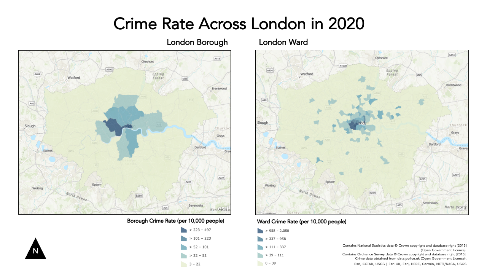

# Week 3 Practical Alternate: Using AGOL for Crime Mapping {-}

For this week's alternate practical, we will continue to use AGOL as our main GIS system to process and analyse our data, similar to the Q-GIS practical. 

This week, compared to last, we will however be dealing with two main 'compromises' in our use of AGOL vs. Q-GIS that you will need to be aware of:

**1. Projections**

Within Q-GIS, as you will see if you read through the main practical (which I highly advised doing), setting the Project and Data CRSs are an essential step in successfully analysing and visualisng spatial data correctly. In our case, our practical data uses two CRS - **BNG for the administrative boundaries** and **WGS84 for the crime data**. As a result, in the main practical, we use a tool within Q-GIS to reproject our crime data into **the same CRS** as the administrative boundaries, i.e. BNG.

AGOL, in comparision, uses WGS84/Mercator as default CRS for all its data mapping and visualisation - and can only be altered if you change the basemap to a dataset that is in your desired CRS/PS (although in their Beta version, it appears that there will be more user choice over choosing projections). AGOL will convert our data, such as our Administrative Boundaries (which are in British National Grid) "on the fly" to WGS84 - so we do not need to reproject it. However, this will mean we may forgot this step in the future - for example, when using R-Studio instead; therefore it is important to recognise that this aspect of our GIS workflow is missed in this tutorial.

**2. Map-Making & Visualisation**

AGOL also has relatively limited capacity for map-making. As a result, for this practical, I would recommend using a mixture of your output from AGOL alongside either a graphic software or even PowerPoint to make final additions that are needed to your map. You'll see these recommendations below as my proposed workaround.

Detailed cartography is one of the key advantages that Q-GIS and ArcGIS have over the use of programming tools, such as R-Studio. As you'll see in future practicals, we can still make excellent maps in R-Studio, it just takes a little more time and experience than the "speed" of the traditional GIS software.

**With all that being said, we still have plenty of data analysis to learn - so let's get started!**

### Practical Instructions {-}

We now have our datasets downloaded and ready to process - we simply need to get them loaded onto our AGO map.

1. Open your ArcGIS Online (AGO) home webpage and click on the **Map** tab.
    + Save your map as **Crime Analysis in London**.
    + You can add as many tags as you like – I used: crime | London | analysis.

Let's go ahead and start adding data to our map.

**Ward Population**

We already have our `ward_population_2019.shp` dataset complete from last week, so we can go ahead and add this directly to the map.

2. Click on the **Add** button and select **Add Layer from File**:
  + Add your `ward_population_2019.shp' to the map using the **Add -> Add Layer From File** tool.
  + Remember, to add a **shapefile** to AGOL, you need to compress it first into a zip file.

**Borough Population**

We, as yet, do not have a `borough_population_2019.shp`.

To create our Borough population shapefile, we need to repeat exactly the same process as last week in terms of joining our table data to our shapefile.

We will let you complete this without full instructions as your first "GIS challenge".

Remember, you need to:

* Add the `London_Borough_Excluding_MHW.shp` file from the `2011` boundary data (in your `raw` data folder) to your map.
    +  Remember, to add a **shapefile** to AGOL, you need to compress it first into a zip file.

* Add the `borough_population_2019.csv` you have just created from your `working` folder to your map.
    + This can just be added as a csv, but remember to add **just as a table**.

* Join the two datasets together using the **Join Features** tool within the **Summarise Data** option after clicking on the **Perform Analysis** button when hovering over the `London_Borough` dataset.

**Crime Data**

We now are ready to load and map our crime data.

We will now add our `all_theft_2020.csv` from our `raw` folder - we will load this exactly like our previous population csv **but** this time, when presented with the option, we need to add the point coordinates to map our crime data as points.

Before we can load our data, we actually need to do one final step of data cleaning (compared to the Q-GIS tutorial). Unfortunately AGOL cannot handle all of the data from 2020 - so we need to reduce the size of our dataset.

For now, we will analyse theft crime for March in 2020.

1. Open your `all_theft_2020.csv` from our `raw` folder in your number editing software, and extract all rows that the field `Month` is equal to `2020-03`.
     + I do not mind how you do this, but just make sure to save to a new CSV called: `march_theft_2020.csv` into your `working` folder.

Once you have extracted this smaller dataset:

1. Click on **Add -> Add Layer From File**.
    + AGOL should automatically detect the `Longitude` and `Latitude` columns and map your data.
    + You may have an error message, but you can ignore this for now.

Unlike Q-GIS, we do not need to reproject our data when using AGOL as the software has done this for us - we can, as a result, move on to the next step - counting the number of crimes in each of our Wards and Boroughs respectively.

#### Counting Points-in-Polygons with AGOL {-}

The next step of our analysis is incrediby simple - as AGOL has an in-built tool for us to use.

We will use the **Aggregate Points** tool within the **Summarise Data** option after clicking on the **Perform Analysis** button when hovering over the `March_theft_2020` point dataset to count how many crimes have occured in both our **Wards** and our **Boroughs**.

We will then have our count statistic which we will need to normalise by our population data to create our **crime rate** final statistic!

Let's get going and first start with calculating the crime rate for the borough scale:

1. Hover over the `March_theft_2020` point dataset and click the **Perform Analysis** button. Next, click on the **Summarise Data** option and then **Aggregate Points**.

2. Set up your query as follows:
    + **Point Layer**: `march_theft_2020`
    + **Aggregation areas**: `borough_population`
    + **Add Statistics**: Field = `UID` | Statistic = `Sum`
    + **Result Layer Name**: `borough_march_theft`
    + No need to add anything to Option 4 (group by)
    + Click **Run Analysis**

Note, the processing for the borough level will take around 5 minutes to process.

Once complete, re-run the same process for the **Ward** scale - note this will take even longer to process (approximately 10 minutes).

#### Calculating Crime Rate in AGOL {-}

Whilst it's great that we've got our `crimecount`, as we know, what we actually need is a **crime rate** to account for the different sizes in population in the boroughs and to avoid a **population heat map**.

We therefore now want to add a Crime Rate statistic to our dataset - we want to normalise our crime count by our population data.

**Note, if your processing did not work OR is still processing after 10 minutes, you can find two pre-processed Ward and Borough shapefiles with population and crime count [here](https://liveuclac-my.sharepoint.com/:u:/g/personal/ucfailk_ucl_ac_uk/EUTRNibqP81ChhkgWYPA1MkB9INtur5RODPjkOrtJ0KI3w?e=Pqad01).**

Let's go ahead and calculate our **Crime Rate** statistic.

To do this in AGOL, we actually need to access the **Symbology** menu.

1. Click on the **Change Style** / **Symbology** button whilst hovering over your `borough` dataset that now contains your crime count.

2. In **1: Choose Attribute**, click on the drop-down next to the currently selected attribute, scroll to the bottom of the list and click on **New Expression**:
    + A new pop-up window should appear - this is where we'll add a new expression to calculate our crime rate.
    + Edit the Custom name to `crime_rate`.
    + In the expression box, remove the current comments.
    + Add the expression: `($feature.crimecount/$feature.POP2019)*10000`
    + You can double-click on the fields on the right of the box to add these if you want.
    + Click on **OK**.

You'll now have a new field populated with the crime rate for each borough. Whilst you're still in the **Style** tab, go ahead and change the styling to show the crime rate for each borough by creating a choropleth map:

3. Click on `Counts and Amounts (Colour)` to access the correct style option.
    + You can click on the `Classify` check box to change the type of **classification scheme** and the **number of classes**.
    + Once you're happy with your styling, click through the **OKs** and **Dones** to return to the main AGO map.
    
Now you just need to **repeat the above steps for your Ward crime data** and we'll have our maps ready to export. 

**Remember to uncheck the box next to your borough layer, so this data does not show through on your ward map (and make sure you ward map has not shown through on your borough layer for that matter!).**

*As an FYI, we won't export our data from AGOL as I'll provide you with the final shapefiles in Week 5 for the practical that week. Just remember to save your map once you've exported your maps as instructed below.*

#### Making our Crime Rate Maps for analysis in AGOL {-}

As stated at the top of this practical, AGOL does not have a huge amount of flexibility when it comes to cartography - so we'll need to get a bit inventive.

To create maps to submit for your assignment, these are the steps I recommend:

1. Click on **Print -> Map with Legend** and either take a screenshot or use the **File** -> **Export as PDF**. 
    + Remember to save your final map outputs in your `maps` folder.
    + You may want to create a folder for these maps titled `w3`.

To add the various map components, open up **PowerPoint** - preferably find a slide size that is wider than it is taller.

2. Insert your two maps onto your slide, placing them side by side.

Now we have our two maps ready, we can add our **main map elements**:

* **Title**
* **Orientation**
* **Data Source**

We will use PowerPoints text box and shape features to replicate this on our slide.

We won't at this time add anything else - an inset map could be nice, but this requires additional data that we do not have at the moment.

Any other map elements would also probably make our design look too busy.

9. Using the tools on PowerPoint:
    + Add a **north arrow**: choose an arrow from PPTs shapes and draw it pointing upwards (i.e. north on your map)
    + Add a **title** at the top of the page, and **subtitles** above the individual maps.
    + Finally add a box detailing Data Sources, you can copy and paste the text below:
<br>Contains National Statistics data © Crown copyright and database right [2015] (Open Government Licence) <br> Contains Ordnance Survey data © Crown copyright and database right [2015] <br> Crime data obtained from data.police.uk (Open Government Licence).
    + Feel free to customise your font etc. to give the final maps a good aesthetic.

Once you have added these properties in, you should have something that looks a little like this:

```{r echo=FALSE, fig.align='center', cache=TRUE}

```

You'll notice I got a bit creative with cropping my maps in various ways to try to create a similar format to the one I made in the Q-GIS tutorial. The only thing I haven't managed to add is a **scale bar** as this would require accuracy in digitising that we do not have in PPT.

This is **as close** as we can get with creating maps using AGO - it would be great if we could edit it further but this is the constraint with using an online tool.

**Export map**

Now we have our maps put together, we are finally ready to export our map!

10. Export your slide as a **PNG**.
    + Remember to also save your original slide.

:::assignment
**Assignment 1: Submit your final maps and a brief write-up**<br>
Your one and only assignment for this week is to submit your maps your relevant seminar folder [here](https://liveuclac-my.sharepoint.com/:f:/g/personal/ucfailk_ucl_ac_uk/EqyMU5-efwVLoJFp3M2yUvcBhh3B69eIDLb-MgOl01FHZg?e=kqyGd0).

What I'd like you to do is, on your own computer, create a new Word document and set the orientation to **Landscape**.

Copy over your map into the first page and ensure it takes up the whole page.

On a second page, write a short answer (less than 100 words) to our original question set at the start of our practical:

> *Does our perception of crime (and its distribution) in London vary at different scales?*

Export this to a PDF and upload to your relevant seminar folder.
(Again, no need for names - but you might need to come up with a random code on your PDF name, just in case someone else has the same file name as you!)
:::
<br>
And that's it for this week's practical!

This has been a long but (hopefully!) informative practical to introduce you to cartography and visualisation in AGOL. It is really important for you to reflect on the many practical, technical and conceptual ideas you’ve come across in this practical and from the lecture material earlier. We’ll delve into some of these in more detail in our discussion on Monday, but it would also be great for you to come to the seminar equipped with questions that might have arisen during this practical.

If you feel you didn't quite understand everything this week, do not worry too much - Week 5 will serve as a good revision of everything we've covered here!

***

#### Extension Activity: Mapping Crime Rates using Averages {-}

If you have managed to get through all of this in record time and are still looking for some more work to do - one question I would ask you is: **could we visualise our crime rate data in a better way?**

At the moment, we are looking at the crime rate as an amount, therefore we use a sequential colour scheme that shows, predominantly, where the crime rate is the highest.

Could we use a different approach - using a diverging colour scheme - that could show us where the crime rate is lower and/or higher than a critical mid-point, such as the average crime rate across the wards or borough?

I think so! But first, you'll need to calculate these averages and then our individual ward/boroughs (%?) difference from this mean. 

*In AGOL, you may find an option that does this for us. If not, you can use the New Expression builder to calculate these values.*

See if you can think how to calculate this - and then create your diverging maps.

You can either just export an image of your results (in the main Q-GIS window) or you are welcome to update your current maps to reflect this new approach.

***

:::sds
**Learning Objectives**<br><br>
You should now hopefully be able to:

* Explain what a Geographic Reference System and a Projected Coordinate System is and their differences.
* Understand the limitations of different PCSs and recognise when to use each for specific anlaysis.
* Know what to include - and what not to include - on a map.
* Know how to represent different types of spatial data on a map.
* Explain what the Modifiable Areal Unit Problem is and why poses issues for spatial analysis.
* Reproject data in Q-GIS.
* Map event data using a 'best-practice' approach.
* Produce a map of publishable quality.
:::

#### Acknowledgements {-}

Acknowledgements are made in appropriate sections, but overall this week, as evident, has utilised the Q-GIS documentation extensively.

