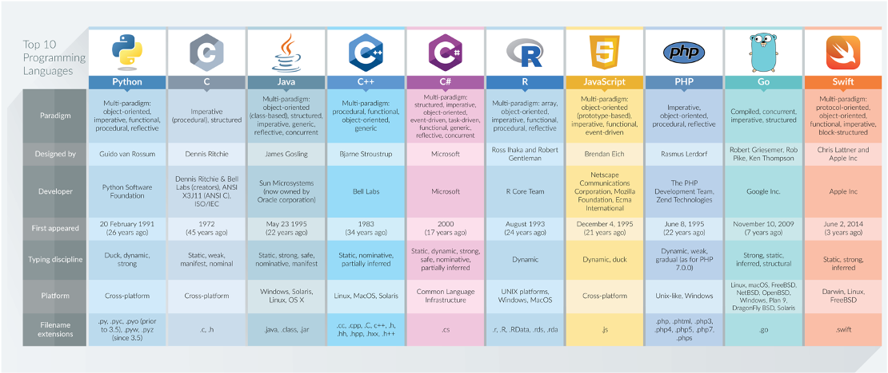
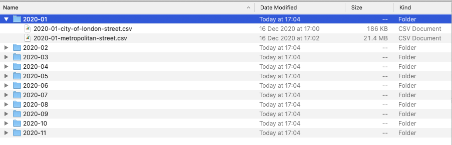
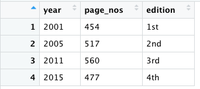
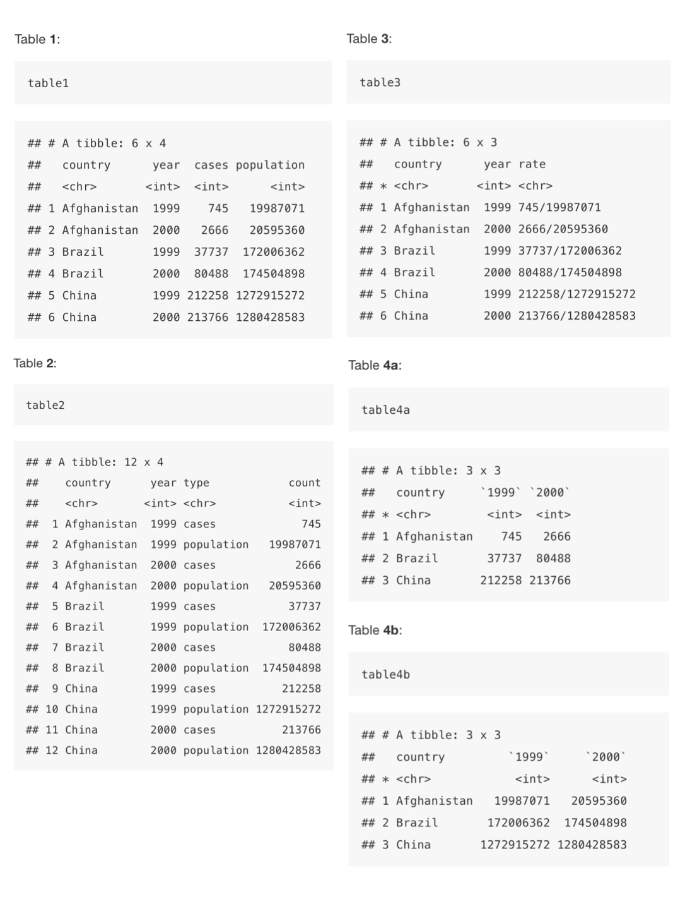
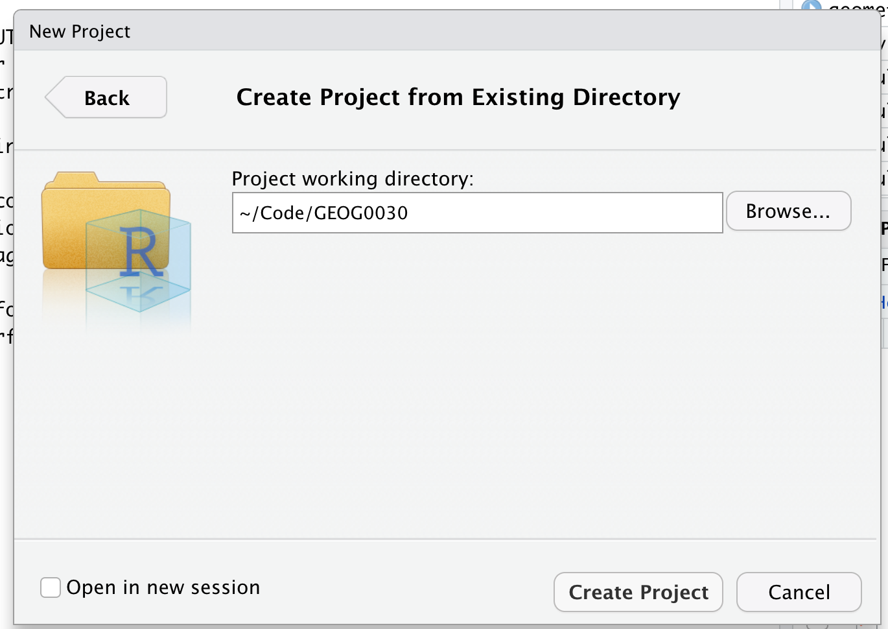
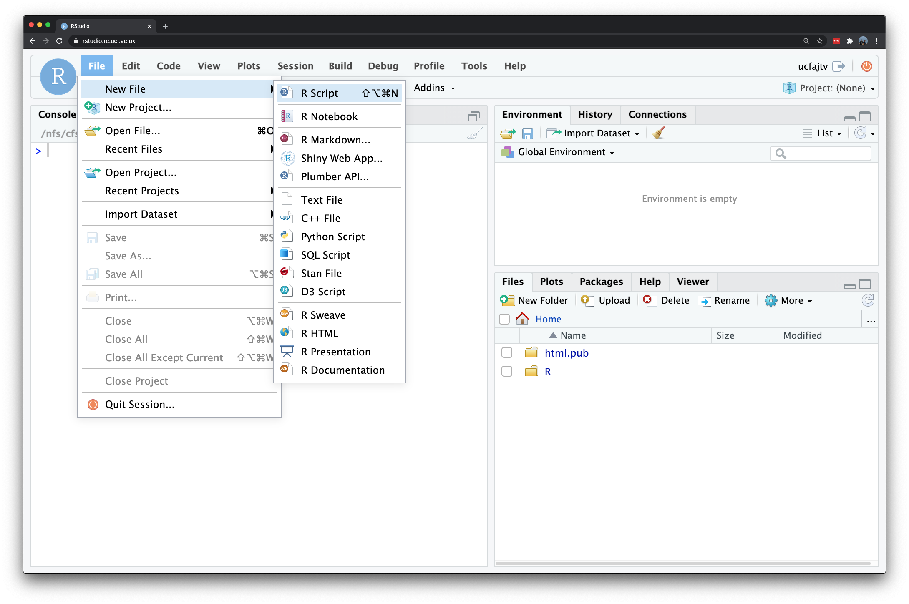

# Programming (for Data Analysis) using R and R-Studio

Welcome to Week 4 in Geocomputation! 

Well done on making it through Week 3 - and welcome to our introduction to using programming, in the form of R and R-Studio, for data analysis.

This week is heavily practical oriented - with **many aspects of your practical integrated at various points in the workshop** - as well as, of course, a data analysis section towards the end.

As always, we have broken the content into smaller chunks to help you take breaks and come back to it as and when you can over the next week.

### Week 4 in Geocomp {-}

```{r 04-welcome, warnings=FALSE, message=FALSE, echo=FALSE, cache=TRUE}
library(vembedr)
embed_msstream('12b10df4-0f35-45bc-b96a-555f6d322d4f') %>% use_align('center')
```
<center>[Video on Stream](https://web.microsoftstream.com/video/12b10df4-0f35-45bc-b96a-555f6d322d4f)</center><br>

This week's content introduces you to the foundational concepts associated with **Programming for Data Analysis**, where we have three areas of work to focus on:

1. General principles of programming
2. How to use R and R-Studio effectively for programmatical data analysis
3. The 'Tidyverse' philosophy

This week's content is split into **4** parts:

1. [An Introduction to Programming] (40 minutes)
2. [Using R and R-Studio for Data Analysis] (60 minutes)
3. [The Tidyverse Philosophy and Principles] (40 minutes)
4. [Practical 3: Analysing Crime in 2020 in London] (30 minutes)

This week, we have a slightly different approach to our workflow structure, with a mixture of **short lectures**, **instructional videos** and **activities** to complete throughout each part. 

A single **Key Reading** is found towards the end of the workshop. 

This week, you have **1 assignment**, which will be highlighted in the workbook.

**Part 4** is the main part of analysis for our Practical for this week, but you will find aspects of programming in **Parts 1-3** that you will need to do in order **to prepare our data for the final part**. 

If you have been unable to download R-Studio Desktop or cannot access it via Desktop\@UCL Anywhere, you will have access to our R-Studio Server website instead. Instructions on how to access this are provided below.

:::puzzle
**Learning Objectives**<br><br>
By the end of this week, you should be able to:

* Understand the basics of programming and why it is useful for data analysis
* Recognise the differences and purpose of a console command versus the creation of a script
* Explain what a library/package is and how to use them in R/R-Studio
* Explain the tidyverse philosophy and why it is useful for us as data analysts
* Wrangle and manage tabular data to prepare it for analysis
* Conduct basic descriptive statistics using R-Studio and R and produce a bar chart
:::

We will build on the data analysis we completed last week and look to further understand crime in London by looking at its prevalence on a month-by-month basis.

***

### An Introduction to Programming {-}

Programming is our most fundamental way of interacting with a computer - it was how computers were first built and operated - and for a **long** time, the Command Line Interface (CLI) was our primary way of using computers before our Graphical User Interface (GUI) Operating Systems (OS) and software became mainstream.

Nowadays, the majority of us use our computers through clicking - and not typing. However, programming and computer code underpin every single application that we use on our computers... or really any technological device.

After all, programming is used for so many purposes and applications, that, we as users take for granted - from software engineering and application development, to creating websites and managing databases at substantial scales.

To help with this diversity of applications, multiple types of programming languages (and ways of using programming languages!) have developed - Wikipedia, for example, has a list of **50 different types** of languages, although there is some overlap between many of these and some are used for incredibly niche activties.

In general, the main programming languages that people focus on learning at the moment include:

```{r 04-programming-languages, echo=FALSE, fig.align='center', out.width = "850pt"}

```
<br><center>*Top 10 programming languages and their applications according to DZone in 2017.*</center><br>

Some can be used for a range of purposes – others are more specific, e.g. HTML for website building. There are also different ways in which programming languages work, which give some advantages over others.

This is to do with how the code is written and 'talks to the computer' - behind our main programming languages there is something called a compiler that takes the code we write in our various programming languages and translates it into machine code, a.k.a. the code our computers know how to understand.

This code is written purely in binary and, as a result, looks **a lot** different to the code we'll be writing in our practicals (think a lot of 1s and 0s!).

For some languages, this translation is completed when your code is compiled before it is run, i.e. the 'compiler' will look through all your code, translate to machine code and then execute the machine code according. 

These languages are known as **compiled**, or **low-level** languages and can, at first, be slow to write but are incredibly efficient when executing huge amounts of code (e.g. when creating software). They however require an understanding of things called registers, memory addresses, and call stacks and are, as a result, a lot more complicated to learn and use (and no, I personally do not know how to code in any low-level languages...nor do I particularly want to!).

For other languages, such as R and Python, these fall into the **interpreted** language category. Here, each line of code is executed without a pre-runtime translation. In this case, a program called an interpreter reads each program statement and, following the program flow, then decides what to do, and does it. 

The issue with these **high-level** programming languages is that this approach can be costly in computational resources (i.e. processing time and memory space). 

As there is no pre-run time compilation, bugs are not found before the code is run but instead as the code is run - as a result (and what you might see happen in your own code), your computer can get stuck trying to execute code which is either completely unfeasible for your computer to execute (e.g. your computer cannot handle the size of data you are feeding it) or it ends up in a loop with no way out - except for you stopping the code.

However, the advantage of using these languages is that their main focus is on things like variables, arrays, objects, complex arithmetic or boolean expressions, subroutines and functions, loops, threads, locks, and other abstract computer science concepts - all of which we'll use within our module, believe it or not! 

These languages have a primary focus on usability over optimal program efficiency, which, when we're just learning to code, are ideal for us in Geocomputation!
<br><br>
<center>*Don't worry if you don't understand what any of this means, you will do by the end of this module!*</center><br>

As we're not taking a Computer Science degree here, we won't go into any more detail about this, but suffice to say, there is a lot more to programming then what we'll cover in Geocomputation.

But what is important to recognise is that **a lot** of work went into creating the programming environments that we get to use today - and I, for one, am extremely glad I never had to learn how to write a compiler!

If understanding a little more about compilers and machine code is of interest to you, the below video provides an accessible explanation - although you might want to come back to it at the end of the practical:

<center>**How do computers read code?**</center>
```{r 04-machine-code, warnings=FALSE, message=FALSE, echo=FALSE, cache=TRUE}
library(vembedr)
embed_youtube('QXjU9qTsYCc') %>% use_align('center')
```

#### The Command Line Interface {-}

The most basic of programming we can use without installing anything on our computers is using the **Command Line Interface**(CLI) already built in, known as the **shell**. 

The **shell** is a simple program that lets you interact with your computer using text commands (Command Line Interface) instead of a point & click **Graphical User Interface** (GLI).

The shell simply takes your commands and provides them to the operating system of your computer.

Each operating system has its own shell program: 

* **Mac / Linux** = **zsh** (new) / **bash** (Bourne-again Shell) (previous)

* **Microsoft** = **PowerShell** (and a few others).

For most operating systems, you can access the shell using a window-based program, known as a **terminal emulator (TE)**. 

* The default **TE** for **Mac & Linux** users is: **Terminal**. 

* The default **TE** for **Windows** users use **Command Prompt** (old) or **Terminal** (new).

*(If you remember my introductory lecture, this is how I used to have to interact with my first computer at a very young age of probably 5 when attempting to load a computer game!)*

The **shell** is an incredibly useful program - and if you take programming further in the future (e.g. analysis of big datsets through servers, running multiple scripts, dealing with version control, software engineering), it will become a tool that you'll become incredibly familiar with.

But for now, we just want to illustrate how cool it can be for us to be able to tell our computer to do things in a few lines of code - rather than having to click and point - particularly once you know how to use the CLI-shell and can remember specific commands.

Let's take a look by completing a simple task with our shell to tell our computer to do something - let's do some **file management** for our practical today.

##### Using the Command Line Interface On Your Computer {-}

As you may remember from last week's practical, I provided you with our crime data in a single processed csv file. 

However, when you download the data from **data.police.uk**, the data is not so nicely formatted!

Essentially, all of our data that we download for crime in London will be provided in individual csvs, according first to month, and then to the police force as so:

```{r echo=FALSE, out.width = "650pt", fig.align='center', cache=TRUE}

```

To be able process this data easily in R, we want to move all of our files into a single folder. 

And believe it or not, it only takes a couple of lines of code to do so. 

Let's take a look: 

<center>**Using the Command Line to copy and move files.**</center>
```{r 04-command-line, warnings=FALSE, message=FALSE, echo=FALSE, cache=TRUE}
library(vembedr)
embed_msstream('4a2c7bde-4074-4307-90d4-19ad73eef9f9') %>% use_align('center')
```
<center>[Video on Stream](https://web.microsoftstream.com/video/4a2c7bde-4074-4307-90d4-19ad73eef9f9)</center>
<br>

As we've seen in the video above, it can really useful - and quick - to use our Shell to organise our data files prior to loading them in R-Studio. 

Just to proove this, the first piece of programming we will do today is use your built-in shell on your computer to repeat the same process and copy our crime data into a single folder.

#### File Management using the Command Line {-}

Now you've watched how I copy the files over, let's go ahead and do this ourselves.

1. Head to **data.police.uk** and download all available crime data for London in 2020 (this may only include up until November) and for both Police Forces. 

<center>*The below video shows you how to do this.*</center>
```{r 04-crime-download, warnings=FALSE, message=FALSE, echo=FALSE, cache=TRUE}
library(vembedr)
embed_msstream('5143010c-bf7a-47b9-b7ec-a74ef1834615') %>% use_align('center')
```

You should now have your data downloaded in a single main folder in your downloads (it may be given a ridiculously long coded filename). 

2. Copy this folder into your **GEOG0030 -> data -> raw -> crime** folder using copy and paste / drag-drop (whatever your preference).

3. Next, open up your shell on your computer.
    + On **mac**, hold **CMD** and hit **space** to open up your search bar and type **terminal**, and a terminal window should appear.
    + On **windows**, press the windows button and do the same. Alternatively search for **shell** or **command prompt**.
    
With your shell open, we will navigate to your raw data folder and copy over the crime data into a single folder. 

To do so, we'll use six main terminal commands:

:::codetime
**Common Shell/Terminal Commands**<br>

* **pwd** (both Mac and Windows): **Print Working Directory** - this will show us where we are in our computer's file system. By default, you should be located at the "base" of your user file.
* **dir** (Windows) or **ls** (Mac): **Lists** all files in the directory you are currently located.
* **cd** (both Mac and Windows): **Change** into a new **directory** (i.e. folder) - this can be a single path 'step' or several steps to get to the directory you want.
* **md** (Windows) or **mkdir** (both Mac and Windows): **Make** a new **directory** (i.e. folder) where you are currently located.
* **cp** (both Mac and Windows): **Copy** content of a directory or specific file to a new location. This command can take **wildcards** to help search multiple folders at once, as we'll see in our query.
* **move** (Windows) or **mv** (Mac): **Move** directory to a new destination.
:::

Let's get going.

4. In your shell, type the command `pwd` and press return. 

You should now see a file path appear under your command - the computer is telling you where you are currently located in your computer system.

5. Next, type `dir` OR `ls` (OS-dependent) and press return. 

The computer now lists all of the folders in your directory that you can move into as a next step from your current folder. 

<br><center>**You now need to identify what folder your GEOG0030 work is contained in - and what your "path" is to get there as we now need to continue changing directories to get to our GEOG0030 folder.**</center><br>

6. Next, type `cd` followed by the folder(s) you need to change into in order to get to your main `GEOG0030` folder. Remember to press return to execute your code. 

<center>In my case, the command is: `cd Code`. </center>

Each time you change folder, this folder is added to the file path next to your **Prompt** - have a quick look at this now.

Keep going changing folders until you are in the folder that contains your downloaded crime data. 

:::codetime
**Auto-Population of File Paths**<br>

**A tip is that your terminal can auto-populate your folder names for you when there is enough information for them to determine the unique folder. To do this, press `tab` on your keyboard.** 

E.g. your crime folder is likely to be a long list of numbers and letters if you haven't renamed it whilst copying it over to your raw folder. Therefore I recommend using this approach will save you time entering all these numbers.

You can also change into this folder in one command, simply keep adding to your folder path as so: 

* Type in (and use tab) `cd GEOG0030/data/raw/crime/52c6b758bceaf2244fc1b6f93e85d7f00f234ccf/` and then press return.
    + Note, if you are using a WINDOWS PC, you need to use a backslash (\\) in your file path, not a forward-slash.
    + Note, you do not need a slash at the start of your file paths.*
:::

Once you are in the correct folder, we first want to make a **new folder** to contain **all** the crime csvs (without their current subfolder system): 

8. Type in `mkdir all_crime` and press return.

If you now type `dir` or `ls`, you should now see the new folder listed within your current folder.

Let's go ahead and copy all of our csvs into this single folder.

9. Type `cp **/*.csv all_crime` and press return. 
    + Again use a backslash (\)) if on a Windows PC.
    + This command uses the **wildcard \* ** to search for any file in any folder, as long as it has a `.csv` file type. 
    + Using **wildcards** is a very common programming tool and we are likely to use them in our practicals moving forward. You can also use them in searches on search engines such as Google!
    
We can now change into our new folder and then list its contents to check that our files have moved across.

10. Type `cd all_crime` and press return. Then type `dir` or `ls`. Check that you have all your files (either 22 or 24, depending on when you are completing this practical!).

Great, we have our files all in a single folder which will make using them in R much easier. We'll do one final thing - and that is move this folder out of this original and into the main `crime` folder.

11. Still in the terminal, type: `cd ..` to take a step back into our police crime data folder. 

12. Next, to move our `all_crime` folder: (WINDOWS) `move all_crime ..` or (MAC): `mv all_crime ..`

13. Finally, type `cd ..` and press return.

You should now find yourself **one step** back in your file system in the main crime folder. We can check that our move worked by again listing the contents of the folder.

14. Type `dir` or `ls` and press return. Check that your `all_crime` folder is now listed.
:::

Great! You've just done your first bit of command line programming!

Think about how quick was it to type those commands and get the files moved - rather than have to do all of that by hand.

Of course it helped that I told you what commands to write - but the more time you spend with programming, the quicker (and more familiar) you will get at (with) coding and executing these commands.

:::note
**Command Line Paths**<br>

Note, the use of `..` in our two commands above means to take a step back in your file system path, as we did in both of these cases here (i.e. the 'parent' folder.

In addition, two further commands to be aware of include:

* `~` (Mac) to denote the **root** or **home** directory, e.g. `cd ~`. 
    + In Windows, there is not really a shortcut for this.

* `.`: a single full-stop means "this folder".
:::

The command line is just one aspect of programming - but we also want to have the ability to create and run scripts.

Scripts are incredibily important for us when completing data anlaysis and, as such, we'll look at the differences between the two as we start to use R/R-Studio for our data analysis today.

One cool thing about the terminal is that we actually have the ability to create and run scripts just within the terminal itself.

We can do this by opening up a **text editor** in our terminal to write a script in any programming language and then execute our script within the terminal. We execute our script by actually setting the terminal to that programming language and then calling the script. 

This all sounds extremely complicated - but it really is not once you've spent a bit of time working with the CLI.

We can have a quick look here:

<center>**Using the Command Line to create and run scripts (in Python).**</center>
```{r 04-script-execute, warnings=FALSE, message=FALSE, echo=FALSE, cache=TRUE}
library(vembedr)
embed_msstream('c1bc80a0-da79-4add-aeac-d15a5c8d1e29') %>% use_align('center')
```
<center>[Video on Stream](https://web.microsoftstream.com/video/c1bc80a0-da79-4add-aeac-d15a5c8d1e29)</center>
<br>

Whilst we could use this type of approach for data analysis for conducting actual spatial analysis, we won't be doing so in Geocomptuation (you are probably happy to read!).

This is because, quite frankly, the terminal is pretty limited in its display of maps and charts, a key output of our work here in Geocomputation, and general user-friendly functionality. In fact, we'd need to save our outputs to a file each time to go view them, which would end up being a pretty clunky workflow...

Instead, what's great is that we have several different types of software and Integrated Develoement Environments that bring the functionality of running scripts together with the visualisation capacity we like in our GIS software.

For us in Geocomputation, our tool of choice for this is **R-Studio**.

### Using R and R-Studio for Data Analysis {-}

Before we go any further, what I want to make clear from this workshop - and the remainder of the module - is that programming using R and R-Studio is ultimately a **tool** we will use to complete specific tasks we need to do for our data analysis.

There are **a lot** of different tools out there that you can use to achieve the same outcomes (as you've seen with Q-GIS, and no doubt had experience of using some statistics/spreadsheet software) but we choose to use this tool because it provides us with many advantages over these other tools - more on this next week.

With this **tool** though, there is a lot to learn about the **principles and the theory behind programming languages**. 

As evident above, whilst we could look at this in a lot of detail (there is *a lot* of theory behind programming which we just won't cover - that's for computer scientists), we will instead focus on the **aspects** most important to our use, which is covered in our main lecture video below: **Principles of Programming for Data Analysis** in the [Programming for Data Analysis] section.

The second thing to make clear is that **R** and **R-Studio** are two different things:

```{r 01-rlang, echo=FALSE, fig.align='center', out.width="200pt"}
knitr::include_graphics('images/w4/r-logo.jpg')
```

<center>**R** is our programming language, which we need to understand in terms of **general principles**, **syntax** and **structure**.</center><br>

```{r 01-rstudio, echo=FALSE, fig.align='center', out.width="350pt"}
knitr::include_graphics('images/w4/RStudio-Logo-Flat.png')
```

<center>**R-Studio** is our **Integrated Development Environment**, which we need to understand in terms of **functionality** and **workflow**.</center><br>

:::fyi
**Integrated Development Environment**<br>
An Integrated Development Environment (IDE) is simply a complicated way of saying "a place where I write and build scripts and execute my code". 

Nowadays, we have some really fancy IDEs that, when they know what language you are coding in, will highlight different types of code according to what they represent (e.g. a variable, a function) as well as try to proof-read/de-bug your code "on-the-fly" before you've even run it.

R-Studio is definitely a **very** fancy IDE - as it offers **a lot** of functionality beyond just writing scripts and execute code as we'll see over the coming weeks.
:::

As you may know already, [R](https://www.r-project.org/) is a free and open-source programming language, that originally was created to focus on statistical analysis.

In conjunction with the development of **R** as a language, the same community created the **R-Studio** **IDE** (or really software now!) to execute this statisitcal programming.

Together, **R** and **R-Studio** has grown into an incredibly success partnership of analytical programming language and analysis software - and is widely used for academic research as well as in the commercial sector. 

One of R's great strength is that it is open-source, can be used on all major computer operating systems and is free for anyone to use. It, as a result, has a huge and active contributor community which constantly adds functionality to the language and software, making it an incredibly useful tool for many purposes and applications beyond statistical analysis.

:::note
**Believe it or not, the entire workbook you are reading right now has been created in R-Studio**, utilising a mixture of programming languages, including R, HTML, CSS and Markdown.
:::

R-Studio has the **flexibility** to understand programming languages other than **R** (including Python!), whilst **R** can be deployed outside of the **R-Studio** environment in standalone scripts and other IDEs.

However, for us, the partnership between R and R-Studio works pretty well for what we want to achieve - so this is what we'll be using for the remainder of the Geocomputation module.

#### How do I use R-Studio? {-}

Unlike traditional statistical analysis programmes you may have used such as **Microsoft Excel** or even **SPSS**, within the R-Studio IDE, the user has to type commands to get it to execute tasks such as loading in a dataset or performing a calculation.

We primarily do this by building up a script (or similar document, more on this in Week 10), that provides a record of what you have done, whilst also enabling the straightforward repetition of tasks. 

We can also use the **R Console** to execute simple instructions that do not need repeating - such as installing libraries or quickly viewing data (we'll get to this in a second).

In addition, R, its various graphic-oriented "packages" and R-Studio are capable of making graphs, charts and maps through just a few lines of code (you might notice a **Plots** window to your right in your R-Studio window)  - which can then be easily modified and tweaked by making slight changes to the script if mistakes are spotted. 

Unfortunately, command-line computing can also be off-putting at first. It is easy to make mistakes that are not always obvious to detect and thus debug. 

Nevertheless, there are good reasons to stick with R and R-Studio. 

These include:

* It is broadly intuitive with a strong focus on publishable-quality graphics.

* It is 'intelligent' and offers in-built good practice – it tends to stick to statistical conventions and present data in sensible ways.

* It is **free**, cross-platform, customisable and extendable with a whole swathe of packages/libraries ('add ons') including those for discrete choice, multilevel and longitudinal regression, and mapping, spatial statistics, spatial regression, and geostatistics.

* It is well respected and used at the world's largest technology companies (including Google, Microsoft and Facebook, and at hundreds of other companies).

* It offers a **transferable skill** that shows to potential employers experience both of statistics and of computing.

The intention of the practical elements of this week is to provide a thorough introduction to R-Studio to get you started:

**1. The basic programming principles behind R.**

**2. Loading in data from `csv` files, filtering and subsetting it into smaller chunks and joining them together.**

**3. Calculating a number of statistics for data exploration and checking.**

**4. Creating basic and more complex plots in order to visualise the distributions values within a dataset.**

What you should remember is that R/R-Studio has a steep learning curve, but the benefits of using it are well worth the effort. 

I highly recommend you take your time and think through every piece of code you type in - and also remember to comment your code (we'll get to this in a bit!) .

The best way to learn R is to take the basic code provided in tutorials and experiment with changing parameters - such as the colour of points in a graph - to really get 'under the hood' of the software. 

Take lots of notes as you go along and if you are getting really frustrated take a break!

This week, we focus solely on using R and R-Studio (from now on, this may be simply denoted as R) for **basic statistical data analysis**. 

Next week, we will introduce using R for **spatial (data) analysis** - but there's lots to get on with today to understand the fundamental principles of using R (and programming in general).

#### Accessing R-Studio for Geocomputation {-}

You have two options for using R-Studio in this module.

1. Using **R-Studio Desktop**: You should have installed this in Week 1 as per the software installation instructions.

2. Using **R-Studio Server**: 
    + First sign in to the UCL VPN or UCL China Connect.
    + To use R-Studio Server, open a web browser and navigate to: https://rstudio.data-science.rc.ucl.ac.uk/
    + Log in with your **usual UCL username and password**. 
    + You should see the RStudio interface appear. 
    + If it is the first time you log on to RStudio server you may only see the RStudio interface appear once you have clicked on the **start a new session** button.

You can use either approach - but do recognise their may be some differences oh how our code appears. 

The code below has been created on an R-Studio Desktop Version 1.2.5033 and tested on the R-Studio Server.

:::note
**Note**<br>

RStudio server will only work with an [active VPN connection](https://www.ucl.ac.uk/isd/it-essentials-for-new-students/video-guides/getting-started-ucls-vpn) that links your personal computer into UCL's network. Students in mainland China may want to use [UCL China Connect](https://www.ucl.ac.uk/isd/services/get-connected/china-connect). Students that use a Mac computer that is running on the latest version of MacOS ([MacOS Big Sur](https://www.apple.com/uk/macos/big-sur/)), are advised to use [Desktop@UCL](https://www.ucl.ac.uk/isd/services/computers/remote-access/desktopucl-anywhere) as the Cisco AnyConnect VPN application may not work. If you are completely unable to access the server (e.g. your browser displays a *This site can't be reached* message), it means that your VPN connection is not working correctly. Please ensure that your VPN is working correctly or use [Desktop@UCL Anywhere](https://www.ucl.ac.uk/isd/services/computers/remote-access/desktopucl-anywhere) instead.
:::

#### An Introduction to R-Studio and its interface {-}

Let's go ahead and open R-Studio (Desktop or Server) and we'll first take a quick tour of the various components of the R-Studio environment interface and how and when to use them:

<center>**Introducing the R-Studio Interface**</center>
```{r 04-rstudio-interface, warnings=FALSE, message=FALSE, echo=FALSE, cache=TRUE}
library(vembedr)
embed_msstream('79bb3915-0085-4f6d-9829-5d97ff44d85a') %>% use_align('center')
```
<center>[Video on Stream](https://web.microsoftstream.com/video/79bb3915-0085-4f6d-9829-5d97ff44d85a)</center>
<br>


As you've heard, R-Studio has various windows that you use for different purposes - and you can customise its layout dependent on your preference.

When you first open R-Studio, it should look a little something like this:

```{r 01-rstudio-interface-script, echo=FALSE, fig.align='center', out.width="650pt"}
knitr::include_graphics('images/w4/04_rstudio_interface.png')
```

The main windows (panel/pane) to keep focused on for now are:

* **Console**: where we write "one-off" code, such as installing libraries/packages, as well as running quick views or plots of our data.

* **Files**: where our files are stored on our computer system - can help with checking file paths as well as file names, and general file management.

* **Environment**: where our variables are recorded - we can find out **a lot** about our variables by looking at the Environment window, including data structure, data type(s) and the fields and 'attributes' of our variables.

* **Plots**: the outputs of our graphs, charts and maps are shown here.

* **Help**: where you an search for help, e.g. by typing in a function to find out its parameters.

You may also have your **Script Window** open, which is where we build up and write code, to a) keep a record of our work, b) enable us to repeat and re-run code again, often with different parameters. We will not use this window until we get to the final practical instructions.

We'll see how we use these windows as we progress through this tutorial and understand in more detail what we mean by words such as 'attributes' (do not get confused here with the **Attribute Table** for Q-GIS) and data structures.

#### Programming for Data Analysis {-}

Before we get started with using R-Studio, we first need to take a few steps back and address the bigger learning curve in the room, that is: **How do I program?**.

As stated earlier, R/R-Studio is just a tool  - but to use it, you need to understand how to write code in R effectively and, of course, accurately to get your analysis to work.

This means we need to learn about and understand:

* **Basic Syntax**
* **Data Structures and Types**
* **Functions and Libraries/Packages**
* **Object-Oriented Programming**

Here, we provide a short introduction to the basic principles of programming, with a focus on Object Oriented Programming. 

This is a video you might want to re-watch after completing today's practical.

<center>**Principles of Programming for Data Analysis**</center>
```{r 04-programming-principles, warnings=FALSE, message=FALSE, echo=FALSE, cache=TRUE}
library(vembedr)
embed_msstream('3286b44f-1bd7-488a-baed-d1376e69c9f5') %>% use_align('center')
```
<center>[Slides](https://liveuclac-my.sharepoint.com/:b:/g/personal/ucfailk_ucl_ac_uk/EVNCaN-2CrVBn5KAOKM1bGUBcXJKWQqmR964v-CB3nEmTg?e=jIs48s) | [Video on Stream](https://web.microsoftstream.com/video/3286b44f-1bd7-488a-baed-d1376e69c9f5)</center>
<br>

In the above lecture, you heard about the different including:

* Syntax using **variables** and **functions**

* Importance of **data types** and **data structures**

* The role of **packages/libraries** in expanding R's functionality

* And a brief introduction to Object-Oriented Programin (OOP)

We can put some of these principles into action by testing some of R-Studio's capability with some short pieces of coding now.

#### Using the Console in R-Studio {-}

We'll first start off with using **R-Studio's console** to test out some of R's in-built functionality by creating a few variables as well as a dummy dataset that we'll be able to analyse - and to get familiar with writing code.

*Note, you might need to click on the console window to get it to expand - you can then drag it to take up a larger space in your R-Studio window.*

The video below provides an overview of the short tutorial with additional explanations, so if you're already a bit stuck, you can watch this as you start to complete the following instructions.

<center>**Using the Console in R-Studio for programming**</center>
```{r 04-programming-tutorial, warnings=FALSE, message=FALSE, echo=FALSE, cache=TRUE}
library(vembedr)
embed_msstream('2508bfa9-865d-4fea-86f7-4398e4c64f78') %>% use_align('center')
```
<center>[Video on Stream](https://web.microsoftstream.com/video/2508bfa9-865d-4fea-86f7-4398e4c64f78)</center>
<br>


In your R-Studio console, you should see a prompt sign - **>** to the left - this means we're ready to start writing code (a bit like earlier in the shell).

:::codetime
**Error Warnings in the Console**<br>

Anything that appears as red in the command line means it is an error (or a warning) so you will likely need to correct your code. 

If you see a `>` on the left it means you can type in your next line, a `+` means that you haven't finished the previous line of code. 

As will become clear, `+` signs often appear if you don't close brackets or you did not properly finish your command in a way that R expected.
:::

In your console, let's go ahead and conduct some quick maths - at their most basic, all programming langauges can work like calculators!

**Command Input**

1. Type in `10 * 12` into the console.

```{r 04-math1, warnings=FALSE, message=FALSE}
# Conduct some maths
10 * 12
```

Once you press return, you should see the answer of 120 returned below.

Great, you've now learnt how to enter code into the R-Studio console! Pretty similar to your computer's CLI right?! 

**Storing Variables**

But rather than use 'raw' or 'standalone' numbers and values, we primarily want to use variables that stores these values (or groups of them) under a memorable name for easy reference later. 

In R terminology this is called **creating an object** and this object becomes stored as a **variable**. 

We do this by using the `<-` symbol is used to assign the value to the variable name you have given. 

Let's go ahead and try this.

Let's create two variables for experimenting with:

2.Type in `ten <- 10` into the console and execute.

```{r 04-math2, warnings=FALSE, message=FALSE}
# Store our ten variable
ten <- 10
```

You have just created your first variable. 

You will see nothing is returned in the console - but if you check your Environment window, it has now appeared as a new variable that contains the associated value.

3. Type in `twelve <- 12` into the console and execute.

```{r 04-math3, warnings=FALSE, message=FALSE}
# Store our ten variable
twelve <- 12
```

Once again, you'll see nothing returned to the console but do check your Environment window for your variable.

We've now stored two **numbers** into our environment - and given them pretty good variable names for easy reference. 

R stores these objects as variables in your computer's RAM so they can be processed quickly. 

Without saving your environment (we will come onto this below), these variables would be lost if you close R (or it crashes).

Now we have our variables, let's go ahead and do the same simple multiplication maths:

4. Type in `ten * twelve` into the console and execute.

```{r 04-math4, warnings=FALSE, message=FALSE}
# Conduct some maths again using our variables
ten * twelve
```

You should see the output in the console of **120** (of course..!). 

Whilst this maths may look trivial, it is, in fact, extremely powerful as it shows how these  **variables** can be treated in the same way as the values they contain.

5. Next, type in `ten * twelve * 8` into the console and execute.

```{r 04-math5, warnings=FALSE, message=FALSE}
# Conduct some more maths with variables and raw values
ten * twelve * 8
```

You should get an answer of 960. As you can see, we can mix **variables** with **raw values** without any problems.

We can also **store the output of variable calculations** as a **new variable**.

6. Type `output <- ten * twelve * 8` into the console and execute.

```{r 04-math6, warnings=FALSE, message=FALSE}
# Conduct some maths and store it as output
output <- ten * twelve * 8
```

As we're storing the output of our maths to a new variable, the answer won't be returned to the screen.

**Accessing and returning variables**

We can ask our computer to return this `output` by simply typing it into the console.

7. Ask the computer to return the variable `output`. You should see we get the same value as the earlier equation.

```{r 04-math7, warnings=FALSE, message=FALSE}
# Return the variable, output
output
```

**Variables of different data types** 

We can also store variables of different data types, not just numbers but text as well. 

8. Type in `str_variable <- "This is our first string variable"` into the console and execute.

```{r 04-var1, warnings=FALSE, message=FALSE}
# Store a variable
str_variable <- "This is our 1st string variable"
```

We have just stored our sentence made from a combination of characters, including letters and numbers. 

A variable that stores "words" (that may be sentences, or codes, or file names), is known as a string. A string is always denoted by the use of the **" "**. 

Let's access our variable to see what is now stored by our computer.

9. Type in `str_variable` into the console and execute.

```{r 04-var2, warnings=FALSE, message=FALSE}
# Return our str_variable
str_variable
```

You should see our entire sentence returned - and enclosed in **""**. 

Again, by simply entering our variable into the console, we have asked R to return our variable to us.

**Calling functions on our variables**

We can also **call** a function on our variable.

This use of **call** is a very specific programming term and generally what you use to say *"use*" a function. 

What it simply means is that we will use a specific **function** to **do something** to our variable.

For example, we can also ask R to **print** our variable, which will give us the same output as accessing it directly via the console:

10. Type in `print(str_variable)` into the console and execute.

```{r 04-var3, warnings=FALSE, message=FALSE}
# Print str_variable to the screen
print(str_variable)
```

We have just used our first function: `print()`. This function actively finds the variable and then **returns** this to our screen. 

You can type `?print` into the console to find out more about the `print()` function. 

```{r 04-var4, warnings=FALSE, message=FALSE}
# Gain access to the documentation for our print function
?print
```

This can be used with any function to get access to their **documentation** which is essential to know how to use the function correctly **and** understand its output.

In many cases, a function will take more than one **argument** or **parameter**, so it is important to know what you need to provide the function with in order for it to work. 

For now, we are using functions that only need one argument.

**Returning functions**

When a function provides an output, such as this, it is known as **returning**. 

Not all functions will *return* an output to your screen - they'll simply just *do* what you access them to do, so often we'll use a `print()` **statement** or another type of **returning** function to check whether the function was successful or not - more on this later in the workshop.

**Examining our variables using functions**

Within the **base** R language, there are various functions that have been written to help us examine and find out information about our variables.

For example, we can use the `typeof()` function to check what data type our variable is:

11. Type in `typeof(str_variable)` into the console and execute.

```{r 04-var5, warnings=FALSE, message=FALSE}
# Call the typeof() function on str_variable to return the data type of our variable.
typeof(str_variable)
```

You should see the answer: `"character"`. As evident, our `str_variable` is a character data type.

We can try testing this out on one of our earlier variables.

12.  Type in `typeof(ten)` into the console and execute.

```{r 04-var6, warnings=FALSE, message=FALSE}
# Call the typeof() function on ten variable to return the data type of our variable.
typeof(ten)
```

You should see the answer: `"double"`. As evident, our `ten` is a double data type.

For high-level objects that involve (more complicated) data structures, such as when we load a csv into R as a **data frame**, we are also able to check what **class** our object is, as follows:

13. Type in `class(str_variable)` into the console and execute.

```{r 04-var7, warnings=FALSE, message=FALSE}
# Call the class() function on str_variable to return the object of our variable.
class(str_variable)
```

In this case, you'll get the same answer - **"character"** - because, in R, both its class and type are the same: a character. 

In other programming languages, you might have had `"string"` returned instead, but this effectively means the same thing.

Let's try testing our `ten` variable:

14. Type in `class(ten)` into the console and execute.

```{r 04-var8, warnings=FALSE, message=FALSE}
# Call the class() function on ten to return the object of our variable.
class(ten)
```

In this case, you'll get a different answer - `"numeric"` - because the class of this variable is numeric. 

This is because the class of numeric objects can contain either doubles (decimals) or integers (whole numbers).

We can test this by asking whether our `ten` variable is an integer or not.

15. Type in `is.integer(ten)` into the console and execute.

```{r 04-var9, warnings=FALSE, message=FALSE}
# Test our ten variable by asking if it is an integer
is.integer(ten)
```

You should see we get the answer `FALSE` - as we know from our earlier `typeof()` function, our variable ten is stored as a double and therefore cannot be an integer. 

Whilst knowing this might not seem important now, but when it comes to our data analysis, the difference of a decimal number vs. a whole number can quite easily add bugs into our code! 

We can incorporate these tests into our code when we need to evaluate an output of a process and do some quality assurance testing of our data analysis.

We can also ask how **long** our variable is - in this case, we'll find out how many different **sets** of characters (strings) are stored in our variable, `str_variable`.

15. Type in `length(str_variable)` into the console and execute.

```{r 04-var10, warnings=FALSE, message=FALSE}
# Call the length() function on str_variable to return the length of our variable.
length(str_variable)
```

You should get the answer `1` - as we only have one set of characters.

We can also ask how long each set of characters is within our variable, i.e. ask how long the string contained by our variable is.

8. Type in `nchar(str_variable)` into the console and execute.

```{r 04-var11, warnings=FALSE, message=FALSE}
# Call the nchar() function on str_variable to return the length of each of our elements within our variable.
nchar(str_variable)
```

You should get an answer of `31`.

**Creating a two-element object**

Let's go ahead and test these two functions a little further by creating a new variable to store two string sets within our object, i.e. our variable will hold two elements.

9. Type in `two_str_variable <- c("This is our second variable", "It has two parts to it")` into the console and execute.

```{r 04-var12, warnings=FALSE, message=FALSE}
# Store a new variable with two items using the c() function
two_str_variable <- c("This is our second string variable", "It has two parts to it")
```

In this piece of code, we've created a new variable using the **c** function in R, that stands for **"combine values into a vector or list**. 

We've provided that function with two sets of strings, using a **comma** to separate our two strings - all contained within the function's **()**.

You should now see a new variable in your Environment window which tells us it's a) chr: characters, b) contains 2 items, and c) lists those items.

Let's now try both our **length()** and **nchar()** on our new variable and see what the results are.

```{r 04-var13, warnings=FALSE, message=FALSE}
# Call the length() function and nchar() function on our new variable
length(two_str_variable)
nchar(two_str_variable)
```

Did you see a difference?

You should have seen that the `length()` function now returned a **2** and the `nchar()` function returned two values of **34 and 22**.

There is one final function that we often want to use with our variables when we are first exploring them, which is `attributes()` - as our variables are very simple, they currently do not have any attributes (you are welcome to type in the code and try) but it is a really useful function, which we'll come across later on.

```{r 04-var14, warnings=FALSE, message=FALSE}
# Call the attributes() function on our new variable
attributes(two_str_variable)
```

We've had fun experimenting with simple variables in our console - and learnt about **many new functions** we can use with our code. 

In fact, we've learnt **7** functions - **can you name/remember them all without scrolling up?**

If you can't, I **highly recommend** taking notes on each of the functions - even if it is just a **short list** of the functions and what they do.

We're now going to move on to creating and analysing our dummy dataset - so fingers crossed you'll remember these as we move forward.

:::codetime
**Using comments in our code**<br>

In addition to make notes about the functions you are coming across in the workshop, you should notice that with each line of code I have written, I have provided an additional **comment** to explain what the code does.

Comments are denoted using the hash symbol **#**. This comments out that particular line so that R ignores it when the code is run.

These comments will help you in future when you return to scripts a week or so after writing the code - as well as help others understand what is going on when sharing your code.

It is good practice to get into writing comments **as you code** and not leave it to do retrospectively - because I can tell you from experience - you most certainly will not. 

Whilst we are using the console, using comments is not necessary - but as we start to build up a script in our full practical, you'll find them essential to help understand your workflow in the future!
:::

#### Analysing dummy data in R-Studio using the Console {-}

The objects we created and played with above are very simple: we have stored either simple strings or numeric values -  but the real power of R comes when we can begin to execute functions on more complex objects.

As we heard in our lecture, R accepts **four** main types of data structures: **vectors**, **matrices**, **data frames**, and **lists**.

So far, we have dabbled with a single item or a dual item **vector** - for the latter, we used the `c()` function to allow us to combine our two strings together within a single vector. 

We can use this same function to create and build more complex objects - which we can then use with some common **statistical functions**.

We're going to try this out by using a simple set of dummy data: we're going to use the total number of pages and publication dates of the various editions of **Geographic Information Systems and Science (GISS)** for our brief dummy analysis:

| Book Edition | Year | Total Number of Pages
| :------ | :---- | :------- |
| 1st | 2001 | 454 |
| 2nd | 2005 | 517 |
| 3rd | 2011 | 560 |
| 4th | 2015 | 477 |

As we can see, we will ultimately want to store the data in a table as above (and we could easily copy this to a csv to load into R if we wanted). 

But **we want to learn a little more about data structures in R**, therefore, we're going to go ahead and build this table "manually".

Let's get going.

**Clearing our Environemnt workspace**

First, let's clear up our workspace and remove our current variables:

10. Type `rm(ten, twelve, output, str_variable, two_str_variable)` into the console and execute.

```{r 04-da1, warnings=FALSE, message=FALSE}
# Clear our workspace
rm(ten, twelve, output, str_variable, two_str_variable)
```
**Note, of course you can either copy and paste this code - or try out using the tab function to autocomplete your variable names in the console as you start typing them in, just as we did when using the Command Line.**

You should now see we no longer have any variables in our window - we just used the `rm()` function to **remove** these variables from our environment.

Keeping a clear workspace is another recommendation of good practice moving forward. 

Of course, we do not want to get rid of any variables we might need to use later - but removing any variables we no longer need (such as test variables) will help you understand and manage your code and your working environment.

**Creating an atomic vector of multiple elements**

The first complex data object we will create is a vector.

A vector is the most common and basic data structure in R and is pretty much the workhorse of R.

Vectors are a collection of elements that are mostly of either character, logical integer or numeric data types.

Technically, vectors can be one of two types:

* **Atomic vectors** (all elements are of the same data type)
* **Lists** (elements can be of different data types)

Although in practice the term “vector” most commonly refers to the atomic types and not to lists.

The variables we created above are actually vectors - however they are made of only one or two elements. We want to make complex vectors with more elements to them.

Let's create our first official "complex" vector, detailing the different total page numbers for GISS:

11. Type `giss_page_no <- c(454, 517, 560, 477)` into the console and execute.

```{r 04-page-no, warnings=FALSE, message=FALSE}
# store our total number of pages, in chronological order, as a variable
giss_page_no <- c(454, 517, 560, 477)
```

Let's check the results.

12. Type `print(giss_page_no)` into the console and execute.

```{r 04-page-no-show, warnings=FALSE, message=FALSE}
# print our giss... variable
print(giss_page_no)
```

We can see we have our total number of pages collected together in a single vector. We could if we want, execute some statistical functions on our vector object:

13. Type our various statistical functions (detailed below) into the console and execute.

```{r 04-mean-giss, warnings=FALSE, message=FALSE}
# calculate the arithmetic mean on our variable
mean(giss_page_no)
# calculate the median on our variable
median(giss_page_no)
# calculate the range numbers of our variable
range(giss_page_no)
```

We have now completed our first set of **descriptive statistics** in R!

We now know that the average number of pages the GISS book has contain is 497 pages - this is of course truly thrilling stuff, but hopefully an easy example to get onboard with.

But let's see how we can build on our vector object by adding in a second vector object that details the relevant years of our book. 

*Note, I entered the total number of pages in a specific order to correspond to these publishing dates (i.e. chronological), as outlined by the table above.*

As a result, I'll enter the publication year in the same order.

14. Type `giss_year <- c(2001, 2005, 2011, 2015)` into the console and execute.

```{r 04-year, warnings=FALSE, message=FALSE}
# store our publication years, in chronological order, as a variable
giss_year <- c(2001, 2005, 2011, 2015)
```

Let's check the results.

14. Type `print(giss_year)` into the console and execute.

```{r 04-year-show, warnings=FALSE, message=FALSE}
#print our giss_year variable
print(giss_year)
```

Again, truly exciting stuff.

Of course, on their own, the two vectors do not mean much - but we can use the same `c()` function to combine the two together to create a matrix.

**Creating a matrix from two vectors**

In R, a matrix is simply an extension of the numeric or character vectors. 

They are not a separate type of object per se but simply a vector that has two dimensions. 

That is they contain both **rows** and **columns**. 

As with atomic vectors, the elements of a matrix must be of the **same data type**. 

As both our page numbers and our years are numeric (*we can check this using which function?*), we can add them together to create a matrix using the `matrix()` function:

15. Type `giss_year_nos <- matrix(c(giss_year, giss_page_no), ncol=2)` into the console and execute.

```{r 04-matrix, warnings=FALSE, message=FALSE}
# create a new matrix from our two vectors with two columns
giss_year_nos <- matrix(c(giss_year, giss_page_no), ncol=2)

# note the inclusion of a new argument to our matrix: ncol=2
#this stands for "number of columns" and we want two.
```

Again, let's check the results.

16. Type `print(giss_year_nos)` into the console and execute.

```{r 04-all-show, warnings=FALSE, message=FALSE}
print(giss_year_nos)
```

The thing about matrices - as you might see above - is that, for us, they don't have a huge amount of use. 

If we were to look at this matrix in isolation from what we know it represents, we wouldn't really know what to do with it. 

As a result, we tend to primarily use **Data Frames** in R as they offer the opportunity to add **field names** to our columns to help with their intepretation.

:::codetime
**Arguments/Parameters in Functions**<br>

The function we just used above, 'matrix()', was the first function that we used that took more than one argument. 

In this case, the arguments the matrix needed to run were: 

1. What data or dataset should be stored in the matrix.
2. How many columns (`ncol=`) do we need to store our data in.

The function can actually accept several more arguments - but these were not of use for us in this scenario, so we did not include them.

For almost any R package, **the documentation will contain a list of the arguments that the function will takes, as well as in which format the functions expects these arguments** and a set of usage examples.

Understanding how to find out what object and data type a variable is essential therefore to knowing whether it can be used within a function - and whether we will need to transform our variable into a different data structure to be used for that specific function.

For any function, there will be **mandatory** arguments (i.e. it will not run without these) or **optional** arguments (i.e. it will run without these, as the default to this argument has been set usually to FALSE, 0 or NULL).
:::

**Creating a Data Frame from our matrix**

A data frame is an extremely important data type in R. 

It is pretty much the **de-facto data structure** for most tabular data and what we use for statistics.

It also is the underlying structure to the table data (what we would call the **attribute table** in Q-GIS) that we associate with spatial data - more on this next week.

A data frame is a special type of list where every element of the list will have the same length (i.e. data frame is a “rectangular” list), 

Essentially, a data frame is constructed from columns (which represent a list) and rows (which represents a corresponding element on each list). Each column will have the same amount of entries - even if, for that row, for example, the entry is simply NULL.

Data frames can have additional attributes such as `rownames()`, which can be useful for annotating data, like `subject_id` or `sample_id` or even `UID`. In statistics, they are often not used - but in spatial analysis, these IDs can be very useful.

Some additional information on data frames:

* They are usually created by `read.csv()` and `read.table()`, i.e. when importing the data into R.

* Assuming all columns in a data frame are of same type, a data frame can be converted to a matrix with `data.matrix()` (preferred) or` as.matrix()`.

* You can also create a new data frame with `data.frame()` function, e.g. a matrix can be converted to a data frame, as we'll see below.

* You can find out the number of rows and columns with `nrow()` and `ncol()`, respectively.

* Rownames are often automatically generated and look like 1, 2, …, n. Consistency in numbering of rownames may not be honoured when rows are reshuffled or subset.

Let's go ahead and create a new data frame from our matrix:

16. Type `giss_df <- data.frame(giss_year_nos)` into the console and execute.

```{r 04-data-frame, warnings=FALSE, message=FALSE}
# Create a new dataframe from our matrix
giss_df <- data.frame(giss_year_nos)
```

We now have a data frame, we can finally use the `View()` function in R.

17. Still in your **console**, type: `View(giss_df)`

```{r 04-view-data-frame, warnings=FALSE, message=FALSE, eval=FALSE }
# View our data frame
View(giss_df)
```

You should now see a table pop-up as a new tab on your script window.

It's now starting to look like our original table - but we're not exactly going to be happy with **X1** and **X2** as our field names - they're not very informative.

**Renaming our column field names**

Instead, what we can do is **rename** our data frame column field names by using the `names()` function.

Before we do this, have a read of what the `names()` function does.

18. Still in your **console**, type: `?names`

```{r 04-names-help, warnings=FALSE, message=FALSE}
# Get the help documentation for the names function
?names
```

As you can see, the function will get or set the names of an object, with renaming occuring by using the following syntax:

`names(x) <- value`

The value itself needs to be *a character vector of up to the same length as x, or NULL.*

This is one of the cool aspects of OOP, in that we can access specific parts of our object and change it without changing the object as a whole or having to create a new object/variable to enact our changes.

We have two columns in our data frame, so we need to parse our `names()` function with a character vector with **two elements**.

19. In the console, we shall enter two lines of code, one after another. First our character vector with our new names, `new_names <- c("year", "page_nos")`, and then the `names()` function containing this vector for renaming, `names(giss_df) <- new_names`:

```{r 04-data-frame-names, warnings=FALSE, message=FALSE}
# Create a vector with our new column names
new_names <- c("year", "page_nos")

#Rename our columns with our next names
names(giss_df) <- new_names
```

You can go and check your data frame again and see the new names using either `View()` function or by clicking on the tab at the top.

**Adding a column to our data frame**

We are still missing one final column from our data frame - that is our **edition** of the textbook. As this is a **character** data type, we would not have been able to add this directly to our matrix - and instead have waited until we have our data frame to do so.

This is because data frames can take different data types, unlike matrices - so let's go ahead and add the **edition** as a new column.

To do so, we follow a similar process of creating a vector with our editions listed in chronological order, but then add this to our data frame by storing this vector as a new column in our data frame.

We use the **$** sign with our code that gives us "access" to the data frame's column  - we then specify the column `edition`, which whilst it does not exist at the moment, will be created from our code that assigns our edition variable to this column. 

This **$** is another feature of OOP.

Let's take a look.

20. Create a `edition` vector variable containing our textbook edition numbers - type and execute `edition <- c("1st", "2nd", "3rd", "4th")`. We then store this as a new column in our data frame under the column name **edition** by typing and executing `giss_df$edition <- edition`:

```{r 04-data-frame-edition, warnings=FALSE, message=FALSE}
# Create a vector with our editions
edition <- c("1st", "2nd", "3rd", "4th")

# Add this vector as a new column to our data frame
giss_df$edition <- edition
```

Again, you can go and check your data frame and see the new column using either `View()` function or by clicking on the tab at the top.

You should now have a data frame that looks like:

```{r echo=FALSE, out.width = "250pt", fig.align='center', cache=TRUE}

```

Now we have our data frame, let's find out a little about it.

We can first return the dimensions (the size) of our data frame by using the `dim()` function (*dim simply stands for dimensions in this case.*).

21. In your **console**, type `dim(giss_df)` and execute:

```{r 04-data-frame-dim, warnings=FALSE, message=FALSE}
# Check our data frame dimensions
dim(giss_df)
```

We can see we have **four rows** and **three columns**.

And we can finally use our `attributes()` function to get the attributes of our data frame.

22. In your **console**, type `attributes(giss_df)` and execute:

```{r 04-data-frame-att, warnings=FALSE, message=FALSE}
# Check our data frame attributes
attributes(giss_df)
```

You should see that we now get a list of the column and row names, plus the class of the data frame.

There is **a lot more** we could now do with our data frame but we simply do not have time - and we'd much rather implement some of these functions or data management techniques with a much more exciting dataset than the details of the **GISS** textbook.

Hopefully though, this has served as a good introduction to the different data structures you'll be coming across over the next 6 weeks as we use R - and provided you with some simple code you can return to time and time again for reminders, such as how to create a new column in your data frame.

Before we leave the console (and to be honest, we won't exactly leave it behind), we'll enter one last line of code for now:

22. Type in `install.packages("tidyverse")` into the console and execute.

```{r 04-install-tidy-verse, warnings=FALSE, message=FALSE, eval=FALSE}
# Install the tidyverse library
install.packages("tidyverse")
```

Leave this code to run - it might take some time but you won't need to worry about this until you've moved onto the practical section.

Now we're ready to move onto our next section, but first - after reading the Tips and recap below - I recommend you take a **long break** from this workbook!

:::note
**Tips & Tricks**<br>

* R is case-sensitive so you need to make sure that you capitalise everything correctly if required.

* The spaces between the words don't matter but the positions of the commas and brackets do. Remember, if you find the prompt, `>`, is replaced with a `+` it is because the command is incomplete. If necessary, hit the escape (esc) key and try again.

* It is important to come up with good names for your objects. In the case of the majority of our variables, we used a underscore `_` to separate the words. It is good practice to keep the object names as short as posssible but they still need to be easy to read and clear what they are referring to. Be aware: **you cannot start an object name with a number!**

* If you press the up arrow in the command line you will be able to edit the previous lines of code you have inputted.
:::

:::codetime
**Coding Breakthroughs**<br>

In this section you have:

1. Entered your first commands into the R command line interface.
2. Created objects in R.
3. Created a vector of values.
4. Executed some simple R functions.
5. Created a data frame.
:::

<br><center>**Now, please, make sure you go ahead and take a break!**</center><br>

### The Tidyverse Philosophy and Principles {-}

Over the past weeks a lot of information has come your way, diving deep into the world of GIScience...and now programing. 

However, whilst you are slowly becoming proficient in using spatial data and hopefully enjoying learning about how to code, we also need to learn about how our **data** is **structured** aand **organised**.

<br><center>**I told you there were quite a few learning curves in this module!**</center><br>

This is crucial for when you are moving on to working on your own projects where you have to source data yourselves: the vast majority of the data you will find in the public domain (or private domain for that matter) will be what's becoming colloquially called: *dirty data*.
 
What we mean by dirty data is data that needs some form of pre-processing, cleaning, and linkage before you can use it for your analysis. 

Let's think back to the Ward and Borough Population data that you downloaded from the ONS - we could not use the Excel Spreadsheet straight away as it was within a large workbook with a) many tabs and b) lots of additional formatting (e.g. empty rows, "whitespace").

Instead, we extracted the data we wanted and formatted it into a very simple table, consisting of only fields that contained individual records for each of our Wards or Boroughs.

This table would fit what is understood as the **tidy data** approach, which is a general perspective on how to structure your data in R to ease its analysis.

**Tidy data** was formalised by R Wizard Hadley Wickham in his contribution to the Journal of Statistical Software as a way of consistently structuring your data.

In the words, of the Wizard:

> Once you have tidy data and the tidy tools provided by packages in the tidyverse, you will spend much less time munging data from one representation to another, allowing you to spend more time on the analytic questions at hand.

This **tidy data** approach is very much at the core of the tidyverse R package that we just installed - and for us as soon-to-be connoisseurs of secondary data, is also of significant importance when organising your data for future projects. 

So what do tidy data look like?

#### Tidy Data In Practice {-}

Believe it or not, you can often represent the same underlying data in multiple ways. 

The example below, taken from the the tidyverse package and described in the R for Data Science book, shows that the same data can organised in four different ways. 

The data shows the population and cases (of something, e.g. malaria) for each country, for 1999 and 2000:

```{r 04-figure-tidy, echo=FALSE, fig.align='center'}

```

None of these representations are wrong per se, however, not are equally easy to use. 

Only Table **1** can be considered as tidy data because it is the only table that adheres to the three rules that make a dataset tidy:

1. **Each variable must have its own column.**
2. **Each observation must have its own row.**
3. **Each value must have its own cell.**

In the case of Table 4 - we even have two tables!

These three rules are interrelated because it’s impossible to only satisfy two of the three. That interrelationship leads to an even simpler set of practical instructions:

1. Put each dataset in a table/data frame/tibble.

2. Put each variable in a column.

```{r 04-figure-hadley-wickham, echo=FALSE, fig.align='center', fig.cap='A visual representation of tidy data by [Hadley Wickham](https://r4ds.had.co.nz/tidy-data.html).'}
knitr::include_graphics('images/w4/04_a_tidy_data.png')
```

**Why ensure that your data is tidy?**

Well, there are two main advantages (according to Hadley Wickham):

* There’s a general advantage to picking one consistent way of storing data. If you have a consistent data structure, it’s easier to learn the tools that work with it because they have an underlying uniformity.

* There’s a specific advantage to placing variables in columns because it allows R’s vectorised nature to shine. As you learned in mutate and summary functions, most built-in R functions work with vectors of values. That makes transforming tidy data feel particularly natural.

We'll see all of this in action over the coming weeks - but if you'd like, you can hear this explanation directly from one of R-Studio's very own resident Data Scientists below. 

You don't need to listen to the whole video, but from the beginning until approximately 7:40mins.

<center>**Tidy Data in R* {-}**</center>
```{r 04-tidy-data, warnings=FALSE, message=FALSE, echo=FALSE, cache=TRUE}
library(vembedr)
embed_youtube('1ELALQlO-yM') %>% use_align('center')
```

The **R-Studio Youtube** channel is also generally a great resource for you to be aware of as you pursue your learning in R.

#### So what is the Tidyverse? {-}

The tidyverse is a collection of packages that are specifically designed for these data sciencey tasks of data wrangling, management, cleaning, analysis and visualisation within R-Studio. 

*Our earlier lecture introduced you to the concept of a package - but they are explained in more detail below.* 

Whilst in many cases different packages work all slightly differently, all packages of the tidyverse share the underlying design philosophy, grammar, and data structures as we'll see over the coming weeks. 

The tidyverse itself is treated and loaded as a single package, but this means if you load the tidyverse package within your script (through `library(tidyverse)`), you will directly have access to all the functions that are part of each of the packages that are within the overall tidyverse. This means you do not have to load each package seperately - saving us lines of code, sweet! 

We've already gone ahead and executed the code to install the tidyverse within our various versions of R - but because the tidyverse consists of multiple packages, it may take a little while before everything is installed so be patient! 

For more information on tidyverse, have a look at https://www.tidyverse.org/.

**How does the tidyverse help with tidying data?**

There are some specific functions in `tidyverse` suite of packages that will help us cleaning and preparing our datasets to create a **tidy dataset**. 

The most important and useful functions, from the `tidyr` and `dplyr` packages, are:

| Package   | Function          | Use to |
| :------   | :------           | :------ |
| dplyr	    | select            | select columns |
| dplyr	    | filter            | select rows |
| dplyr	    | mutate            | transform or recode variables |
| dplyr	    | summarise         | summarise data |
| dplyr	    | group by          | group data into subgropus for further processing |
| tidyr	    | pivot_longer      | convert data from wide format to long format |
| tidyr	    | pivot_wider       | convert long format dataset to wide format |

These functions all complete very fundamental tasks that we need to manipualte and wrangle our data.

We will get to use these over the coming weeks, so do not panic about trying to remember them all right now.

:::codetime
**Installing and using Libraries/Packages for Data Analysis**<br>

As you will have heard in our earlier lecture, our common Data Analysis languages, including Python and R, have developed large community bases and as a result there are significant amount of help and support resources for those working in data science.

Beyond help and support, these large community bases have been essential for expanding the utility of a programming language for specific types of data analysis.

This is because of how programming languages work – they have a core library of functions to do certain things, such as calculate the mean of a dataset as we did earlier.

But to do more specific or specialized analysis, such as create a buffer around a point, a function needs to be written to enable this.

You either need to write the function yourself – or hope that someone else has written it – plus you need to know that there is the supporting functions around it. E.g. your code can “read” your spatial data and know a) its spatial and b) the projection system its in to calculate a distance.

Without this, you won’t be able to run your function or do your analysis.

These community bases have identified these gaps, such as for spatial data reading and analysis, and spent considerable amount of time writing these functions and supporting functions to add to the core library.

These functions often get packaged into an additional library (or can be called a package) that you add to your own core library by installing this library to your computer AND then importing it to your work through your script.

The `tidyr` and `dplyr` packages with the tidyverse are just two examples of these additional libraries created by the wider R community.  

The code you just ran asked **R-Studio** to fetch and install the `tidyverse` into your R-Studio - so this means we'll be able to use these libraries in our practical below simply by using the `library(tidyverse)` code at the top of our script.

One thing we need to be **aware** of when it comes to using functions in these **additional** libraries, is that sometimes these functions are called the same thing as the base **R** package, or even, in some cases, another additional library. 

We therefore often need to specify which library we want to use this function from, and this can be done with a simple command (`library::function`) in our code - as we'll see in practice over the next few weeks, so just make a mental note of this for now.
:::

Whilst we've gone ahead and installed the tidyverse, each time we start a new script, we'll need to load the tidyverse. 

We are going to show all of this in our next Prcatical, which gets you to analyse crime in London whilst putting into place everything we've been dicussing today.

***

### Practical 3: Analysing Crime in 2020 in London {-}

Wow, we've got through a lot today - and barely even started our practical!

But, what I can say, is that there is not a substantial more to learn in terms of principles and practicalities of programming beyond building up your "dictionary/vocabulary" of programming libraries and respective commands.

There are some **more complicated** coding things we can do, such as `for` and `while` loops and `if` statements, but, for now, consider yourself a solid beginner programmer.

As a result, we're ready to put this all into practice in our practical today, which will be relatively short in comparison to everything you've been through above.

What we'll be doing today is running an exploratory data analysis, using basic statistics, of crime in London over a **monthly** basis.

Let's get started.

#### Setting Up R-Studio for GEOG0030 {-}

In the previous section, R may have seemed fairly labour-intensive. We had to enter all our data manually and each line of code had to be written into the command line. Fortunately this isn't routinely the case. 

In RStudio, we can use **scripts** to build up our code that we can run repeatedly - and save for future use.

Before we start a new script, we first want to set up ourselves ready for the rest of our practicals by **creating a new project**.

To put it succintly, **projects** in R-Studio keep all the files associated with a project together — input data, R scripts, analytical results, figures. 

This means we can easily keep track of - and access - inputs and outputs from different weeks across our module, whilst still creating standalone scripts for each bit of processing analysis we do.

It also makes dealing with **directories** and **paths** a whole lot easier - particularly if you **have followed the folder structure I advised at the start of the module**.

Let's go ahead and make a **New Project** directly within our **GEOG0030** folder.

1. Click on **File -> New Project --> Existing Directory** and browse to your **GEOG0030** folder. Click on **Create Project**.

```{r 04-new-project, echo=FALSE, fig.align='center', out.width="650pt"}

```

You should now see your main window switch to this new project - and if you check your **Files** window, you should now see a new **R Project** called **GEOG0030**:

```{r 04-R-project, echo=FALSE, fig.align='center', out.width="150pt"}

```

We are now "in" the GEOG0030 project - and any folders within the GEOG0030 project can be easily accessed by our code. Furthermore, any scripts we create will be saved in this project. Note, there is not a "script" folder per se, but rather your scripts will simply exist in this project.

You can test this change of directly by selecting the **Terminal** window (next to your **Console** window) to access the Terminal in R-Studio and type our `pwd` command. You should see that our current directory is your GEOG0030 folder.


:::reading
**R for Data Science by Hadley Wickham and Garret Grolemund**<br><br>
Your only key reading for this week is to read through the **R for Data Science** handbook - although you can take each section at your own leisure over the coming weeks.
For this week, I'd highly recommend reading more about why we use [Projects](https://r4ds.had.co.nz/workflow-projects.html), whilst this section tells us more about [Scripts](https://r4ds.had.co.nz/workflow-scripts.html). I'd stick with these sections for now, but have a quick glance at what's available in the book.
:::

**Setting up our script**

In our shorter practical sessions above, we've had a bit of fun playing with the R code within the R console and seeing how we can store variables and access information about them. Furthermore, we've had a look at the different data structures we may use moving forward. 

But ultimately this really doesn't offer the functionality that we want for our work - or even the reality of what we need to do with spatial analysis. 

What we really want to do is to start building **scripts** and add start analysing some data! 

Therefore, for the majority of our analysis work, we will type our code **within a script** and not the console.

Let's create our first script:

2. Click on **File -> New File --> R Script**. 
    + You can also use the plus symbol over a white square as a shortcut or even **Ctrl/CMD + Shift + N**.

This should give you a blank document that looks a bit like the command line. The difference is that anything you type here can be saved as a script and re-run at a later date. 

```{r 04-rstudio-interface-script-open, echo=FALSE, fig.align='center', out.width="650pt"}

```

Let's go ahead and save this script straight away.

3. Save your script as: `wk4-csv-processing.r`.

Through our name, we know now that our script was created in Week 4 of Geocomputation and the code it will contain is something to do with csv processing. This will help us a lot in the future when we come to find code that we need for other projects.

I personally tend to use **one script** per type of processing **or** analysis that I'm completing. 

For example, if you are doing **a lot** of data cleaning to create a final dataset that you'll then analyse, its best practice to separate this from your analysis script so you do not continually clean your raw datasets when you run your script.

**Giving our script some metadata**

The **first** bit of code you will want to add to any script is to add a **TITLE**. This title should give any reader a quick understanding of what your code achieves.

When writing a script it is important to keep notes about what each step is doing. To do this, the hash (`#`) symbol is put before any code. This comments out that particular line so that R ignores it when the script is run.

Let's go ahead and give our script a **TITLE** - and maybe some additional information:

4. Add the following to your script (substitute accordingly):

```{r 04-scr-title, warnings=FALSE, message=FALSE, cache=TRUE}
# Combining Police Data csvs from 2020 into a single csv
# Followed by analysis of data on monthly basis
# Script started January 2021
# NAME
```

Save your script.

**Load Our Libraries**

Now we have our title, the **second** bit of code we want to include in our script is to load **our libraries** (i.e. the installed packages we'll need in our script):

5. Type the following into the script:

```{r 04-scr-lib, warnings=FALSE, message=FALSE, eval=FALSE, cache=TRUE}
# Libraries used in this script:
# Load the tidyverse library
library(tidyverse)
```

By loading simply the `tidyverse`, we have a pretty good estimate that we'll be able to access all the functions that we're going to need today. 

However, often when developing a script, you'll realise that you'll need to add libraries as you go along in order to use a specific function etc. 

When you do this, **always add your library to the top of your script** - if you ever share your script, it helps the person you are sharing with recognise quickly if they need to install any additional packages prior to trying to run the script. It also means your libraries do not get lost in the multiple lines of code you are writing.

**Setting Up Our Directory**

Understanding and accessing our directory path used to be the worst part of programming. And if you do not use the Project approach advocated above, it certainly will continue to be.

If, for example, we did not use a project approach, we would need to **set** our working directory directly within our script using the command: 

`setwd("file/path/to/GEOG0030)`

We'd therefore need to know what our path is and hope we do not make any mistakes. There are some automated shortcuts to doing this in R using the Files window, but ultimately, having to set a working directory is becoming a thing of the past. 

Because we are using a project approach - we do not need to set a working directory - because we're already in it!

Therefore, when looking for data in our folders, we know pretty much the path we'll need to take.

However, we still might need to access data from another folder outside of our GEOG0030 folder - so we need to know how to do this.

To help with this, we're going ot add one more library to our library list, called the `here` library. We won't go into too much detail what this library does per se, but essentially it alows you to direct R to a specific area on your computer and a specific file with relative ease.

We actually won't use it in this practical, but I wanted to get you into the habit of adding it to your scripts by default.

First, you'll need to install this library to your computer.

6. In your **Console** window, type and execute:

```{r 04-here-install, warnings=FALSE, message=FALSE, eval=FALSE, cache=TRUE}
# Install the here library via your console
install.packages("here")
```

Once installed, we can go ahead and load this after our tidyverse library - your script should look like so:

```{r 04-scr-libs, warnings=FALSE, message=FALSE, cache=TRUE}
# Libraries used in this script:
# Load the tidyverse library
# Load the here library
library(tidyverse)
library(here)
```

One thing to note, not only does installing and loading libraries need to occur in two different parts of R-Studio, but when installing, your library needs to be in **""** but when loading, it does not.

:::codetime
**File and folder names best practice**<br>

Please ensure that **folder names** and **file names** do not contain spaces or special characters such as `*` `.` `"` `/` `\` `[` `]` `:` `;` `|` `=` `,` `<` `?` `>` `&` `$` `#` `!` `'` `{` `}` `(` `)`. 

Different operating systems and programming languages deal differently with spaces and special characters and as such including these in your folder names and file names can cause many problems and unexpected errors. 

As an alternative to using white space you can use an underscore `_` if you like.
:::

Remember to save your script.

We're now ready to run these first two lines of code.

#### Running a script in R-Studio {-}

There are two main ways to run a script in R-Studio - all at once or by line/chunk by line/chunk.

It can be advantageous to pursue with the second option as you first start out to build your script as it allows you to test your code iteratively.

**To run line-by-line:**

By clicking:

* Select the line or chunk of code you want to run, then click on **Code** and choose **Run selected lines**.

By key commands:

* Select the line or chunk of code you want to run and then hold **Ctl** or **Cmd** and press **Return**.

**To run the whole script**

By clicking:

* Click on **Run** on the top-right of the scripting window and choose **Run All**.

By key commands:

* Hold **Option** plus **Ctl** or **Cmd** and **R**.

**Stopping a script from running**

If you are running a script that seems to be stuck (for whatever reason) or you notice some of your code is wrong, you will need to **interrupt** R. 

To do so, click on **Session -> Interrupt R**. If this does not work, you may end up needing to **Terminate R** but this may lose any unsaved progress.

:::codetime
**Run your code line-by-line**<br>

In this practical, I recommend **running each line (or set of lines) of code you enter as you go** - rather than wait til the end and execute the whole script.
This way you will be able to find any bugs as you go along. 

**Don't forget to scroll to the top of your script and execute your library loads!**
:::

#### Data Import and Processing {-}

We're now ready to get started with using the crime data csvs currently sat in our `all_crime` folder.

To do so, we need to first figure out how to import the csv and understand the data structure it will be in after importing.

**Importing and loading Data**

To read in a csv into R requires the use of a very simple function: `read_csv()`.

We can look at the help documentation to understand what we need to provide the function (or rather the optional arguments), but as we just want to load single csv, we'll go ahead and just use the function with a simple parameter.

```{r 04-data-load-csv, warnings=FALSE, message=FALSE, cache=TRUE}
# Read in a single csv from our crime data
crime_csv <- read_csv("data/raw/crime/all_crime/2020-11-metropolitan-street.csv")
```

We can explore the csv we have just loaded as our new `crime_csv` variable and understand the class, attributes and dimensions of our variable.

```{r 04-data-csv-class, warnings=FALSE, message=FALSE, cache=TRUE}
# Check class and dimensions of our data frame
# you can also check the attributes if you would like - this will load up a huge list of every row though!
class(crime_csv)
dim(crime_csv)
```

We've found out our variable is a data frame, containing **96914 rows and 12 columns**.

We can also tell it's a big file - so best not load it up right now.

We however do not want just the single `csv` and instead what to combine all our csvs in our `all_crime` folder into a single dataframe - so how do we do this?

**Joining all of our csvs files together into a single data frame**

This will be the most complicated section of code you'll come across today, and we'll use some functions that you've not seen before - we also need to install and load an additional library to use something known as a **pipe function** which I'll explain in more detail next week.

In your console, install the `magrittr` package:

```{r 04-magrittr-install, warnings=FALSE, message=FALSE, eval=FALSE, cache=TRUE}
# Install the magrittr library via your console
install.packages("magrittr")
```

And in your `# Load libraries` section of your script, add the `magrittr` library. Your library section should look like this:

```{r 04-scr-libs-all, warnings=FALSE, message=FALSE, cache=TRUE}
# Libraries used in this script:
# Load the tidyverse library
# Load the here library
library(tidyverse)
library(here)
library(magrittr)
```

**Remember to execute the loading of the `magrittr` library by selecting the line and running the code.**

Now we're ready to add and run the following code:

```{r 04-combine-csv, warnings=FALSE, message=FALSE, cache=TRUE}
# Read in all csvs and append all rows to a single data frame
all_crime_df <- list.files(path="data/raw/crime/all_crime", full.names=TRUE) %>%
  lapply(read_csv) %>%
  bind_rows
```

This might take a little time to process (or might not), as we have a lot of data to get through.

You should see a new datafarme appear in your global environment called `all_crime`, for which we now have 1,099,507 observations!

:::codetime
**Explaining the above code**<br>

It is a little difficult to explain the code above without going into a detail explanation of what a pipe is (next week) but essentially what these three lines of code does is: 

1. List of of the files found in the data path: `"data/raw/crime/all_crime`

2. Read each of these as a csv (this is the `lapply()` function) in as a dataframe

3. And then bind the rows of these dataframes to a single dataframe called `all_crime_df`

We'll go into more detail about pipes next week.
:::

We can now have a look at our large dataframe in more detail.

Let's have a look
```{r 04-data-frame-analysis, warnings=FALSE, message=FALSE, cache=TRUE}
# Understand our all_crime_df cols, rows and print the first five rows
ncol(all_crime_df)
nrow(all_crime_df)
head(all_crime_df)
```


You should now see with have the same number of columns as our previous single csv, **but** 1,099,507 rows!

You can also see that the `head()` function provides us with the first **five** rows of our dataframe. You can conversely use `tail()` to provide the last five rows.

**Filtering our data to a new variable**

For now in our analysis, we only want to extract the **theft** crime in our dataframe - so we will want to filter our data based on the **Crime type** column.

However, as we can see, we have a space in our field name for **Crime type** and, in fact, many of the other fields.

As we want to avoid having spaces in our field names when coding (or else our code will break!), we need to rename our fields.

To do so, we'll first get all of the names of our fields so we can copy and paste these over into our code:

```{r 04-get-field-names, warnings=FALSE, message=FALSE, cache=TRUE}
# Get the field names of our all_crime_df
names(all_crime_df)
```

We can now copy over these values into our code to create a new **vector** variable that contains these field names, updated without spaces.

We can then rename the field names in our dataset - just as we did with our GISS table earlier:

```{r 04-rename-field-names, warnings=FALSE, message=FALSE, cache=TRUE}
# # Create a new vector containing updated no space / no capital field names
no_space_names <- c("crime_id", "month", "reported_by", "falls_within", "longitude","latitude", "location", "lsoa_code", "lsoa_name", "crime_type", "last_outcome_category", "context")

# Rename our df field names using these new names
names(all_crime_df) <- no_space_names
```

*Note, we could have cleaned our data further and so would only needed to rename a few columns using slicing - but we'll save data frame slicing for next week!*.

We now have our dataframe ready for filtering - and to do so, we'll use the `filter()` function for the `dplyr` library.

This function is really easy to use - but there is also a `filter()` function in the R base library - that does something different to the function in `dplyr`.

As a result, we need to use a specific type of syntax - `library::function` - to tell R to look for and use the the filter function from the `dplyr` library rather than the default base library.

We then also need to populate our `filter()` function wsith the necessary paramteres to extract only the "Theft from the person" crime type. This includes providing the function with our main dataframe **plus** the filter query, as outliend below:

```{r 04-filter-data-frame, warnings=FALSE, message=FALSE, cache=TRUE}
# Filter all_crime_df to contain only theft, store as a new variable: all_theft_df
all_theft_df <- dplyr::filter(all_crime_df, crime_type == 'Theft from the person')
```

You should now see the new variable appear in your Environment with 28,476 observations.

Great, you've completed your first ever filter using programming.

We now want to follow the **tidy data** philosophy and create one final dataframe to allow us to analyse crime in London by month. 

To do so, we want to count how many thefts occur each month in London - and luckily for us `dplyr` has another function that will do this for us, known simply as `count()`. 

*You perhaps can see already that `dplyr` is likely to become well-used library by us in Geocomputation...!*

Go ahead and search the help to understand the `count()` function - you'll also see that there is only **one** function called `count()` so far, i.e. the one in the `dplyr` library, so we do not need to use the additional syntax we used above.

Let's go ahead and **count** the number of thefts in London **by month**.

The code for this is quite simple:

```{r 04-count-theft, warnings=FALSE, message=FALSE, cache=TRUE}
# Count in the all_theft_df the number of crimes by month and store as a new dataframe
theft_month_df <- count(all_theft_df, month)
```

We've stored the output of our `count()` function to a new dataframe: `theft_month_df`. 

Go ahead and look at the dataframe to see the output - it's a very simple table containing simply the month and `n`, i.e. the number of crimes occuring per month.

We can and should go ahead and rename this column to help with our interpretation of the dataframe.

We'll use a quick approach to do this, that uses **selection** of the precise column to rename only the second column: 

```{r 04-rename-df-column, warnings=FALSE, message=FALSE, cache=TRUE}
# Rename the second column of our new data frame to crime_totals
names(theft_month_df)[2] <- "crime_totals"
```

This selection is made through the `[2]` element of code added after the `names()` function we have used earlier. We'll look more at selection, slicing and indexing in next week's practical.

#### Data Analysis: Distribution of Crime in London by month in 2020 {-}

We now have our final dataset ready for our simple analysis for our Assignment.

:::assignment
**Assignment 1: Analysis of crime per month in London in 2020**

For your assignment this week, I would like you to complete two tasks.

**1. Basic statistics**

First what I would like you to do, using the code you've written previously is to find out:

* **What is the mean average crime per month?**

* **What is the median average crime per month?**

You may also automate the collection of the **max**, **min** and **range** of our crime per month dataframe.

**2. Monthly graph**

The second thing I would like you to do is present our data on a simple bar chart.

The basic code to generate a bar chart is provide here:

```{r 04-bar-plot, warnings=FALSE, message=FALSE}
# Read in a single csv from our crime data
barplot(theft_month_df$crime_totals, main="Crime distribution in London by month in 2020", names.arg = c("Jan", "Feb", "Mar", "Apr", "May", "Jun", "Jul", "Aug", "Sep", "Oct", "Nov"))
```

As you'll see, we have added a **Title** to our graph (`main=` argument), whilst used the `names.arg` parameter to add the months of the year in along the x-axis.

Using the `barplot()` documentation, I would like you to figure out how to change the bar chart fill and borders another colour from grey and black respectively. 

You may also look to customise your chart further, but primarily I'd like you to work out how to change these colours to something more aesthetically appealing!

You do not need to submit your bar chart this week, but have it ready for your work in Week 5.
:::

Beyond the assignment, just take a look at your bar chart and how the distribution of crime changed last year...

Well that's pretty cool, huh?! I wonder what happened in March to make theft from a person decrease so substantially?

We've managed to take a dataset of over 1 million records and clean and filter it to provide a chart that actually shows the potential impact of the COVID-19 lockdown on theft crime in London.

Of course, there is a lot more research and  exploratory data analysis we'd need to complete before we could really substantiate our findings, but this first chart is certainly a step in the right direction!

Next week, we'll be doing **a lot** more with our dataset - including **a lot more** data wrangling and of course spatial anlaysis, but hopefully this week has shown you want you can achieve with just a few lines of code.

**Now, make sure to save your script, so we can return to it next week.**

You do not need to save your workspace - but can do so if you'd like. Saving the workspace will keep any variables generated during your current session saved and available in a future session.

***
#### Extension Activity: Mapping Other Crime Type Distributions Across London {-}

If you've whizzed through this workshop and would like an additional challenge, you are more than welcome to deploy the code you've used above on one or more other crime types in London.

If you remember, each crime is categorised into one of 14 types. 

These include:

| Crime Type | Description |
| :---------- | :---------------------- |
| All crime | Total for all categories. |
| Anti-social behaviour | Includes personal, environmental and nuisance anti-social behaviour. |
| Bicycle theft | Includes the taking without consent or theft of a pedal cycle. |
| Burglary | Includes offences where a person enters a house or other building with the intention of stealing. |
| Criminal damage and arson | Includes damage to buildings and vehicles and deliberate damage by fire. |
| Drugs | Includes offences related to possession, supply and production. |
| Other crime | Includes forgery, perjury and other miscellaneous crime. |
| Other theft | Includes theft by an employee, blackmail and making off without payment. |
| Possession of weapons | Includes possession of a weapon, such as a firearm or knife. |
| Public order | Includes offences which cause fear, alarm or distress. |
| Robbery | Includes offences where a person uses force or threat of force to steal. |
| Shoplifting | Includes theft from shops or stalls. |
| Theft from the person | Includes crimes that involve theft directly from the victim (including handbag, wallet, cash, mobile phones) but without the use or threat of physical force. |
| Vehicle crime | Includes theft from or of a vehicle or interference with a vehicle. |
| Violence and sexual offences | Includes offences against the person such as common assaults, Grievous Bodily Harm and sexual offences. |

You can conduct the same analysis on one or more of these categories in addition to theft, to see if you can find a similar pattern in their prevalance/distribution over the same months.

***

:::reading
**R for Data Science by Hadley Wickham and Garret Grolemund**<br><br>
As highlighted earlier, your only key reading for this week is to read through the **R for Data Science** handbook - although you can take each section at your own leisure over the coming weeks.

For this week, I'd highly recommend reading more about why we use [Projects](https://r4ds.had.co.nz/workflow-projects.html), whilst this section tells us more about [Scripts](https://r4ds.had.co.nz/workflow-scripts.html). 

In addition, you can look at Sections: 1, 2, 4, 11 and 12. I'd stick with these sections for now, but have a quick glance at what else is available in the book. We'll be looking at Data Transformation (5) and Visualisation (3) next week, plus more on Exploratory Data Analysis (7). 

Don't worry about completing the exercises - unless you would like to!
:::

#### Recap {-}
In this section you have learnt how to:

1. Create an R script.
2. Load a `csv` into R, perform some analysis, and write out a new `csv` file to your
working directory.
3. Subset R data frames by name and also column and/or row number.
4. Created a simple graph to plot crime in London by month.

*** 

:::sds
**Learning Objectives**<br><br>
You should now hopefully be able to:

* Understand the basics of programming and why it is useful for data analysis
* Recognise the differences and purpose of a console command versus the creation of a script
* Explain what a library/package is and how to use them in R/R-Studio
* Explain the tidyverse philosophy and why it is useful for us as data analysts
* Wrangle and manage tabular data to prepare it for analysis
* Conduct basic descriptive statistics using R-Studio and R
:::

#### Acknowledgements {-}

Part of this page is adapted from [POLS0008: Understanding Data](https://jtvandijk.github.io/POLS0008/understanding-data.html) and [GEOG0114: Exploratory spatial data analysis](https://jtvandijk.github.io/GEOG0114/exploratory-spatial-data-analysis.html) by Justin Van Dijk at UCL as well as [Software Carpentry's Introduction to R Data Types and Data Structures](https://swcarpentry.github.io/r-novice-inflammation/13-supp-data-structures/) Copyright © Software Carpentry.

The examples and datasets used in the workbook are original to GEOG0030.