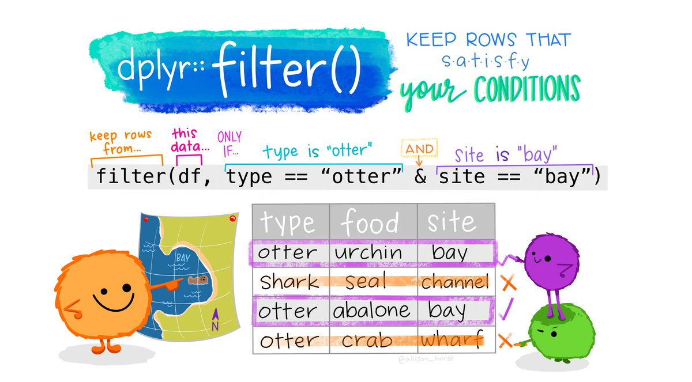
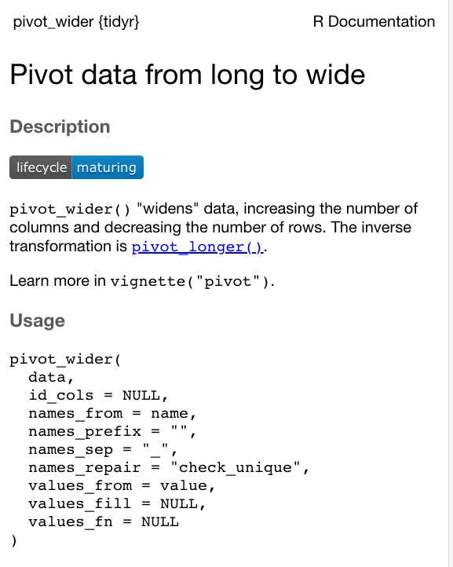

# Programming for GIScience and Spatial Analysis

Welcome to Week 5 in Geocomputation! 

This week is, again, heavily practical oriented - with our practical taking up the majority of our time this week. 

You'll find in this practical, many additional explanations of key programming concepts - such as **selection, slicing and pipes** - integrated within it.

As always, we have broken the content into smaller chunks to help you take breaks and come back to it as and when you can over the next week.

### Week 5 in Geocomp {-}

*To be added on Thursday - always nice to say hi to you all!*
```{r 05-welcome, warnings=FALSE, message=FALSE, echo=FALSE, cache=TRUE}
library(vembedr)
embed_msstream('') %>% use_align('center')
```
<center>[Video on Stream]()</center><br>

This week's content introduces you to the foundational concepts associated with **Programming for Spatial Data Analysis**, where we have three new areas of work to focus on:

1. Data wrangling in programming (using indexing, selection and slicing)
2. Using spatial libraries in R to **store and manage** spatial data
3. Using visualisation libraries in R to **map** spatial data

This week's content is split into **4** parts:

1. [Spatial Analysis for Data Science Research] (20 minutes)
2. [Spatial Analysis Software and Programming] (20 minutes)
3. [Spatial Analysis in R-Studio] (40 minutes)
4. [Practical 4: Analysing Crime in 2020 in London from a spatial perspective] (90 minutes)

This week, we have **2 lectures (15 mins and 40 mins)**, and an additional **instructional video** to help you with the completion of this week's practical.

A single **Key Reading** is found towards the end of the workshop.

:::note
After promising to set a Mini-Project during Reading Week, I appreciate the delivery of this material is late, so I will not be setting the Project as promised. Instead, I would like you to spend time going through the practical and experimenting with the visualisation code at the end. There is also an extension that I would like you to complete, if possible over Reading Week.
:::

**Part 4** is, as usual, the main part of analysis for our Practical for this week - all programming this week is within Part 4, which is a little longer than usual to account for this.

If you have been unable to download R-Studio Desktop or cannot access it via Desktop\@UCL Anywhere, you will have access to our R-Studio Server website instead. Instructions on how to access this are provided in the previous week's workshop.

:::puzzle
**Learning Objectives**<br><br>
By the end of this week, you should be able to:

* Understand how spatial analysis is being used within data science applications
* Recognise the differences and uses of GUI GIS software versus CLI GIS software
* Understand which libraries are required for spatial analysis in R/R-Studio
* Conduct basic data wrangling in the form of selection and slicing
* Create a map using the `tmap` visualisation library
:::

We will continue to build on the data analysis we completed last week and look to further understand crime in London by looking at its prevalence on a month-by-month basis **but this time, from a spatial perspective**.

***

### Spatial Analysis for Data Science Research {-}

Over a decade ago, when I first became involved in the GIScience world, the term "data science" barely existed - fast-forward to today, and it doesn't go a day without hearing the phrase and the hubris surrounding its potential to help solve the many grand challenges the modern world faces.

Whilst there is much hubris (and not a **huge** amount of evidence) of data science's ability to "save the world", on a more fundamental level, data science, and the community of practice associated with it, is having a transformational impact on how we think about and "do" data-focused (and primarily quantitative) research.

For us geographers and geographically-minded analysts, our traditional use of GIScience and spatial analysis is most certainly not immune to this transformation - many of the datasets assicated with data science do have a locational component and thus we have seen an increasing interest in and entry into the spatial analyis field from more "generalised" data analysts or data scientists.

Furthermore, the increasing popularity of data science amongst ourselves as geographers is also having a signficant impact on how we "do" spatial anaysis.

We have, as a result, seen a greater focus on the use of programming as a primary tool within spatial analysis, concomitant to a new prioritisation of openness and reproducibility in our research and documentation of our results.

Hence why, a decade later, an Undergraduate module on GIScience now focues on "Geocomputation", a precursor to spatial data science, rather than a more generalised understanding of the GIS industry and the traditional applications of GIS and spatial analysis, such as:

* Transportation
* Logistics
* Supply Chain Management
* Generalised Urban Planning
* Insurance
* Environmental modelling

Whilst these traditional applications and industries still utilise GIS software (and there is substantial potential to build careers in these areas, particularly through the various Graduate Schemes offered by related companies such as Arup, Mott MacDonald, Esri, to name a few), with data science emerging as a dominant area of growth in spatial analysis, it is important to prioritise the skills you will need to complete in the relevant sectors that are hiring "spatial data scientists", i.e. learning to code effectively and efficiently.

Once you have acquired these skills, the outstanding question becomes: how will I apply them in my future career?

Whilst the majority of spatial analysis using programming is not exactly too different from spatial analysis using GIS software, the addition of programming skills have opened up spatial analysis to many different applications and, of course, novel datasets. 

Within academia and research itself, we see the use of spatial analysis within data science research for:

**1. Analysis of distributions, patterns, trends and relationships within novel datasets**

The most basic application of spatial analysis - but one that now utilises large-scale novel datasets, such as mobile phone data, social media posts and other human 'sensor data'.

To get a better understanding of the various applications, a key recommendation is to look at Carto's introduction video to their **Spatial Data Science** conference held this year, where they highlighted how spatial data science has been used for various applications within COVID-19.

*As a commerical firm, they seem to have a bit of cash to make great videos*, but I'd also recommend looking at the various talks held at the conference this year that show the diversity of applications using *spatial data science* from the various participants.

<center>**Carto's take on the use of spatial data science for COVID-19**</center><br>
```{r 05-carto-covid-video, warnings=FALSE, message=FALSE, echo=FALSE, cache=TRUE}
library(vembedr)
embed_youtube('FomlfXwdwLc') %>% use_align('center')
```
<br>

**2. Supplementing the analysis of traditional datasets for augmented information**

Adding a 'spatial data science' edge to traditional analysis, supplementing "small" datasets with big data (or vice versa) to provide new insights into both datasets.

An example of this is the recent combination of geodemographic classification (Week 9) with big data information on mobility (e.g. mobile phone data, travel card data) to understand different types of commuter flows and thinking through how this can inform better urban planning policy.

A recent paper that did just such is from Liu and Cheng (2020), with the following abstract:

>Plentiful studies have discussed the potential applications of contactless smart card from understanding interchange patterns to transit network analysis and user classifications. However, the incomplete and anonymous nature of the smart card data inherently limit the interpretations and understanding of the findings, which further limit planning implementations. Geodemographics, as ‘an analysis of people by where they live’, can be utilised as a promising supplement to provide contextual information to transport planning. This paper develops a methodological framework that conjointly integrates personalised smart card data with open geodemographics so as to pursue a better understanding of the traveller’s behaviours. It adopts a text mining technology, latent Dirichlet allocation modelling, to extract the transit patterns from the personalised smart card data and then use the open geodemographics derived from census data to enhance the interpretation of the patterns. Moreover, it presents night tube as an example to illustrate its potential usefulness in public transport planning.

*(Yunzhe Liu & Tao Cheng (2020) Understanding public transit patterns with open geodemographics to facilitate public transport planning, Transportmetrica A: Transport Science, 16:1, 76-103, DOI: 10.1080/23249935.2018.1493549)*

We'll be looking at this in a little more detail in Week 9.

**3. Creation of new datasets from both traditional and novel datasets**

Opening up spatial analysis to novel datasets has enabled many researchers to identify opportunities in the creation of new datasets that can 'proxy' certain human behaviours and characteristics that we currently do not either have data for, or the data is old/insufficient/not at the right scale.

A good example of this is my previous research group at the University of Southampton: [Worldpop](www.worldpop.org).

**Worldpop** create population and socio-economic datasets for every country across the world utilising (primarily) bayesian modelling approaches alongside both census data and more innovative datasets, such as mobile phone data or tweets.

You can watch this incredibly cheesey but informative video made by Microsoft about the group below:

<center>**What does Worldpop do?**</center><br>

```{r 05-worldpop-video, warnings=FALSE, message=FALSE, echo=FALSE, cache=TRUE}
library(vembedr)
embed_youtube('Zta7FwUo5GA') %>% use_align('center')
```
<br>

There are plenty of examples in recent GIS and spatial analysis research where new datasets are/have been created for use in similar applications. Another example is Facebook, who is using a lot of their socila network data to create mobility and social connectivity datasets with their 'Data For Good' platform (see more [here](https://dataforgood.fb.com)).

**4. Creation of new methods and datasets**

Finally, the intersection of data science and spatial analysis has also seen geographers adapt data science techniques to create new methods and analytical algorithims to puruse the creation of more new datasets and/or new insight.

An example of this is the increased use and adaptation of the DB-Scan algorithm (Week 7) within urban analytics, seen within the various papers:

1. Xinyi Liu, Qunying Huang & Song Gao (2019) Exploring the uncertainty of activity zone detection using digital footprints with multi-scaled DBSCAN, International Journal of Geographical Information Science, 33:6, 1196-1223, DOI: 10.1080/13658816.2018.1563301

2. Arribas-Bel, D., Garcia-López, M. À., & Viladecans-Marsal, E. (2019). Building (s and) cities: Delineating urban areas with a machine learning algorithm. Journal of Urban Economics, 103217.

3. Jochem, W. C., Leasure, D. R., Pannell, O., Chamberlain, H. R., Jones, P., & Tatem, A. J. (2020). Classifying settlement types from multi-scale spatial patterns of building footprints. Environment and Planning B: Urban Analytics and City Science. https://doi.org/10.1177/2399808320921208

Beyond these research-oriented applications, we can also think of many 'data sciencey' applications that we use in our day to day lives that use spatial analysis as a key component.

From the network analysis behind route-planning within mapping applications to searching travel apps for a new cafe or restaurant to try, not only does spatial analysis underline much of the distance and location-based metrics these applications rely on, it also helps to integrate many of the novel datasets - such as traffic estimations or social media posts - that augment these distance metrics and become invaluable to our own decision-making.

:::sugreading
**Applications of Spatial Analysis with 'Data Science' Applications **<br>
A short blog piece by Esri on the insight that can be derived from spatial analysis can be found [here](https://www.esri.com/arcgis-blog/products/product/analytics/the-power-of-where-how-spatial-analysis-leads-to-insight/).
:::

### Spatial Analysis Software and Programming {-}

This week - and the previous - is your first introduction in our module to using R-Studio for the management and and analysis of spatial data. Prior to this, we've been using traditional GIS software in the form of QGIS.

As we've suggested above, the increasing popularity of data science is having a signficant impact on how we “do” spatial anaysis, with **a shift in focus to using programming as our primary tool rather than traditional GIS-GUI software**.

GUI-GIS software still has its place and purpose, particularly in the wider GIScience and GIS industry - but when we come to think of data science, the **command line** has become the default.

Behind this shift in focus, alongside the need to have a tool that is capable of handling large datasets, has been a focus on improving **openness and reproducibility** within spatial analysis research.

As Brunsdon and Comber (2020) propose:

> Notions of scientific openness (open data, open code and open disclosure of methodology), collective working (sharing, collaboration, peer review) and reproducibility (methodological and inferential transparency) have been identified as important considerations for critical data science and for critical spatial data science within the GIScience domains.

*(Brunsdon, C., Comber, A. Opening practice: supporting reproducibility and critical spatial data science. J Geogr Syst (2020). https://doi.org/10.1007/s10109-020-00334-2)*

As part of this move towards openness and reproducibility within spatial data science, we can look to the **emerging key principles of data science research** to explain why programming is becoming the primary tool for spatial analysis research.

**Key principles of data science research**

When thinking about spatial analysis, we can identify the key principles of data science as:

**1. Repeatability**: the idea that a given process will produce the same (or nearly the same) output given similar inputs. Instruments and procedures need to be consistent.

**2. Reproducibility**: There are three types of reproducibility when we think of data science research.
  
  * **Statistical reproducibility**: an analysis is statistically reproducible when detailed information is provided about the choice of statistical tests, model parameters, threshold values, etc. 
  * **Empirical reproducibility**: an analysis is empirically reproducible when detailed information is provided about non-computational empirical scientific experiments and observations. In practice, this is enabled by making data freely available, as well as details of how the data was collected.
  * **Computational reproducibility**: an analysis is computationally reproducible if there is a specific set of computational functions/analyses (in data science, almost always specified in terms of source code) that exactly reproduce all of the results in an analysis.

**3. Collaboration**: an analysis workflow that is easy to share work with others and collaborate, preferably in real-time, alongside easy integration with version control.

**4. Scalability**: at its most basic, an analysis that can re-run the same processing easily, with simple adjustment of variables and parameters to include additional data; at an intermediate level, the analysis and workflow can be easily expanded to include larger datasets (which require more processing requirements); at the most advanced, the workflow is suitable for distributed/multiple core computing.

We can use these principles to review the different tools/software available to us for spatial analysis, in order to be confident moving forward, that we use the appropriate tools for the tasks we have at hand.

<center>**A Review of Spatial Analysis Software**</center>
```{r 05-gis-software, warnings=FALSE, message=FALSE, echo=FALSE, cache=TRUE}
library(vembedr)
embed_msstream('273d2eb1-52c7-41fc-93c0-28a789d49b10') %>% use_align('center')
```
<center>[Slides](https://liveuclac-my.sharepoint.com/:b:/g/personal/ucfailk_ucl_ac_uk/Ecz71KYp5ZdAqvvnypg9qscBPF3KadtpKDXSm9-64naQQw?e=TdnoC3) | [Video on Stream](https://web.microsoftstream.com/video/273d2eb1-52c7-41fc-93c0-28a789d49b10)</center>
<br>

### Spatial Analysis in R-Studio {-}

We have now seen that for us, to work towards completing spatial analysis research that adheres to these data science pricinples, we need to focus on using programming tools, such as R and R-Studio, rather than the traditional GIS GUI software.

But the question is, **how do we use R and R-Studio as a piece of GIS software?**

As you'll already have seen, there are quite a few **aesthetic** differences between R-Studio and Q-GIS - for one, there is no "map canvas area where we'll see our data as we load it.

There are also quite a few other differences in terms of how we:

* Load
* Manage
* Process
* Analyse
* Visualise
* Disseminate

spatial data and our spatial analysis outputs.

To help you understand these differences, the following longer lecture (approximately 40 minutes) provides you with a thorough introduction into how we use R-Studio as a GIS software:

<center>**Using spatial data in R/R-Studio**</center>
```{r 05-r-spatial-libraries, warnings=FALSE, message=FALSE, echo=FALSE, cache=TRUE}
library(vembedr)
embed_msstream('6c53d925-e442-48ce-b084-cb4c6b7c13dc') %>% use_align('center')
```
<center>[Slides](https://liveuclac-my.sharepoint.com/:b:/g/personal/ucfailk_ucl_ac_uk/EYUrYMUFloZKqXnWDgqUtUQBL0huScw7gLlcKRPN9jIj_g?e=WXk0lO) | [Video on Stream](https://web.microsoftstream.com/video/6c53d925-e442-48ce-b084-cb4c6b7c13dc)</center>
<br>

### Practical 4: Analysing Crime in 2020 in London from a spatial perspective {-}

Now we've had our introduction to using R-Sutdio as a GIS software, it's time to get started using it ourselves for spatial analysis.

As outlined earlier, we'll be completing an analysis of our crime dataset in London, but rather than solely looking at crime change of time - we're going to add in a spatial component to our analysis, and understanding how crime has changed across our **wards** over the year.

To do this, what we'll first do is head back to our script from last week, run our script - and then write our `all_theft_df` to a `csv` file. 

If you had saved your environment from last week, keeping your variables in the memory, theoretically you won't need to export the dataframe as you should have access to this variable within your new script - but it would be good practice to write out the data - and then load it back in.

We're going to be adding in and using a few additional libraries into our script today - but we'll explain them as and when we use them; for now, just add them into our `library` section of our script when instructed to below.

Overall, our workflow will be:

1. Take our `all_theft_df` and wrangle it to produce a dataframe with a **ward per row** with a **crime count for each month in our fields**.

2. Join this dataframe to our `ward_population_2019` shapefile (in your `working` folder) and then produce a **crime rate** for each **month, for each ward**.

3. Create **a map for January 2020** using the `tmap` library.

4. **Extension**: Create a new dataframe that represents crime from a **quarterly** perspective and create four maps ready for export.

Let's get started!

#### Write out / export our dataframe from last week {-}

1. Open up R-Studio (Server or Desktop), and make sure you open up your **GEOG0030** project.

2. Next open your script from Week 4 - it should be saved as: `wk4-csv-processing.r` and should be visible in your **files** from your **GEOG0030** project.

3. First check your Environment box - if you have a variable in your Global Environment with the name `all_theft_df` then you do not need to run your script. If you do not have a variable saved, go ahead and run your script to and **including** the code that **filters** our large `all_crime_df` to only the `all_theft_df`:
 
```{r 05-filter-data-frame, warnings=FALSE, message=FALSE, cache=TRUE, eval=FALSE}
# Filter all_crime_df to contain only theft, store as a new variable: all_theft_df
all_theft_df <- dplyr::filter(all_crime_df, crime_type == 'Theft from the person')
```

We should all now have an `all_theft_df` variable in our environment that we're ready to export to a csv.

4. Scroll to the bottom of your Week 4 script and enter the following code and execute:

```{r 05-export-theft-data-frame, warnings=FALSE, message=FALSE, cache=TRUE, eval=FALSE}
# Write out the theft_crime_df to a csv within our raw crime data folder
write.csv(all_theft_df,"data/raw/crime/all_crime_2020.csv", row.names = FALSE)
```

Remember, if using a Windows machine, you'll need to submit your forward-slashes (`/`) with backslashes, and in this case, within R, it will need to be **two** backslashes (`\\`).

You should now see a new `csv` within your raw crime data folder (**data -> raw -> crime**).

5. Save your `wk4-csv-processing.r` script and then close the script.

#### Setting up your script {-}

1. Open a new script within your GEOG0030 project (Shift + Ctl/Cmd + N) and save this script as `wk5-crime-spatial-processing.r`.

2. At the top of your script, add the following metdata (substitute accordinlgy):

```{r 05-scr-title, warnings=FALSE, message=FALSE, cache=TRUE}
# Analysing crime in 2020 by month and ward
# Script started February 2021
# NAME
```

3. Now let's add **all** of the libraries we'll be using today:

```{r 05-scr-libs-all, warnings=FALSE, message=FALSE, cache=TRUE}
# Libraries used in this script:
library(tidyverse)
library(here)
library(janitor)
library(magrittr)
library(sf)
library(tmap)
```

As you'll have heard in our lecture, we'll be using `sf` to read and load our **spatial data**, use the `tidyverse` libraries to complete our data wrangling and then use the `tmap` library to visualise our final maps.

The `here` library enables easy reference to our working drive, `janitor` cleans the names of our data frame, whilst `magrittr` allows us to use the **pipe** function (`%>%`) which we'll explain in a bit more detail below.

#### Loading our datasets {-}

We're going to load both of the datasets we need today straight away: 1) the `all_theft_2020.csv` we have just exported and 2) the `ward_population_2019.shp` we created in Week 3.

1. First, let's load our `all_theft_2020.csv` into a dataframe called `all_theft_df`. *You should see we use the same read_csv code as last week.*
    + For those of use with the variable still stored in your Environment, you can still add this code to your script - it will simply overwrite your current variable (which essentially stores the same data that is contained in the csv).

```{r 05-load-csv, warnings=FALSE, message=FALSE, cache=TRUE}
# Read in our all_theft_2020 csv from our raw crime data folder
all_theft_df <- read_csv("data/raw/crime/all_crime_2020.csv") %>% clean_names()
``` 

We can double-check what our csv looks like by either viewing our data or simply calling the `head()` function on our dataframe.
   
    + Call the `View()` function in the console or the `head()` function in the script.

2. Call the `head()` function on our data to check the first five rows:

```{r 05-head-csv, warnings=FALSE, message=FALSE, cache=TRUE}
# Check the first five rows of our all_theft_2020 dataframe
head(all_theft_df)
``` 

You should see these rows display in your console. Great, the dataset looks as we remember, with the different fields, including, **importantly** for this week, the **LSOA_code** which we'll use to process and join our data together (you'll see this in a second!).

Next, let's load our first ever spatial dataset into R-Studio - our `ward_population_2019.shp`. We'll store this as a variable called `ward_population` and use the `sf` library to load the data:

```{r 05-load-shp, warnings=FALSE, message=FALSE, cache=TRUE}
# Read in our ward_population_2019 shp from our working data folder
# Note the st_read function here - keep a record of this function as it is your main function to read in shape data
# Do not worry about the stringsAsFactors paratmer this week
ward_population <- st_read("data/working/ward_population_2019.shp", stringsAsFactors = FALSE)
``` 

You should now see the `ward_population` variable appear in your Environment window.

As this is the first time we've loaded spatial data into R, let's go for a little exploration of how we can interact with our spatial data frame.

#### Interacting with spatial data {-}

The first thing we want to do when we load spatial data is, of course, map it to see its 'spatiality' (I'm going to keep going with that word..) or rather how the data looks from a spatial perspective.

To do this, we can use a really simple command from R's base library: `plot()`.

As we won't necessarily want to plot this data everytime we run this script in the future, we'll type this command **into the console** as a "one-off".

1. In your console, plot our new spatial data:

```{r 05-plot-wardpop, warnings=FALSE, message=FALSE, cache=TRUE}
# Plot our ward_population data
plot(ward_population)
``` 

You should see your `ward_population` plot appear in your **Plots** window - as you'll see, your ward dataset is plotted 'thematically' by each of the fields within the dataset, including our `POP2019` field we created last week.

Note, this `plot()` function is **not to be used** to make maps - but simply as a quick way of viewing our spatial data.

We can also find out more information about our `ward_population` data.

2. Let's next check out our class of our data. Again, **in the console** type:

```{r 05-class-wardpop, warnings=FALSE, message=FALSE, cache=TRUE}
# Find out the class of our ward_population data
class(ward_population)
``` 

We should see our data is an `sf` `dataframe`, which is great as it means we can utilise our `tidyverse` libraries with our `ward_population`.

We can also use the `attributes()` function we looked at last week to find out a little more about our "spatial" data frame.

3. Again, **in the console** type:

```{r 05-att-wardpop, warnings=FALSE, message=FALSE, cache=TRUE}
# Find out the attributes of our ward_population data
attributes(ward_population)
``` 

We can see how many rows we have, the names of our rows and a few more pieces of information about our `ward_population` data - for example, we can see that the specific `$sf_column` i.e. our spatial information) in our dataset is called `geometry`.

We can investigate this column a little more by **selecting** this column within our console to return.

4. **In the console** type:

```{r 05-geom-wardpop, warnings=FALSE, message=FALSE, cache=TRUE}
# Get info about the geometry of our ward_population data
ward_population$geometry
``` 

You should see new information about our `geometry` column display in your console. 

From this selection we can find out the dataset's:

* geometry type
* dimension
* bbox (bounding box)
* CRS (coordinate reference system)

And also the first five geometries of our dataset.

This is really useful as one of the first things we want to know about our spatial data is **what coordinate system** it is projected with. 

As we should know, our `ward_population` data was created and exported within **British National Grid**, therefore seeing the EPSG code of British National Grid - 27700 - as our CRS confirms to us that R has read in our dataset correctly!

We could also actually find out this information using the `st_crs()` function from the `sf` library.

```{r 05-crs-wardpop, warnings=FALSE, message=FALSE, cache=TRUE}
# Find out the CRS of our ward_population data
st_crs(ward_population)
``` 

You'll see we actually get **a lot** more information about our CRS beyond simply the code using this function.

This function is **really important** to us as users of spatial data as it allows us to retrieve and set the CRS of our spatial data (the latter is used in the case the data does not come with a `.proj` file but we do know what projection system should be used).

To **reproject** data, we actually use the `st_transform()` function - but we'll take a look at this in more detail in Week 7.

The final thing we might want to do before we get started with our data analysis is to simply look at the data table part of our dataset, i.e. what we'd call the Attribute Table in Q-GIS, but here it's simply the table part of our data frame.

To do so, you can either use the `View()` function in the console **or** click on the `ward_population` variable within our enviroment.

#### Processing our crime data to create our required output data frame {-}

Now we have our data loaded, our next step is to process our data to create what we need as our final output for analysis: a spatial dataframe that contains a **theft crime rate** for **each ward** for **each month** (of available data) in 2020.

**But wait** - if we look at our `all_theft_df`, we do **not** have a field that contains the wards our crimes have occured in. 

We only have **two** types of spatial or spatially-relevant data in our `all_theft_df`:

1) The **approximate ("snap point") latitude and longitude of our crime** in WGS84.
2) The **Lower Super Output Area (LSOA)** in which it occured.

From Week 3's practical, we know we can map our points using the coordinates and then provide a count by using a **point-in-polygon** (PIP) operation. 

However to do this for each month, we would need to filter our dataset for each month and repeat the PIP operation - when we know a little more advanced code, this might end up being quite simple, but for now, when all we're trying to do is some basic table manipulation, surely there must be a quicker way?

##### Adding Ward Information to our `all_theft_df` dataframe {-}

Yes, there is! All we need to do is figure our which Ward our LSOAs fall within and then we can add this as an additional attribute or rather **column** to our `all_theft_df` - so how do we do this?

From a GIScience perspective, there are many ways to do this - but the most straight forward is to use something called a **look-up table**.

Look-up tables are an extremely common tool in database management and programming, providing a very simple approach to storing additional information about a feature (such as a row within a dataframe) in a separate table that can quite literally be "looked up" when needed for a specific application. 

In our case, we will actually join our look-up table to our current `all_theft_df` to get this information "hard-coded" to our dataframe for ease of use.

To be able to do this, we therefore need to find a look-up table that contains a list of **LSOAs** in London and the **Wards** in which they are contained. 

Lucky for us, after a quick search of the internet, we can find out that the **Office for National Statisitcs** provides this for us in their **Open Geography Portal**.

They have a table that contains exactly what we're looking for: **Lower Layer Super Output Area (2011) to Ward (2018) Lookup in England and Wales v3**.

As the description on the website tells us, *"this file is a best-fit lookup between 2011 lower layer super output areas, electoral wards/divisions and local authority districts in England and Wales as at 31 December 2018.* 

As we know we are usig - but the LSOAs are still from 2011 within the police data, we know this is the file we'll need to complete our look-up.

In addition, the description tells us what field names are included in our table, which we can have a good guess at which we'll need before we even open the data: LSOA11CD, LSOA11NM, WD18CD, WD18NM, WD18NMW, LAD18CD, LAD18NM.

*(Hint, it's the ones beginning with LSOA and WD!)*

We therefore have one more dataset to download and then load into R.

1. Download the look-up table at the ONS: https://geoportal.statistics.gov.uk/datasets/8c05b84af48f4d25a2be35f1d984b883_0

2. Move this file in your **data -> raw -> boundaries** folder and rename to "data/raw/boundaries/lsoa_ward_lookup.csv".

3. Load the dataset using the `read_csv()` function:
    + Do not worry if you have a few parsing failures, the table should still work fine.
    
```{r 05-lookup-csv, warnings=FALSE, message=FALSE, cache=TRUE}
# Read in our lsoa_ward_lookup csv from our raw boundaries data folder
lsoa_ward_lookup <- read_csv("data/raw/boundaries/lsoa_ward_lookup.csv")
``` 

Now we have our lookup table, all we are going to do is extract the relevant ward name and code for each of the LSOAs in our `all_theft_df`. 

To do so, we're going to use one of the `join` functions from the `dplyr` library.

:::codetime
**Joining data by fields in programming**<br><br>

We've already learnt how to complete **Attribute Joins** in Q-GIS via the **Joins** tab in the Propeties window - so it should come of no surprise that we can do **exactly** the same process within R.

To conduct a **Join** between two **dataframes** (spatial or non-spatial, it does not matter), we use the same principles of selecting a **unique but matching** field within our dataframes to join them together.

As we have seen from the list of fields above - and with our knowledge of our `all_theft_df` dataframe - we know that we have at least **two** fields that should match across the datasets: our **lsoa codes** and **lsoa names**.

We of course need to identify the precise fields that contain these values in each of our data frames, i.e. `LSOA11CD` and `LSOA11NM` in our `lsoa_ward_lookup` dataframe and `lsoa_code` and `lsoa_name` in our `all_theft_df` dataframe, but once we know what fields we can use, we can go ahead and join our two data frames together.

**But how do we go about join them in R?**

Within R, you have two options to complete a data frame join:

* The **first** is to use the **Base** R library and its `merge()` function: 
    + By default the data frames are merged on the columns with names they both have, but you can also provide the columns to match separate by using the parameters: `by.x` and `by.y`.
    + E.g. your code would look like: `merge(x, y, by.x = "xColName", by.y = "yColName")`, with `x` and `y` each representing a dataframe.
    + The rows in the two data frames that match on the specified columns are extracted, and joined together. 
    + If there is more than one match, all possible matches contribute one row each, but you can also tell merge whether you want all rows, including ones without a match, or just rows that match, with the arguments all.x and all.

<br>

* The **second** option is to use the **Dplyr** library and one of their `mutate()`-based `join()` functions:
    + `dplyr` uses `SQL` database syntax for its join functions. 
    + There are **four types** of joins possible (using this SQL syntax) with the `dplyr` library.
        + `inner_join()`: includes all rows in x and y.
        + `left_join()`: includes all rows in x.
        + `right_join()`: includes all rows in y.
        + `full_join()`: includes all rows in x or y.
    + Figuring out which one you need will be on a case by case basis.
    + Again, if the join columns have the same name, all you need is left_join(x, y).
    + If they don’t have the same name, you need a by argument, such as left_join(x, y, by = c("xName" = "yName")) .
    + Note the syntax for the `by` parameter in the `dplyr`: you submit only the column name you're interested in (e.g. LSOACD) but within qutation marks (i.e. "LSOACD"). 
    + Left of the equals is the column for the first data frame, right of the equals is rthe name of the column for the second data frame.

**So which approach should I choose?**

In all cases moving forward, we will use the one of the `dplyr` join approaches. 

There are three reasons for using the `dplyr` approach:

1. The base `merge()` function does not always work well with data frames and can create errors in your joining.
2. With the `dplyr` code built on `SQL`, joins run substantially faster and very well on dataframes.
3. **All** tidyverse functions use **NAs** as a part of data, because it should explain some aspects of information that can't be explained by "identified" data and will not drop **NAs** during processing, which, if this happens without your realisation, can affect your data and its reliability quite substantially.
    + When using the tidyverse, we often need to use a specific function to drop NA values, e.g. `na.omit()` or find ways of replacing NAs, as we'll see later.

One thing to note is that there is a new package entering the "game" of data wrangling in R, called `data.table`. We won't look into this package now, because its best suited for **really large datasets** but one to quickly make a note about if you end up dealing with datasets for your dissertations that have **millions** of entries.
:::
<br>

**Joining our two tables using the `left_join()` function from `dplyr`**

Now we know what set of functions we can use to join our data, let's go ahead and join our `lsoa_ward_lookup` dataframe to our `all_theft_df` dataframe so we can get our ward information.

We're going to need to make **multiple** joins between our tables as we have multiple entries of crime for the same LSOA - as a result, we're going to need to use a function that allows us to keep **all rows** in our `all_theft_df` dataframe, but we do not need to keep **all rows** in our `lsoa_ward_lookup` if those wards are not within our dataset.

Let's have a look in detail at how the four different types of joins from `dplyr` work:

```{r echo=FALSE, out.width = "550pt", fig.align='center', cache=TRUE}
knitr::include_graphics('images/w5/dplyr-joins.png')
```
<br>

It looks like we're going to need to use our `left_join()` function as we want to join matching rows from our `lsoa_ward_lookup` dataframe to our `all_theft_df` dataframe but make sure to keep all rows in the latter.

1. **Within your script**, create a join between our two dataframes and store as a new variable:

```{r 05-ward-lsoa-lookup-csv, warnings=FALSE, message=FALSE, cache=TRUE}
# Join lsoa_ward_lookup rows to the all_theft_df on our two lsoa code fields
# Note again how we state to the two fields we'll use in the join in the by parameter
all_theft_ward_df <- left_join(all_theft_df, lsoa_ward_lookup, by = c("lsoa_code" = "LSOA11CD"))
``` 

Run the code. 

Let's go ahead and check our join - we want to check that our LSOA codes and names match across our new dataframe.

2. **In your console**, check the first five rows of our new data frame:

```{r 05-join-check, warnings=FALSE, message=FALSE, cache=TRUE}
# Check our join via the first five rows
head(all_theft_ward_df)
``` 

You should now see that you have with **19 variables**: 12 from `all_theft_df`, plus 7 from `lsoa_ward_lookup`. 

Note, the join does not keep the 'join key' fields from both dataframes by default. It keeps only the field from the "left" dataframe - hence we are now missing `LSOA11CD`. 

To keep both fields in future, we would need to add the `keep` parameter into our code, and set this to `TRUE` as so:

*Do not add this to your script, it is just provided as an example!*
```{r 05-ward-lsoa-lookup-csv-true, warnings=FALSE, message=FALSE, cache=TRUE, eval=FALSE}
# Join lsoa_ward_lookup rows to the all_theft_df on our two lsoa code fields
# Set keep to TRUE to keep both join key fields
all_theft_ward_df <- left_join(all_theft_df, lsoa_ward_lookup, by = c("lsoa_code" = "LSOA11CD"), keep = TRUE )
``` 

Now we have our joined dataset, we can move forward with some more data wrangling. 

The thing is, our data frame is getting quite busy - we have duplicate fields and some fields we just won't need. 

It would be good if we could trim down our dataframe to only the relevant data that we need moving forward, particularly, for example, if we wanted to go ahead and write out a hard copy of our theft data that now contains the associated ward.

To be able to "trim" our data frame, we have two choices in terms of the code we might want to run.

First, we could look to **drop** certain columns from our data frame.

Alternatively, we could create a subset of the columns we want to **keep** from our data frame and store this as a new variable or simply overwrite the currently stored variable.

To do either of these types of data transformation, we need to know **more about how we can interact with a data frame** in terms of **indexing, selection and slicing**.

:::codetime
**Data Wrangling: Introducing Indexing, Selection and Slicing**<br>

Everything we will be doing today as we progress with our data frame cleaning and processing relies on us understanding how to interact with and transform our data frame - this interaction itself relies on knowing about how **indexing** works in R as well as how to **select** and **slice** your data frame to extract the relevant cells, rows or columns and then manipulate them - as we'll be doing in this practical. 

Whilst there are traditional programming approaches to this using the base R library, `dplyr` is making this type of data wrangling easier by the year! 

If you've not used R before - or have but not familiar with how to index, select and slice, I would highly recommend watching this following video that explains the process from both a base R perspective and using the `dplyr` library - it also includes a good explanation about what our pipe function , `%>%` , does.

*I'd love to have time to make this video for you all myself, but this is currently not possible - and this video provides a very accessible explanation. I'll add some detailed notes as and when we use these functions in the next section of the practical, but for an audio/visual explanation, I'd highly recommend watching this video.*

<center>**Selection and slicing in R**</center>

```{r 05-r-slicing, warnings=FALSE, message=FALSE, echo=FALSE, cache=TRUE}
library(vembedr)
embed_youtube('KXSPxjjS8Fc') %>% use_align('center')
```
<br>

As you can see from the video, there are two common approaches to selection and slicing in R, which rely on indexing and/or field names in different ways.

The following summarises the above video, for ease of reference during the practical:

**Base R approach to selection and slicing (common programming approach)**

The most basic approach to selecting and slicing within programming relies on the principle of using **indexes** within our data structures.

Indexes actually apply to any type of data structure, from single atomic vectors to complicated data frames as we use here.

Indexing is the numbering associated with each element of a data structure.

For example, if we create a simple vector that stores three strings:

```{r 05-select-1, warnings=FALSE, message=FALSE, cache=TRUE}
# Store a simple vector of three strings
simple_vector <- c("Aa", "Bb", "Cc", "Dd", "Ee", "Ff", "Gg")
```

R will assign each element (i.e. string) within this simple vector with a number: Aa = 1, Bb = 2, Cc = 3 and so on.

Now we can go ahead and select each element by using the base selection syntax which is using square brackets after your element's variable name, as so:

```{r 05-select-1b, warnings=FALSE, message=FALSE, cache=TRUE}
# Select the first element of our variable ss
simple_vector[1]
```

Which should return the first element, our first string containing "Aa". You could change the number in the square brackets to any number up to 7 and you would return each specific element in our vector.

However, say you don't want the first element of our vector but the second to fifth elements.

To achieve this, we conduct what is known in programming as a **slicing** operation, where, using the **[]** syntax, we add a **: (colon)** to tell R where to **start** and where to **end** in creating a selection, known as a **slice**:

```{r 05-slice-1, warnings=FALSE, message=FALSE, cache=TRUE}
# Select the second to fifth element of our vector, creating a 'slice' of our vector
simple_vector[2:5]
```

You should now see our 2nd to 5th elements returned. You've created a slice!

Now what is super cool about selection and slicing is that we can add in a simple **- (minus)** sign to essentially reverse our selection.

So for example, we want to return everything **but** the 3rd element:

```{r 05-slice-2, warnings=FALSE, message=FALSE, cache=TRUE}
# Select everything but the third element of our vector
simple_vector[-3]
```

And with a slice, we can use the minus to slice **out** parts of our vector, for example, remove the 2nd to the 5th elements (note the use of a minus sign for **both**):

```{r 05-slice-3, warnings=FALSE, message=FALSE, cache=TRUE}
# Select the second to fifth element of our vector, creating a 'slice' of our vector
simple_vector[-2:-5]
```

This use of **square brackets** for selection syntax is **common** across many programming languages, including Python, but there are often some differences you'll need to be aware of if you pursue other languages.

For example:

* Python always starts its index from 0! Whereas we can see here with R, our index starts at 1
* R is unable to index the characters within strings - this is something you **can** do in Python, but in R, we'll need to use a function such as `substring()` - more on this another week.

But ultimately, this is all there is to selection and slicing - and it can be applied to more complex data structures, such as data frames. Let's take a look.

**Selection and slicing in data frames**

We apply these selection techniques to data frames, but we will have a little more functionality as our data frames are made from both **rows** and **columns**.

This means when it comes to selections, we can utilise an amended selection syntax that follows a specific format to select individual rows, columns, slices of each, or just a single cell:

<br><center>**[ rows, columns]**</center><br>

There are many ways we can use this syntax, which we'll example below using our `lsoa_ward_lookup` data frame.

First, before looking through and executing these examples (in your console) familiarise yourself with the `lsoa_ward_lookup` data frame:

```{r 05-lsoalueg-1, warnings=FALSE, message=FALSE, cache=TRUE, eval=FALSE}
# View lsoa_ward_lookup dataframe, execute this code in your console
View(lsoa_ward_lookup)
```

To select a single column from your data frame, you can use one of two approaches.

First we can follow the syntax above carefully and simply set our column parameter in our syntax above to the number 2:

```{r 05-lsoalueg-2, warnings=FALSE, message=FALSE, cache=TRUE, eval=FALSE}
# Select the 2nd column from the data frame, Opt 1
lsoa_ward_lookup[,2]
```

You should see your second column display in your console.

Second, we can actually select our column by only typing in the number (no need for the comma). 

By default, when there is only **one** argument present in the selection brackets, R will select the column from the data frame, not the row:

```{r 05-lsoalueg-3, warnings=FALSE, message=FALSE, cache=TRUE, eval=FALSE}
# Select the 2nd column from the data frame, Opt 2
lsoa_ward_lookup[2]
```

Note, this is different to when we "accessed" the properties of the column last week using the `$` syntax - we'll look at how we use this in later practicals.

To **select a specific row**, we need to add in a comma after our number - this will tell R to select the relevant row instead:

```{r 05-lsoalueg-4, warnings=FALSE, message=FALSE, cache=TRUE, eval=FALSE}
# Select the 2nd row from the data frame
lsoa_ward_lookup[2,]
```

You should see your second row appear.

Now, to select a specific cell in our data frame, we simply provide both arguments in our selection parameters:

```{r 05-lsoalueg-5, warnings=FALSE, message=FALSE, cache=TRUE, eval=FALSE}
# Select the value at the 2nd row and 2nd column in the data frame
lsoa_ward_lookup[2,2]
```

What is also helpful in R is that we can select our columns by their field names by passing these field names to our selection brackets as a string. 

For a single column:

```{r 05-lsoalueg-6, warnings=FALSE, message=FALSE, cache=TRUE, eval=FALSE}
# Select the LSOA11NM column (2nd column) by name
lsoa_ward_lookup["LSOA11NM"]
```

Or for many columns, we can supply a combined vector:

```{r 05-lsoalueg-7, warnings=FALSE, message=FALSE, cache=TRUE, eval=FALSE}
# Select the LSOA11CD (1st column) and LSOA11NM column (2nd column) by name
lsoa_ward_lookup[c("LSOA11CD", "LSOA11NM")]
```

This approach to selecting multiple columns is also possible using the indexing, but in this case we use the **slicing** approach we saw earlier (note, you cannot *slice* using field names but need to provide each individual field name within a vector as above).

To retrieve our 2nd - 4th columns in our data frame, we can use either approach:

```{r 05-lsoalueg-8, warnings=FALSE, message=FALSE, cache=TRUE, eval=FALSE}
# Select the 2nd to 4th columns from our data frame
lsoa_ward_lookup[2:4]
# Does the same thing:
# lsoa_ward_lookup[,2:4]
```

We can also apply the negative

```{r 05-lsoalueg-9, warnings=FALSE, message=FALSE, cache=TRUE, eval=FALSE}
# Select everything but the 2nd to 4th columns from our data frame
lsoa_ward_lookup[-2:-4]
```

If you do not want a slide, we can also provide a combined list of the columns we want to extract:

```{r 05-lsoalueg-10, warnings=FALSE, message=FALSE, cache=TRUE, eval=FALSE}
# Select the 2nd, 3rd, 4th and 7th columns from our data frame
lsoa_ward_lookup[c(2, 3, 4, 7)]
```

We can apply this slicing approach to our rows:

```{r 05-lsoalueg-11, warnings=FALSE, message=FALSE, cache=TRUE, eval=FALSE}
# Select the 2nd to 4th rows from our data frame
lsoa_ward_lookup[2:4,]
```

As well as a negative selection:

```{r 05-lsoalueg-12, warnings=FALSE, message=FALSE, cache=TRUE, eval=FALSE}
# Select everything but the 2nd to 4th rows from our data frame
lsoa_ward_lookup[-2:-4,]
```
*(Note we have fewer rows than we should in the original data frame!)*

And if it's not a slice you want to achieve, you can also provide a list of the rows (akin to our approach with the columns above)!

**And of course, for all of these, we can store the output of our selection as a new variable or pipe it to another function.** 

That's obviously what makes selection and slicing so useful - however it can be at times a little confusing.


**Dplyr approach to selection and slicing (making our lives easy!)**

We're quite lucky, therefore, as potential data wranglers that the `dplyr` library has really tried to make this more user-friendly. 

Instead of using the square brackets **[]** syntax, we now have functions that we can use to select or slice our data frames accordingly:

* For columns, we use the `select()` function that enables us to select a (or more) column(s) using their column names or a range of "helpers" such as `ends_with()` to select specific columns from our data frame.

* For rows, we use the `slice()` function that enables us to select a (or more) row(s) using their position (i.e. similar to the proess above)

For **both** functions, we can also use the **negative / - ** approach we saw in the base R approach to "reverse a selection", e.g.:

```{r 05-lsoalueg-13, warnings=FALSE, message=FALSE, cache=TRUE, eval=FALSE}
# A few Dplyr examples in one!

# Select column 2
select(lsoa_ward_lookup, 2)
# Select everything but column 2
select(lsoa_ward_lookup, -2)
# Select LSOA11CD column, note no ""
select(lsoa_ward_lookup, LSOA11CD)
# Select everything but column 2
select(lsoa_ward_lookup, -LSOA11CD)

# Select LSOA... columns
select(lsoa_ward_lookup, starts_with("LSOA"))
# Select everything but column 2
select(lsoa_ward_lookup, -LSOA11CD)

```

We'll be using these functions throughout our module, so we'll leave our examples there for now!

In addition to these index-based functions, within `dplyr`, we also have:

* `filter()` that enables us to easily filter rows within our data frame based on specific conditions (such as being a City of London ward). This function requires a little bit of SQL knowledge, which we'll pick up on throughout the module - but look further at in Week 6.

```{r echo=FALSE, out.width = "550pt", fig.align='center', cache=TRUE}

```
<center>*Image: Allison Horst*</center><br>

In addition, `dplyr` provides lots of functions that we can use directly with these selections to apply certain data wrangling processes to only specific parts of our data frame, such as `mutate()` or `count()`.

We'll be using quite a few of these functions in the remaining data wrangling section below - plus throughout our module, so I highly recommend downloaded (and even printing off!) the `dplyr` [cheat sheet](https://github.com/rstudio/cheatsheets/raw/master/data-transformation.pdf) to keep track of what functions we're using and why!

One thing to note is that in either the **base R** or **dplyr** approach, we can use the `magrittr` pipe - `%>%` - to 'pipe' the outputs of our selection into another function. This is explained in more detail in another section. 
:::
<br>

As we have seen above, whilst there are two approaches to selection using either **base** R library or the **dplyr** library, we will continue to focus on using functions directly from the **dplyr** library to ensure efficiently and compatibility within our code.

Within **dplyr**, as you also saw, whether we want to keep or drop columns, we always use the same function: `select`. 

To use this function, we provide our function with a single or "list" (not a programmatical list, just a list) of the columns we want to keep - or if we want to drop them, we use the **same** approach, but add a **-** before our selection. (We'll use this drop approach in a litte bit).

Let's see how we can extract just the relevant columns we will need for our future analysis - note, in this case we'll overwrite our `all_theft_ward_df` variable.

3. In your script, add the following code to extract only the relevant columns we need for our future analysis:

```{r 05-select-rel-columns, warnings=FALSE, message=FALSE, cache=TRUE}
# Reduce our data frame using the select function
all_theft_ward_df <- select(all_theft_ward_df, crime_id, month, longitude, latitude, lsoa_name, lsoa_code, crime_type, WD18CD, WD18NM)
``` 

You should now see that your `all_theft_ward_df` data frame should only contain 9 variables - you can go and view this data frame or call the `head()` function on the data in the console if you'd like to check out this new formatting.

:::codetime
**Improving efficiency in our code**<br>

Our current workflow looks good - we now have our data frame ready for use in wrangling... but wait, could we not have made this whole process a little more efficient?

Well, yes! There is a quicker way - particularly if I'm not writing out explanations to you to read through - but generally, yes, we coud make our code way more "speedy" by using the pipe function, `%>%`, introduced above, which for those of you that remember, we used in our work last week.

As explained above, a pipe is used to pipe the results of one function/process into another - when "piped", we do not need to include the first "data frame" (or which data structure you are using) in the next function. The pipe "automates" this and pipes the results of the previous function straigt into this function.

It might sound a little confusing at first, but once you start using it, it really can make your code quicker and easier to write and run - and it stops us having to create lots of additional variables to store outputs along the way. It also enabled the code we used last week to load/read all the csvs at once - without the pipe, that code breaks!

Let's have a think through what we've just achieved through our code, and how we might want to re-write our code.

In our workflow, we have:

* Joined our two data frames together
* Remove the columns not needed for our future analysis

Let's see how we can combine this process into a single line of code:

**Option 1: Original code, added pipe**
```{r 05-speedy-1, warnings=FALSE, message=FALSE, cache=TRUE}
# Join dataframes, then select only relevant columns
all_theft_ward_df_speedy_1 <- left_join(all_theft_df, lsoa_ward_lookup, by = c("lsoa_code" = "LSOA11CD")) %>% select(crime_id, month, longitude, latitude, lsoa_name, lsoa_code, crime_type, WD18CD, WD18NM)
``` 

You should see that we now end up with a data frame akin to our final output above - the same number of observations and variables, all from one line of course.

We could also take another approach in writing code, by completing our selection **prior** to our join, which would mean having to write out fewer field names when piping this output into our join.

Let's have a look:

**Option 2: New code - remove columns first**
```{r 05-speedy-2, warnings=FALSE, message=FALSE, cache=TRUE}
# Select the relevant fields from the lookup table, then join to dataframe
all_theft_ward_df_speedy_2 <- select(lsoa_ward_lookup, LSOA11CD, WD18CD, WD18NM) %>% right_join(all_theft_df, by = c( "LSOA11CD" = "lsoa_code"))
``` 

You'll see in this approach, we now have 14 variables instead of the 9 as we haven't really "cleaned" up the fields from the original `all_theft_df` - we could drop these fields by piping our output into another `select()` function, but we may end up creating even more coding work for ourselves this way.

What these two options do show is that there are multiple ways to achieve the same output, using similar code - we just need to always think through what outputs we want to use.

Pipes help us improve the efficiency of our code - the one thing however to note in our current case is that by adding the pipe, we would not be able to check our join prior to the selection - so sometimes, it's better to add in this efficiency, once you're certain that your code has run correctly.

For now, **we'll keep our original `all_theft_ward_df` data frame that you would have created prior to this info box - but from now on, we'll use pipes in our code when applicable.

Go ahead and **remove** the **speedy** variables from your environment: `rm(all_theft_ward_df_speedy_1, all_theft_ward_df_speedy_2)`.
:::

We now **FINALLY** have our dataset for starting our last bit of data wrangling: aggregating our crime by ward for each month in 2020.

**Aggregate crime by ward and by month**

To aggregate our crime by ward for each month in 2020, we need to use a combination of `dplyr` functions.

First, we need to **group** our crime by each ward and then count - by month - the number of thefts occuring in each ward.

To do so, we'll use the `group_by()` function and the `count()` function.

The `group_by()` function creates a "grouped" copy of the table (in memory) - then any `dplyr` function used on this grouped table will manipulate each group separately (i.e. our count by month manipulation) and then **combine the results** to a single output.

If we solely run the `group_by()` function, we won't really see this effect on its own - instead we need to add our summarising function -in our case the `count()` function, which "counts the number of rows in each group **defined by the variables** provided within the function, in our case, `month`.

Let's see this in action:

1. Pipe our grouped table into the count function to return a count of theft per month for each Ward in our `all_theft_ward_df` data frame:

```{r 05-group-ward-count-month, warnings=FALSE, message=FALSE, cache=TRUE}
# Group our crimes by ward, then count the number of thefts occuring in each month
theft_count_month_ward <- group_by(all_theft_ward_df, WD18CD) %>% count(month)
``` 

To understand our output, go ahead and `View()` the variable.

We have **3** fields - with **4490** rows.

You should see that we've ended up with a new table that lists each ward (by the `WD18CD` column) eleven times, to detail the number of thefts for each month - with the months represented as a single field. 

<br>
<center>*But does this table adhere to the Tidyverse principles we read about this and last week?*</center>
<br>

Not really - whilst it is just about usable for a statistical analysis - if we think about joining this data to our `ward_population` dataset, we are really going to struggle to add each monthly count of crime in this format.

What we would really prefer is to have our **crime count detailed as one field for each individual month, i.e. `2020-01` as a single field, then `2020-02`, etc.

To do this, we need to figure out how to transform our data to present our months as fields - and yes, before you even have a chance to guess it, **the Tidyverse DOES have a function for that!**

*Do you see why using the Tidyverse is an excellent choice to our R-Studio learning... ;)*

This time, we look to the **tidyr** library which has been written to quite literally:

> "help to create tidy data, where each column is a variable, each row is an observation, and each cell contains a single value. 'tidyr' contains tools for changing the shape (pivoting) and hierarchy (nesting and 'unnesting') of a dataset, turning deeply nested lists into rectangular data frames ('rectangling'), and extracting values out of string columns. It also includes tools for working with missing values (both implicit and explicit)."

*tidyr documentation*

And even in our explanation of the **tidyr** library, we may have found our solution in **tools for changing the shape (pivoting)**.

To change the *shape* of our data, we're going to need to use **tidyr**'s pivot functions.

*Note, do not get confused here with the traditional sense of pivot in data processing in terms of pivot tables. If you've never use a pivot table before in a spreadsheet document (or R-Studio for that matter), they are primarily used to summarizes the data of a more extensive table. This summary might include sums, averages, or other statistics, which the pivot table groups together in a meaningful way.*

In our case, the application of the word **pivot** is not quite the same - here, our `pivot()` functions will change just the shape of our data (and **not the values**). 

In the **tidyr** library, we have the choice of two `pivot()` functions: `pivot_longer()` or `pivot_wider()`.

* `pivot_wider()` "widens" data, increasing the number of columns and decreasing the number of rows. 
* `pivot_longer()` "lengthens" data, increasing the number of rows and decreasing the number of columns.

Well, our data is already pretty long - and we know we want to create new fields representing our months, so I think we can make a pretty comfortable guess that `pivot_wider()` is the right choice for us.

We just need to first read through the documentation to figure out what parameters we need to use and how.

2. Type `?pivot_wider` into the console.

You should now see the documentation for the function.

We have a **long list** of parameters we may need to use with the function - but we need to figure out what we need to use to end up with the data frame we're looking for from our data:

<br>
```{r echo=FALSE, out.width = "550pt", fig.align='center', cache=TRUE}

```

If we read through the documentation, we can figure our that our two parameters of interest are the `names_from` and `values_from` fields. 
We use the `names_from` parameter to set our `month` column as the column from which to derive ouput fields from, and the `values_from` field as our `n` field (count field) to set our values.

As we do not have a field that uniquely identifies each of our rows, we can not use the `id_cols` parameter.

We will therefore need to state the parameters in our code to make sure the function reads in our fields for the right parameter.

3. Pivot our data "wider" to create a theft by ward by month data frame:

```{r 05-pivot-theft-month, warnings=FALSE, message=FALSE, cache=TRUE}
# Read in our lsoa_ward_lookup csv from our raw boundaries data folder
theft_by_ward_month_df <- pivot_wider(theft_count_month_ward, names_from = month, values_from = n)
```

Have a look at the resulting data frame - does it look like you expect?

:::fyi
**Trial and error your code**<br>
When you come across a new function you're not quite sure how to use, I can highly recommend just trialling different inputs for your parameters until you get the output right.

To do this, just make sure you don't overwrite any variables until you're confident the code work. 

In addition, always make sure to check your output against what you're expecting. 

In our case here, we can check our original `theft_count_month_ward` data frame values against the resulting `theft_by_ward_month_df` dataframe - for example, do we see 30 thefts in January for ward E05000026? 

As long as you do, we're ready to move forward with our processing.
:::
<br>

One final thing we want to do is clean up the names of our fields to mean a little more to us. Let's transform our numeric dates to text dates (and change our WD18CD in the process).

4. Rename our field names for our `theft_by_ward_month_df` data frame:

```{r 05-rename-fields-df, warnings=FALSE, message=FALSE, cache=TRUE}
# Read in our lsoa_ward_lookup csv from our raw boundaries data folder
names(theft_by_ward_month_df) <- c('ward_code', 'jan_2020', 'feb_2020', 'mar_2020', 'apr_2020', 'may_2020', 'jun_2020', 'jul_2020', 'aug_2020', 'sept_2020', 'oct_2020', 'nov_2020','dec_2020')
```

And we're now done! We have our final data frame to join to our `ward_population` spatial data frame. Excellent!

Let's just do one final bit of data management and write out this completed theft by ward by month table to a new csv for easy reference/use in the future.

5. Write out completed theft table to a new csv file for future reference:

```{r 05-export-theft-by-ward-month, warnings=FALSE, message=FALSE, cache=TRUE, eval=FALSE}
# Write out the theft_crime_df to a csv within our working data folder
write.csv(theft_by_ward_month_df, "data/working/theft_by_ward_per_month_2020.csv", row.names = FALSE)
```

#### Join our theft data frame to our ward population data frame {-}

We're now getting to the final stages of our data processing - we just need to join our completed theft table, `theft_by_ward_month_df` to our `ward_population` spatial data frame and then compute a theft crime rate.

This will then allow us to map our theft rates per month by ward - exactly what we wanted to achieve within this practical.

Luckily for us, the join approach we used earlier between our `all_theft_df` and our `lsoa_ward_lookup` is the exact same approach we need for this, even when dealing with spatial data.

Let's go ahead and use the same `left_join` function to join our two data frames together - in this case, we want to keep all rows in our `ward_population` spatial data frame, so this will be our `x` data frame, whilst the `theft_by_ward_month_df` will be our `y`.

1. Join our two data frames together, using our respective ward code fields to join the data:

```{r 05-theft-ward-join, warnings=FALSE, message=FALSE, cache=TRUE}
# Join theft by month to the correct wards in our ward_population data frame
all_theft_ward_sdf <- left_join(ward_population, theft_by_ward_month_df, by = c("GSS_CODE" = "ward_code"))
``` 

To double-check our join, we want to do one extra step of "quality assurance" - we're going to check that each of our wards has at least one occurence of crime over the eleven months.

We do this by computing a new column that totals the number of thefts over the 11 month period.

By identifying any wards that have zero entries (i.e. NAs for each month), we can double-check with our original `theft_by_ward_month_df` to see if this is the correct "data" for that ward or if there has been an errors in our join.

We should actually remember from last week, that only those wards in the City of London (that are to be omitted from the analysis) should have a total of zero.

We can compute a new column by using the `mutate()` function from the **dplyr** library. We use the `rowsums()` function from the base library to compute the sum of rows, which we use the `across()` function from the `dplyr` library to parse.

This code is actually a little complicated - and not wholly straight-foward to identify from reading through `dplyr` documentation alone. 

And believe it or not, I **do not know** every single function available within our various R libraries - so how did I figure this out?

Well, just through simple searching - it might take a few attempts to find the right solution, but the great thing about programming is that you can try things out easily and take steps back.

You can find the original post where I found this code on [Stack Overflow](https://stackoverflow.com/questions/28873057/sum-across-multiple-columns-with-dplyr) and what you'll notice is that there is a variety of answers to try - and believe me, I certainly did! Luckily the final answer provided a good solution to what we needed.

2. Summarise all thefts for each ward by computing a new totals column using the `mutate()` and `rowsums()` functions:

```{r 05-total-theft-column, warnings=FALSE, message=FALSE, cache=TRUE}
# Total number of thefts for each ward, create new column
all_theft_ward_sdf <- all_theft_ward_sdf %>% mutate(theft_total = rowSums(across(8:19), na.rm = T))
``` 

You can now `View()` our updated `all_theft_ward_sdf` spatial data frame - and sort out columns to see those with a `theft_total` of 0. 

What you should see is that we have approximately 20 City of London wards without data, whilst we do indeed have 10 additional wards without data.

The question is why? Do we have errors in our processing that we need to investigate? Or do these areas simply have no theft?

If we had not complete this analysis in Q-GIS prior to this week's practical, we would need to conduct a mini-investigation into the original theft dataset and search for these individual wards within the dataset to confirm to ourselves that they are not present within this original dataset. Luckily, having done the practical two weeks before, I can very much confirm that these wards do not have any records of thefts within them. 

We can therefore move forward with our dataset as it is, but what we'll need to do is adjust the values present within these wards prior to our visualisation analysis - these should not have "NA" as their value but rather 0. In comparison our City of London wards should only contain "NAs".

To make sure our data is as correct as possible prior to visualisation, we will remove our City of London wards that do not have any data (crime or population), and then convert the NAs in our theft counts to 0.

3. Filter out the City of London wards with a theft count of 0 and then replace the NAs in our theft columns with 0.
```{r 05-tidy-tidy, warnings=FALSE, message=FALSE, cache=TRUE}
# Filter out City of London wards with a crime count of 0 or a population of 0
# Note the logic is a little complicated here to achieve the above filter
all_theft_ward_sdf <- filter(all_theft_ward_sdf, theft_total > 0 | DISTRICT != "City and County of the City of London") 

# We're also going to remove the ward of Vintry, which whilst it has a positive crime count, it does not contain a population
# I only realise this at the end of the practical, therefore it's added as a single line of code here!
all_theft_ward_sdf <- filter(all_theft_ward_sdf, NAME != "Vintry")

# Replace all NAs in our data frame with 0
all_theft_ward_sdf[is.na(all_theft_ward_sdf)] = 0
``` 

The final thing we need to do before we can map our theft data is, of course, compute a crime rate per month for our `all_theft_ward_sdf` data frame.

We have our `POP2019` column within our `all_theft_ward_sdf` data frame - we just need to figure out the code that allows us to apply our calculation that we've used in our previous practicals (i.e. using the Attribute/Field Calculator in Q-GIS: value/POP2019 * 10000) to each of our datasets.

Once again, after a bit of searching, we can find out that the `mutate()` function comes in handy - and we can follow a specific approach in our code that allows us to apply the above equation to all of our columns within our data frame.

**Now** this is certainly a big jump in terms of complexity of our code - below, we are going to store within our `crime_rate` variable our own *function* that calculates crime rate on a given value, currently called `x`, but will be (through our second line our code) each individual cell within our `all_theft_ward_sdf` spatial data frame contained within our month columns (using the `mutate_at()` function).

How this code works - for now - is not something you need to worry about too much, but it shows you that a simple task that we completed *easily* in Q-GIS can, actually, be quite complicated when it comes to writing code.

What is great is that you now have this code that you'll be able to refer to in the future if and when you need it - and you can of course trial and error different calculations to include with the function.

For now, let's get on with calculating our theft crime rate. 

We're going to create a **new dataframe** to store our crime rate as when we apply our calculation to our current data frame, we are actually **transforming** the original values for each month and not creating a new column per se for each month.

4. Create a new data frame to store the crime rate for each ward for each month.
```{r 05-crime-rate-calc, warnings=FALSE, message=FALSE, cache=TRUE}
# Create a new function called crime rate, which takes an argument, x, and the following calculation
# The calculation to pass x through is equal to ( x / POP2019) * 10 000)
crime_rate = function(x, na.rm = FALSE) ((x/all_theft_ward_sdf$POP2019)*10000)

# Apply this calculation to all columns between 8 and 18 within the all_theft_ward_sdf and transform the values
theft_crime_rate_sdf <- mutate_at(all_theft_ward_sdf, vars(8:18), crime_rate)
``` 

Have a look at your new `theft_crime_rate_sdf` spatial data frame - does it look as you would expect?

:::note
**Complexities of coding**<br>
These last few chunks of code are the most complicated pieces of code we have come across so far in this module - and not something I would expect you to be able to write on your own. 

And to be honest, neither have I. 

Much of programming is figuring out what you need to do - trying out different approaches and if you get stuck, searching online for solutions - and then copy and pasting! 

You then use trial and error to see if these solutions work - and if not, find a new option.

What is important is to recognise what inputs and outputs you need for the functions you are using - and starting from there. This is only knowledge you'll gain from programming more, so do not worry at this stage if this feels a little overwhelming, because it will.

Just keep going and you'll find in six weeks time, you'll be able to re-read the code above and make **a lot** more sense out of it!
:::
<br>

Now we have our **final** data frame, we can go ahead and make our maps.

#### Making Maps in R-Studio: Grammar of Graphics {-}

Phew - we are so nearly there - as we now have our dataset ready, we can start mapping.

This week, we're going to focus on using only one of the two visualisation libraries mentioned in the lecture - and we'll start with the easiest: `tmap`.

>**tmap** is a library written around thematic map visualisation. The package offers a flexible, layer-based, and easy to use approach to create thematic maps, such as choropleths and bubble maps. 

It is also based on the grammar of graphics, and resembles the syntax of ggplot2 and so provides a *reasonable* introduction into understanding how to make maps in R.

What is really great about **tmap** is that it comes with one quick plotting method for a map called: `qtm` - it quite literally stands for quick thematic map.

We can use this function to plot the theft crime rate for one of our months really **really** quickly.

Let's create a crime rate map for January 2020.

1. Within your script, use the `qtm` function to create a map of theft crime rate in London in January 2020.

```{r 05-jan-2020-cr, warnings=FALSE, message=FALSE, cache=TRUE,}
# Use qtm, pass our theft_crime_rate_sdf as our data frame, and then the jan-2020 column as our fill argument
qtm(theft_crime_rate_sdf, fill="jan_2020")
``` 

In this case, the `fill` argument is how we tell `tmap` to create a choropleth map based on the values in the column we provide it with - if we simply set it to `NULL`, we would only draw the borders of our polygon (you can try this out in your console if you'd like).

Within our `qtm` function, we can pass quite a few different parameters that would enable us to change specific aesthetics of our map - if you go ahead and search for the function in the **Help** window, you'll see a list of these parameters.

We can, for example, set the lines of our ward polygons to white by adding the `borders` parameter.

2. Update our map to contain white borders for our ward polygons:

```{r 05-jan-2020-cr-white, warnings=FALSE, message=FALSE, cache=TRUE}
# Use qtm, pass our theft_crime_rate_sdf as our data frame, and then the jan-2020 column as our fill argument
# Add the borders parameter and set to white
# Note colour based parameters can take words or HEX codes
qtm(theft_crime_rate_sdf, fill="jan_2020", borders = "white")
``` 

Yikes - that doesn't look great! But at least we tried to change our map a little bit.

:::note
**Setting colours in R**<br>

Note, when it comes to setting **colours** within a map or any graphic (**using ANY visualisation library**), we can either pass through a colour **word**, a **HEX code** or a pre-defined **palette** when it comes to graphs and maps.

You can find out more [here](http://www.sthda.com/english/wiki/colors-in-r), which is a great quick reference to just some of the possible colours and palettes you'll be able to use in R but we'll look at this in more detail in the second half our module.

For now, you can use the options I've chosen within my maps - or if you'd like, experiment a little bit and see what works!
:::

We can continue to add and change parameters in our `qtm` function to create a map we are satisfied (we just need to **read the documentation to figure out what parameters do what**).

**The issue with the `qtm` function is that it is extremely limited in its functionality** to:

* Change the classification breaks used within the `Fill` parameter 

* Add additional data layers, such as an underlying ward polygon layer to show our City of London wards that are missing.

Instead, when we want to develop more complex maps using the `tmap` library, we want to use their **main plotting method** which uses a function called `tm_shape()`, which we build on using the 'layered grammar of graphics' approach.

:::codetime
**Using the `tm_shape() function and the "grammar of graphics"**<br><br>

The main approach to creating maps in `tmap` is to use the "grammar of graphics" to build up a map based on what is called the `tm_shape()` function.

Essentially this function, when populated with a spatial data frame, takes the spatial information of our data (including the projection and geometry/"shapes" of our data) and creates a spatial "object". This object contains some information about our original spatial data frame that we can override (such as the projection) within this function's parameters, but ultimately, by using this function, you are instructing R that this is the object from which to "draw my shape".

But to actually draw the shape, we next need to add a layer to specify the type of shape we want R to draw from this information - in our case, our polygon data. We need to add a function therefore that tells R to "draw my spatial object as X" and within this "layer", you can also specific additional information to tell R **how** to draw your layer.

You can then add in additional layers, including other spatial objects (and their related shapes) that you want drawn on your map, plus a specify your layout options through a layout layer. Hence the "layered" approach of making maps mentioned in the lecture.

This all sounds a little confusing - and certainly not as straight-forward as using the Print Layout on Q-GIS. 

However, as with **Everything In Programming**, the more times you do something, the clearer and more intuitive it becomes.
:::

For now, let's see how we can build up our first map in `tmap`.

##### Building a map: theft in January 2020 {-}

To get started with making a map, we first need to specify the spatial object we want to map.

In our case, this is our `theft_crime_rate_sdf` spatial data frame, so we set this to our `tm_shape()` function. 

However, on it's own, if you try, you'll see that we have "no layer elements defined after tm_shape".
<br>
<center>**For the following lines of code, I want you to build on the first line by adding the extra pieces of code I've added at each step.**</center>
<center>**DO NOT duplicate the entire code at each step (i.e. copy and paste below one another!).**</center>
<center>**In the end you only want ONE CHUNK of code that plots our map.**</center>
<br>

1. Set our `tm_shape()` equal to our `theft_crime_rate_sdf` spatial data frame. Execute the line of code and see what happens:

```{r 05-mapping-101, warnings=FALSE, message=FALSE, cache=TRUE, eval=FALSE}
# Set our tm_shape equal to our spatial data frame
tm_shape(theft_crime_rate_sdf)
```

We therefore need to tell R that we want to map this object as polygons. 

To do so we use the `tm_polygons()` function and **add this function as a layer to our spatial object by using a + sign**:

2. Add our `+ tm_polygons()` layer and execute:

```{r 05-mapping-using-tm-shape, warnings=FALSE, message=FALSE, cache=TRUE}
# Draw our spatial object as polygons
tm_shape(theft_crime_rate_sdf) + tm_polygons()
``` 

As you should now see, we have now mapped the spatial polygons of our `theft_crime_rate_sdf` spatial data frame - great! A step in the right direction.

However, this is not the map we want - we want to have our polygons represented by a choropleth map where the colours reflect the theft crime rate in January, rather than the default grey polygons we see before us.

To do so, we use the `col=` parameter that is within our `tm_polygons()` shape. 

The `col=` parameter is used to "fill" our polygons with a specific fill type, of either:

* a single color value (e.g. "red")
* the name of a data variable that is contained in shp. Either the data variable contains color values, or values (numeric or categorical) that will be depicted by a specific color palette. In the latter case, **a choropleth is drawn**.
* "MAP_COLORS". In this case polygons will be colored such that adjacent polygons do not get the same color. 

<center>*(This information is all extracted from the `tm_polygons() documentation - see how important the Help window is in R!)*</center>

Let's go ahead and pass our `jan_2020` column within the `col=` parameter and see what we get.

3. Add `col = "jan_2020"` to our `tm_polygons()` function as a parameter:

```{r 05-choro-1, warnings=FALSE, message=FALSE, cache=TRUE}
# Map our theft_crime_rate_sdf using the Jan 2020 column
tm_shape(theft_crime_rate_sdf) + tm_polygons(col = "jan_2020")
``` 

Awesome! It looks like we have a choropleth map. 

We are slowly getting there.

But there are two things we can notice straight away that do not look right about our data.

The first is that our **classification breaks** do not really reflect the variation in our dataset - this is because `tmap` has defaulted to its favourite break type: **pretty breaks**, whereas, as we know, using an approach such as **natural** breaks, aka **jenks**, may reveal better variation in our data.

**So how do we state our classification breaks in `tmap`?**

To figure this out, once again, we need to visit the documentation for `tm_polygons()` and read through the various parameters to find out what we might need...

..Hmm, if we scroll through the parameters the three that stick out are: `n`, `style`, and `breaks`. It seems like these will help us create the right classfication for our map:

* `n`: state the number of classification breaks you want
* `style`: state the style of breaks you want, e.g. "cat", **"fixed", "sd", "equal", "pretty", "quantile"**, "kmeans", "hclust", "bclust", **"fisher", "jenks",** "dpih", "headtails", and "log10_pretty".
* `breaks`: state the numeric breaks you want to use when using the **fixed** style approach.

There are some additional parameters in there that we might also want to consider, but for now we'll focus on these three and specifically the first two today.

Let's say we want to change our choropleth map to have 5 classes, determined via the jenks method - we simply need to add the `n` and `style` parameters into our `tm_polygons()` layer.

4. Add the `n` and `style` parameters into our `tm_polygons()` layer. *Note we pass the jenks style as a string.*

```{r 05-choro-2, warnings=FALSE, message=FALSE, cache=TRUE}
# Map our theft_crime_rate_sdf using Jan 2020 column, with 5 breaks and using the jenks style
tm_shape(theft_crime_rate_sdf) + tm_polygons(col = "jan_2020", n = 5, style = "jenks")
``` 

We now have a choropleth that reflects better the distribution of our data - but I'm not that happy with the classification breaks used by the "jenks" approach - they're not exactly as readable as our pretty breaks. 

Therefore, I'm going to use these breaks, but round them down a little to get a compromise between my two classification schemes. 

To do so, I need to change the `style` of my map to **fixed** and then supply a new argument from **breaks** that contains these rounded classification breaks.

5. Change the `style` parameter and add the `breaks` parameter:

```{r 05-choro-3, warnings=FALSE, message=FALSE, cache=TRUE}
# Map our theft_crime_rate_sdf using the Jan 2020 column, but fixed breaks as defined
tm_shape(theft_crime_rate_sdf) + tm_polygons(col = "jan_2020", n = 5, style = "fixed", breaks = c(0, 5, 16, 40, 118, 434))
``` 

That looks a little better from the classification side of things.

We still have one final "data-related" challenge to solve, before we start to style our map - and that is showing the polygons for City of London wards, even though we have no data for them.

We always want to create a map that contains as much information as possible and leave no room in interpretation error - by leaving our CoL wards as a white space within our current map, we are not telling our map readers anything other than there is a mistake in our map that they'll question!

We therefore want to include our CoL wards in our map, but we'll symbolise them differently so we will be able to explain why we do not have data for the CoL wards when, for example, we'd write up our analysis or present the map on a poster. This explanation is something you'd add into a figure caption or footnotes, for example, depending on how long it needs to be!

For now, we want to add these polygons to our map - and the easiest way to do so is to simply add another spatial object to our map that symbolises our polygons as grey (/"gray", alas US-centric programming here ;) wards.

Let's go ahead and try this out using the "layered" approach of graphic making, where we simply rinse and repeat and add our layer (and spatial object) as another addition to our map.

This time, we'll use our original spatial data frame that we loaded into our script, `ward_population`, so we do not get confused between our layers. 

As per out `tm_polygons()` layer, we simply add this using the **+** sign.

6. Create a new tm_shape(), equal to our `ward_population` spatial data frame and draw as grey polygons.

```{r 05-choro-4, warnings=FALSE, message=FALSE, cache=TRUE}
# Map our theft_crime_rate_sdf as above and our CoL wards (from ward_population)
tm_shape(theft_crime_rate_sdf) + tm_polygons(col = "jan_2020", n = 5, style = "fixed", breaks = c(0, 5, 16, 40, 118, 434)) + tm_shape(ward_population) + tm_polygons("gray")
``` 

Hmmm!

Interesting!

We have our grey polygons of our ward - and what appears to be the legend for our choropleth - but no choropleth map?

What could have gone wrong here?

Maybe this is to do with the **LAYERED** approach - ah! As we have **added** our new shape-layer, we have simply **added** this on top of our original map.

So it seems how we **order** our `tmap` code is really important!

As we **build** our maps, we need to be conscious of the order in which we layer our objects and polygons. Whatever comes first in our code is drawn first, and then the next layer is drawn on top of that and so on! 

This should be simple fix - and requires just a little rearranging of our code.

7. Re-arrange our code to have our grey CoL wards first, and then our Jan 2020 theft crime rate choropleth map:

```{r 05-choro-5, warnings=FALSE, message=FALSE, cache=TRUE}
# Re-order map to display grey polygons under our choropleth map
tm_shape(ward_population) + tm_polygons("gray") + tm_shape(theft_crime_rate_sdf) + tm_polygons(col = "jan_2020", n = 5, style = "fixed", breaks = c(0, 5, 16, 40, 118, 434))
``` 

Ahah, that's much better!

Now we have our data displayed, we want to go ahead and start styling our map. 

##### Styling maps using `tmap` {-}

And now things start to get even more complicated...

As you've seen, getting to the point where we have a choropleth map in R takes **a lot of knowledge** about how to use the `tmap` library successfully.

Whilst ultimately it is only four functions so far, it is still **A LOT** to learn and understand to make a good map, compared to, for example, the Q-GIS Print Layout.

To **style** our map takes even more understanding and familiarity with our `tmap` library - and it is only something you'll only really learn by having to make your own maps.

As a result, I won't go into explaining **exactly** every aspect of map styling - but I will provide you with some example code that you can use as well as experiment with to try to see how you can adjust aspects of the map to your preferences.

Fundamentally, the **key functions** to be aware of:

* `tm_layout()`: Contains parameters to style titles, fonts, the legend etc
* `tm_compass()`: Contains parameters to create and style a North arrow or compass
* `tm_scale_bar()`: Contains parameters to create and style a scale bar

To be able to start styling our map, we need to interrogate each of these functions and their parameters to trial and error options to ultimately create a map we're happy with.

Here, for example, is a first pass at styling our above map to contain a title, change the colour palette of our map, plus change the position of the legend, add a north arrow and a scale bar - whilst also formatting the font:

*Example code: feel free to implement/adjust:*
```{r 05-map-template-1, warnings=FALSE, message=FALSE, cache=TRUE}
# Creating a map template for us to use
tm_shape(ward_population) + tm_polygons("gray", border.col = "gray") + tm_shape(theft_crime_rate_sdf) + tm_polygons(col = "jan_2020", n = 5, style = "fixed", breaks = c(0, 5, 16, 40, 118, 434), palette="Blues", border.col="white") + tm_layout(main.title='January 2020', main.title.fontface = 2, fontfamily = "Helvetica", legend.outside = FALSE, legend.position = c("left","top"), legend.title.size = 1, legend.title.fontface = 2) + tm_compass(type="arrow", position = c("right", "bottom")) + tm_scale_bar(breaks = c(0, 5, 10, 15, 20), position = c("left", "bottom"))
``` 

Well this is starting to look **a lot** better, I'm still not happy with certain aspects. 

For example, I think moving the legend outside of the map might look better - plus I'd prefer that the legend also has a different title that is more informatives.

Let's see what small adjustments we can make.

Here I've added:

* a `title = ` argument into the `tm_polygons()` layer for the `theft_crime_rate_sdf` 
* whilst adding `legend.outside = TRUE, legend.outside.position = "right"` to the `tm_layout()` layer.

Let's see:

*More example code - feel free to add and implement:*
```{r 05-map-template-2, warnings=FALSE, message=FALSE, cache=TRUE}
# Creating a map template for us to use, legend outside
tm_shape(ward_population) + tm_polygons("gray", border.col = "gray") + tm_shape(theft_crime_rate_sdf) + tm_polygons(col = "jan_2020", n = 5, style = "fixed", breaks = c(0, 5, 16, 40, 118, 434), title="Theft Crime Rate per 10,000 people", style="jenks", palette="Blues", border.col="white") + tm_layout(main.title='January 2020', main.title.fontface = 2, fontfamily = "Helvetica", legend.outside = TRUE, legend.outside.position = "right", legend.title.size = 1, legend.title.fontface = 2) + tm_compass(type="arrow", position = c("right", "bottom")) + tm_scale_bar(breaks = c(0, 5, 10, 15, 20), position = c("left", "bottom"))
``` 

Well I'm pretty happy with that! 

There's only a few more things I'd want to do - and that would be to add an additional legend property to state why the City of London wards are grey as well as our data source information. 

*Remember - all our maps contain data from the Ordnance Survey and Office for National Statistics and this needs to be credited as such (I've put this for now in our [Acknowledgements] section of the workshop).*

This could all be added in an additional text box within our map using the `tm_credits()` function - but I'm not happy with the display that R creates (feel free to experiment with this if you'd like!). I haven't quite figured out how to get the `tm_credits()` box to appear outside the main plotting area!

For now, I would add this in post-production or take the my next step in my **own** R map-making learning curve is to figure out how to make an additional box **outside** the map area. Let's see what we get up to in the second half of term!

**Exporting our final map to a PNG**

Once we're finished making our map, we can go ahead and export it to our **maps** folder.

To do so, we need to save our map-making code to a function and then use the `tmap_save()` function to save the output of this code to a picture within our maps folder.

8. Once you're happy with your map, export it using the code below.
```{r 05-export-map, warnings=FALSE, message=FALSE, cache=TRUE, eval=FALSE}
# Store map as a variable
jan2020_map <- tm_shape(ward_population) + tm_polygons("gray", border.col = "gray") + tm_shape(theft_crime_rate_sdf) + tm_polygons(col = "jan_2020", n = 5, style = "fixed", breaks = c(0, 5, 16, 40, 118, 434), title="Crime Rate per 10,000 people", style="jenks", palette="Blues", border.col="white") + tm_layout(main.title='January 2020', main.title.fontface = 2, fontfamily = "Helvetica", legend.outside = TRUE, legend.outside.position = "right", legend.title.size = 1, legend.title.fontface = 2) + tm_compass(type="arrow", position = c("right", "bottom")) + tm_scale_bar(breaks = c(0, 5, 10, 15, 20), position = c("left", "bottom"))

## save an image ("plot" mode)
tmap_save(jan2020_map, filename = "maps/jan2020_theft_crime_map.png")
```

We also want to export the rest of our hard work in terms of data wrangling that we've completed for this practical - so let's go ahead and export our data frames so we can use them in future projects, where during GEOG0030 or beyond.

What we'll do is export both the `all_theft_ward_sdf` spatial data frame and `theft_crime_rate_sdf` as shapefiles.

This means we'll have both datasets to use in the future - you can, if you want, also export the `all_theft_ward_sdf` spatial data frame as a csv if you like.

9. Export our final spatial data frames as shapefiles:

```{r 05-export-data-frames, warnings=FALSE, message=FALSE, cache=TRUE, eval=FALSE}
# Write out the theft_crime_df to a csv within our raw crime data folder
st_write(theft_crime_rate_sdf,"data/working/theft_rate_by_ward_per_month_2020.shp", row.names = FALSE)

# Write out the all_theft_ward_sdf to a shapefile within our working data folder
st_write(all_theft_ward_sdf,"data/working/theft_count_by_ward_per_month_2020.shp", row.names = FALSE)

# Write out the all_theft_ward_sdf to a csv within our raw crime data folder
write.csv(all_theft_ward_sdf,"data/working/theft_count_by_ward_per_month_2020.csv", row.names = FALSE)
```

And that's it - we've made it through our entire practical - awesome work and well persevered!

You will have learnt **a lot** going through this practical that we'll keep putting into action as we move forward in Geocomputation.

Therefore, as I always say, do not worry if you didn't understand **everything** we've covered as we'll revisit this over the next five weeks - and you'll of course always have this page to look back on.

To consolidate our learnings, I have a small task for you to complete - as I've said earlier, I won't set the mini-project I had planned, but what I would like you to do is complete a small assignment in time for our seminar in Week 6.

:::assignment
**Assignment: Making maps for another month!**

For your assignment for this week, what I'd like you to do is to simply **make a map for a different month of 2020** and export this to submit within your respective seminar folder.

If you navigate to your folder from [here](https://liveuclac-my.sharepoint.com/:f:/r/personal/ucfailk_ucl_ac_uk/Documents/GEOG0030/student_resources/crime-maps?csf=1&web=1&e=0u7JGz), you'll see I've added folders within each seminar for the different maps we're making within our practicals. 

What I'd like you to do is check this folder to see what months are already covered within the folder - and then make a map for the month that isn't yet made!

To help, when you export your map, make sure to use the name of the month at the start of your title (i.e. as prescribed above!). 

You'll of course see that January 2020 is already taken - by me! But it'd be great to get maps for every single month of the year within each seminar folder.

**But what if all the months are now done?**

Please go ahead and make a duplicate map (not of January, of course!) - the more the merrier, and if you can look into different colour palettes and styling effects, even better!

**Remember, you'll need to really think about your classification breaks when you change to map a different map from January as my breaks are based on January's distribution! We won't worry about standardising our breaks across our maps for now - just make sure you represent the distribution of your data well!**

If you have any issues with this, please get in touch!
:::

#### Recap {-}

Wow - that's been a lot to get through, but over the last two weeks, you really have had a crash-course in how to use programming for statistical and spatial analysis. 

In this week's workshop, you've learnt about why we use programming for spatial anlaysis, including how the four key principles of data science have affected how we "do" spatial analysis.

You've then had a thorough introduction into how we use R and R-Studio as a GIS - and as we can see through our practical, in comparison to Q-GIS, there is **a lot** more to learn, as we need to know a lot about programming, particuarly to "wrangle" our data - before we even get to map-making.

Furthermore, when it comes to map-making in R, this isn't even as straight-forward! We need to know all about this "grammar of graphics" and how to layer our data and what parameters do what, which, compared to drawing a few boxes etc. in Q-GIS, is a **whole** lot more complicated!

You can therefore see that Geocomputation **really** requires a combination of foundational concepts in GIScience, Cartography and Programming in order to understand precisely what you're doing - and even when you've had this foundational introduction, it can still feel overwhelming and a lot to learn - and that's because it is!

I do not expect you to **"get this"** all at once, but this workbook is here for you to refer to as and when you need to get your "Aha" moments, that you'll get a) on this course and b) as you, for example, complete your own independent research projects, such as your dissertations. 

Take this all in good time, and we'll get there in the end - and I will revisit lots of the concepts we've looked at over the last two weeks time and time again!

What you should realise however is that once you have this code written - you can just come back to it and copy and paste from your scripts, to use in other scripts, for example, changing variables, data files and, of course, parameter settings. 

And that's how you end up building up a) your scripts in the first place but b) your understanding of what this code does!

If you're concerned that need to know and understand every function – I can whole-heartedly say - no, you don’t. It takes time, experimenting and research to learn R.

For example, last week I had you clean the names of our crime dataset clean names manually - I found out this week there is a great package called `janitor` that has a function called `clean_names()` would do that all for us. We'll use this in Week 6 for some data cleaning, so we won't deviate now.

Ultimately programming - and increasing your "vocabulary" of packages and functions - is an iterative learning process and only one you'll build upon by writing more and more scripts!

To help with all of this new learning, I recommend only **one** key reading for now: 

:::reading
**Key Reading**<br>
**Geocomputation with R** (2020) by Robin Lovelace, Jakub Nowosad and Jannes Muenchow, which is found online [here](https://geocompr.robinlovelace.net/index.html).

I'd recommend reading through Chapters **1, 2, 3 and 8**.
:::

We'll continue to build on everything we've learnt over the last five weeks as we move into the second half of the module, where we focus more on **spatial analysis** techniques. 

You'll be probably happy to know we will focus less on programming concepts and more on spatial analysis concepts - and use what we know so far with programming to conduct the spatial analysis.

This **should** mean that our practicals will be a little shorter in terms of reading - and even more active in terms of doing!

***
**Extension: Facet Mapping**

So you've got this far and really want more work? Really? Are you serious?

Ok, well here we go! (And for those of you that don't, do not worry, as we'll be looking at this in more detail at Week 10!)

So how cool would it be if we could make a map for all 11 (12) months of data in an instant using code...?

Well that's exactly what **faceting** is for!

According to Lovelace et al (2020):

>Faceted maps, also referred to as ‘small multiples’, are composed of many maps arranged side-by-side, and sometimes stacked vertically (Meulemans et al. 2017). Facets enable the visualization of how spatial relationships change with respect to another variable, such as time. The changing populations of settlements, for example, can be represented in a faceted map with each panel representing the population at a particular moment in time. The time dimension could be represented via another aesthetic such as color. However, this risks cluttering the map because it will involve multiple overlapping points (cities do not tend to move over time!). Typically all individual facets in a faceted map contain the same geometry data repeated multiple times, once for each column in the attribute data. However, facets can also represent shifting geometries such as the evolution of a point pattern over time. 

In our case, we want to create facet maps that show our theft rate over the 11 months and to do so, we need to add two bits of code to our original `tmap` approach.

First, in our `tm_polygons()` shape, we add all our months as a combined vector. 
    + *We make this easy for ourselves by creating a `month` variable that stores these values from a selection of the `names()` function on our spatial data frame.

Second, we add a `tm_facets()` function that tells `tmap` to facet our maps, with a specific number of columns.

The code below shows how to create a basic facet map using this code.

**What I'd like you to do is figure out how to make this facet map more aesthetically pleasing - including changing the location of the legend (or removing it?) as well as altering the colours etc.**

If you manage to create a facet map you are happy with, please export this and upload it to your relevant seminar folder!

```{r 05-facet-map, warnings=FALSE, message=FALSE, cache=TRUE}
# Store our months as a variable
month <- names(theft_crime_rate_sdf)[8:18]

# Map all our months at once
tm_shape(ward_population) + tm_polygons("gray", border.col = "gray") + tm_shape(theft_crime_rate_sdf) + tm_polygons(col = month) + tm_facets( ncol=3)
``` 

***

:::sds
**Learning Objectives**<br><br>
You should now hopefully be able to:

* Understand how spatial analysis is being used within data science applications
* Recognise the differences and uses of GUI GIS software versus CLI GIS software
* Understand which libraries are required for spatial analysis in R/R-Studio
* Conduct basic data wrangling in the form of selection and slicing
* Create a map using the `tmap` visualisation library
:::

***

#### Acknowledgements {-}

This page is entirely original to GEOG0030.

The datasets used in this workshop (and resulting maps): 

* Contains National Statistics data © Crown copyright and database right [2015] (Open Government Licence) 
* Contains Ordnance Survey data © Crown copyright and database right [2015] 
* Crime data obtained from data.police.uk (Open Government Licence).
