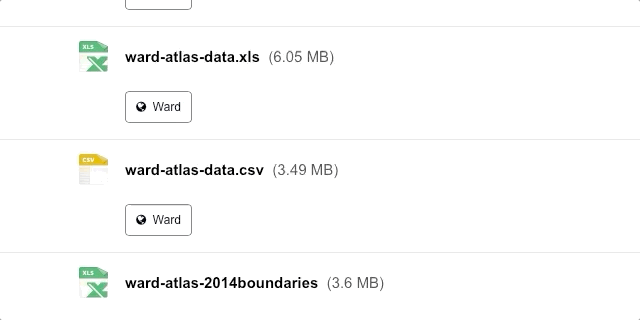
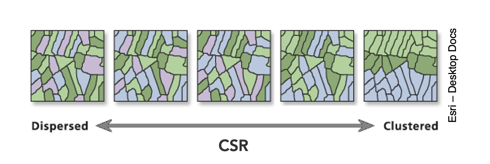

# (PART) Core Spatial Analysis {-}

# Analysing Spatial Patterns I: Spatial Auto-Correlation & Regression

Welcome to Week 6 in Geocomputation!

This week marks a big change in our Geocomputation adventure as we begin to fully focus on **spatial analysis** using R-Studio and R programming simply as a **tool** to conduct this analysis.

Everything we do over the coming weeks *could* be completed in Q-GIS (or many other GIS software), but to adhere to our data science principles - and to ultimately make our lives easier - we focus on learning how to excecute spatial analysis in R.

We will now slightly **change the structure** of our workshops to reflect this new focus. As you'll find, the content of the workshops will be more practical-led, with short lectures provided where necessary.

We will continue to on one variable (and thus dataset) throughout and build our script to reflect our investigation - whilst also still using the terminal, when applicable.

As a result, all workshops will begin from now on with a bit of "script housekeeping" - we will always start our content by first creating a new script, adding the **dependencies** (i.e. libraries) you'll need for this week's content and then download, clean and load the **data** ready to begin the main workshop content. 

We will **not** cover the programming principles used in our code *if* we have covered it in previous practicals **but** if we come across something new, we will of course provide an explanation.

We have a small bit of data cleaning to do this week, so we best get started!

### Week 6 in Geocomp {-}

```{r 06-welcome, warnings=FALSE, message=FALSE, echo=FALSE, cache=TRUE, tidy=TRUE}
library(vembedr)
embed_msstream('4854f460-3223-4555-a50b-07ed43afa051') %>% use_align('center')
```
<center>[Video on Stream](https://web.microsoftstream.com/video/4854f460-3223-4555-a50b-07ed43afa051)</center><br>

This week's content introduces you to two spatial analysis techniques: spatial autocorrelation and regression with spatial data. We have three areas of work to focus on:

1. What is spatial autocorrelation
2. How to define neighbours both theoretically and programmatically for use in spatial autocorrelation and regression
3. How to factor spatial autocorrelation into regression models

This week's content is split into **4** parts:

1. [Workshop Housekeeping] (30 minutes)
2. [Analysing Spatial Patterns] (10 minutes)
3. [Analysing Distributions] (90 minutes)
4. [Analysing Relationships] (25 minutes)

This week, we have **1 lecture** and **2 assignments** within this week's workshop.

:::puzzle
**Learning Objectives**<br><br>
By the end of this week, you should be able to:

* Understand how to analyse distributions of (areal) spatial data through visual and statistical analysis 
* Explain the different approaches to defining neighbours within spatial autocorrelation
* Run different types of spatial autocorrelation techniques and understand their differences
* Understand the basics of incorporating the issue of spatial autocorrelation into regression
:::

This week, we are using a completely new dataset and investigating a different phenomena: **childhood obesity**.

We'll be investigating its **distribution** across London at the **ward scale** and then start to look into the different factors that might contribute to obesity in children, which will be resumed in one of the optional practicals in Week 10.

To complete this analysis, we'll be using a **single data download from the London Datastore**, which we'll need to clean, wrangle and then join to one of our Ward shapefiles in order to spatially investigate the distribution of childhood obesity - and then analyse factors that might contribute toward it.

***
### Workshop Housekeeping {-}

As stated above, we'll start each week with a workshop housekeeping section where we'll outline the datasets (and cleaning) and libraries you'll need for your analysis. 

It's up to you if you want to do this before listening to the lectures in the relevant sections - but don't forget to do this, or you won't have any data to analyse.

We provide instructions on how to clean your data and then the reminder to load it within your R script. 

#### Setting up your script {-}

1. Open a new script within your GEOG0030 project (Shift + Ctl/Cmd + N) and save this script as `wk6-obesity-spatial-analysis.r`.

2. At the top of your script, add the following metdata (substitute accordingly):

```{r 06-scr-title, warnings=FALSE, message=FALSE, cache=TRUE, tidy=TRUE}
# Analysing childhood obesity and its factors
# Script started February 2021
# NAME
```

#### Dependencies (aka libraries) {-}

Now we'll install the libraries we need for this week.

`spdep` contains the relevent functions to run our various spatial autocorrelation tests, whilst `RColorBrewer` enables us to use colour palettes from ColorBrewer family within our maps - more on this later. 

You'll need to install these two libraries, plus `janitor` that will be used to clean our file names, using the `install.packages(c("janitor", "spdep", "RColorBrewer"))` command **in your console**.

3. **Within your script**, add the following libraries for loading:

```{r 06-scr-libs-all, warnings=FALSE, message=FALSE, cache=TRUE, tidy=TRUE}
# Libraries used in this script:
library(tidyverse)
library(here)
library(magrittr)
library(sf)
library(tmap)
library(janitor)
library(spdep)
library(RColorBrewer)
```

Remember to select the lines of code you want to run and press **CMD (Mac)/CTRL(Windows) + Enter/Return** - we won't remind you to run each line of code in the remainder of the practical sessions.

#### Datasets for this week {-}

We are going to only need **two** datasets for this week - our **London Ward boundaries** from **2011** and the **Greater London Authority (GLA) Ward Atlas and Profiles**.

The GLA Ward Atlas and Profiles provide a range of demographic and related data for each ward in Greater London and were specifically designed to provide an overview of the ward's population by collating and presenting a range of data on the population, diversity, households, life expectancy, housing, crime, benefits, land use, deprivation, and employment (GLA, 2014).

Indicators in the Atlas/Profile include:

* Age and sex
* Land area, projections and population density
* Household composition, religion, ethnicity
* Birth rates (general fertility rate), death rates (standardised mortality ratio), life expectancy
* Average house prices, properties sold, housing by council tax band, tenure, property size (bedrooms), dwelling build period and type, mortgage and landlord home repossession
* Employment and economic activity, Incapacity Benefit, Housing Benefit, Household income, Income Support and JobSeekers Allowance claimant rates, dependent children receiving child-tax credits by lone parents and out-of-work families, child poverty
* GCSE results, A-level / Level 3 results (average point scores), pupil absence, 
* Child obesity 
* Crime rates (by type of crime), fires, ambulance call outs, road casualties 
* Happiness and well-being, land use, public transport accessibility (PTALs), access to public greenspace, access to nature, air emissions / quality, car use, bicycle travel
* Indices of Deprivation
* Election turnout

i.e. a lot of data!

The main dataset utilises the **2011 Ward Boundaries as its spatial representation**, therefore **we need to use the 2011 boundaries**. 

The data is collected from a range of data sources, which you can read about on the website prior to downloading. The Atlas dataset combines data from 2011 - approximately 2015. 
*There is an additional excel workbook that contains the data referenced to the 2014 boundaries, but this requires some manual cleaning to use that we don't want to do this week!*

:::note
**Data Currency and Spatial/Temporal Compatibility**<br>

2015 certainly feels like a long time ago - and 2011 is even longer! Currency of data is a big issue when we are looking to compare data - for example, as many of you are finding with your own dissertation research, the UK's last census was in 2011. This means our main source of detailed small area data is quite outdated and we're a year or two away from this year's census (data to be collected soon!) being available for academic research. 

But, what you might have seen via the London Data Store and some of the Data Portals I've mentioned, is that there are many more recent datasets out there to analyse - from Mean Income estimations readily available for 2019, to our Population Estimates, as well as other data such as the **2019** Index of Multiple Deprivation.

However, when you do find more recent datasets like these, you can often run into **spatial incompability** issues - particuarly in our situation when using the **Ward** spatial unit, which has changed **THREE** times since the last census. 

What you might find is that the data you download can only be used with boundaries from specific years - so if you want to analyse data across different iterations of the Ward boundaries, you'll need to find a way of "translating" the data into one version of the boundaries. 

Now this in itself comes with many complications - particularly when it comes to thinking through the implications this may have due to the statistical collection and representation of the sampled population within the dataset!

There is no easy way to solve this but follow the best practice advice that comes with the datasets. In our case, we have been able to find this Ward Atlas that provides the data we need for our analysis - but you might not always be so lucky.

One more thing in terms of **temporal compatibility** - it is *ok* to mix data from different years (within reason!), as long as you show consideration to the different currency of your datasets. A good rule of thumb is with 3-5 years.
:::

**Downloading our data**

We already have our 2011 London Ward boundaries within our **raw** data folder, so we only need to download our Ward Atlas.

1. Navigate to the Ward Atlas dataset in the London Data Store [here](https://data.london.gov.uk/dataset/ward-profiles-and-atlas).

2. Download the `ward-atlas-data.csv`.
    + You might find that instead of downloading the file, your browser will open up a new window. You have two options:
        + 1) Copy and paste all contents of the page into a text editor such as Notepad and save your pasted contents as `ward-atlas-data.csv` in your **raw** data folder - make sure to add the `.csv` to the end of your file name to save your text file as a `csv.
        + 2) Click back to the dataset page, right-click on the `ward-atlas-data.csv` name and select **Download Linked File** from your computer's options. Move this into your **raw** data folder. *This is the easier approach of the two*.

```{r echo=FALSE, out.width = "450pt", fig.align='center', cache=TRUE, tidy=TRUE}

```

Make sure you store this in your raw folder.

**Loading our data**

Let's first load our London Ward shapefile from our **raw -> boundaries -> 2011** folder.

1. Load the 2011 London Ward boundaries.

```{r 06-load-shp, warnings=FALSE, message=FALSE, cache=TRUE, tidy=TRUE}
# Read in our London Ward boundaries
london_ward_shp <- read_sf("data/raw/boundaries/2011/London_Ward_CityMerged.shp")
``` 

We can both `View()` and `plot()` the data in our **console** to check what our data looks like.

We're happy with the dataframe (its field names) and what's its looking like as a shapefile, so we do not need to do any cleaning on this dataset.

We can now turn to our **London Ward Atlas** dataset and load the dataset into R.

2. Load the Ward Atlas Data csv.

```{r 06-load-csv, warnings=FALSE, message=FALSE, cache=TRUE, tidy=TRUE}
# Read in our ward atlas data csv from our raw data folder
all_ward_data <- read_csv("data/raw/ward-atlas-data.csv")
``` 
*Don't worry if you get a few parsing errors, the dataset is not structured in a "tidy" way yet!*

If you go ahead and view the data, you'll see we have **a lot** of information about our Wards in the dataset - we have a total of **946 variables** four our 629 wards.

We can't exactly analyse all of these variables, so we'll need to extract only the variables we need.

**Selecting our variables for analysis**

To clean our data and extract the variables for our analysis, we need to identify those most useful to our research.

Of course, we need to find a variable that matches our phenomena of investigation: child obesity.

We then need to identify the variables that most match the "explanatory factors" we think might contribute to childhood obesity. 

In conventional research, aka what you'll do for your dissertation, the selection of these factors would always be **informed by research**. We would conduct an **extensive Literature Review** to identify the common factors associated with childhood obesity and then look to find data and the right variables to reflect these factors.

In our case, I've conducted a *brief* review of the literature ( ;) ) and identifed that generally there are two sets of factors that may contribute to childhood obesity:

1. **Individual level factors**: diet and exercise, parents' weights, mode of travel to school / time taken to walk to school.
2. **Household/societal level factors**: area deprivation, household income, household employment

You can read a little more into these factors in [this review](https://www.ncbi.nlm.nih.gov/pmc/articles/PMC557218/) by Mayor in 2005 of the "Health Survey for England: Obesity Among Children Under 11" report that was published by the Department of Health, based on their surveys. 

This report is pretty old - but this gives us opportunity to investigate into the current(-ish) situation of childhood obesity and see if these findings still are similar 10 years later.

Within our Ward Atlas dataset, however, we will not be able to capture the **individual** level factors due to the nature of the data - we would need those individual level datasets that the Department of Health have access to! 

The next best thing we can do is an investigation into the more household/societal level factors that might impact childhood obesity.

With the above study in mind, the variables we'll look to include are:

* Obesity of children *(Dependent)*
* Deprivation *(Explanatory / Independent)*
* Household Income *(Explanatory / Independent)*
* Household Employment *(Explanatory / Independent)*

Plus a few others that have featured in more recent literature:

* House Price *(Explanatory / Independent)*
* Access to Greenspace *(Explanatory / Independent)*

These are all available within our dataset - we just need to extract them from our currently very large dataframe!

:::fyi
If you wanted to find more recent versions of these datasets for an even more updated analysis, you can find them as follows:

* **Deprivation data**: The latest Index of Multiple Deprivation is 2019. You can find all three versions, 2011, 2015, and 2019, [here](https://data.london.gov.uk/dataset/indices-of-deprivation). The 2019 dataset works with the 2018 Ward boundaries.
* **Obesity data**: The obesity data is extracted from the National Child Measurement Programme (NCMP). This program measures the height and weight of children in Reception class (aged 4 to 5) and year 6 (aged 10 to 11), to assess overweight and obesity levels in children within primary schools. The latest dataset is available from 2017/2018 - 2019/2020 directly from the NHS [website](https://digital.nhs.uk/services/national-child-measurement-programme/). The newer datasets can work with 2018 boundaries but there are a few errors.
* **Greenspace access**: Access to greenspace in London is produced by GIGL. The most recent dataset (used in this analysis) is found [here](https://data.london.gov.uk/dataset/access-public-open-space-and-nature-ward). This dataset works with 2011 boundaries.
* **House prices**: Yearly house price datasets (up to 2017, instead of 2014) [here](https://data.london.gov.uk/dataset/average-house-prices). These datasets work with the 2014 ward boundaries.
* **Household income**: Yearly income datasets (up to 2018, instead of 2014) [here](https://www.ons.gov.uk/peoplepopulationandcommunity/personalandhouseholdfinances/incomeandwealth/bulletins/householddisposableincomeandinequality/financialyearending2020provisional). These datasets work with MSOA boundaries.

Again, you'll run into issues of incompatability if you try to analyse across these datasets and their variables without additional processing.
:::

Let's go ahead and get the data extracted and cleaned. 

**Extracting and cleaning (wrangling) our dataset**

This week, our data wrangling is quite minimal - but it is important you follow all the steps to ensure you have the correct final dataframe for our analysis.

Overall, you will:

* Select the required columns for our dataframe and analysis
* Remove the first row, which contains data for the whole of England, not a Ward
* Clean and rename our field columns
* Coerce our variables into the correct data type for our analysis
* Join our 'atlas data' dataframe to our ward spatial dataframe

Now for this week, I've done the hardest bit for you - I've scrolled through **ALL** 946 variables to identify the fields that we need to extract for our analysis.

The fields that we need to extract from our dataset include:

* **838**: Childhood Obesity Prevalence; Year 6 (School children aged 10-11); 2011/12 to 2013/14: % obese
* **900**: Indices of Deprivation; IDACI; 2010
* **248**: House Prices; Median House Price; 2014
* **353**: Household Income; Mean Modelled Household income (\xa3); 2012/13
* **373**: Employment; Adults not in Employment - 2011 Census; % of households with no adults in employment with dependent children
* **377**: Qualifications; Qualifications and Students - 2011 Census; % No qualifications
* **859**: Access to green space and nature; % homes with deficiency in access to nature; 2012
* **865**: Public Transport Accessibility; Average PTAL score; 2014

and of course:

* **2**: X2 - which contains our ward codes.
* **4**: X4 - which contains our ward names.

(The Xs were part of the bad formatting R interpreted as it parsed the csv).

Now I've included the index number of each field as we're going to use these within our selection. 

Currently our variable names are a) very long and b) contain spaces and special characters in them, which make them pretty useless for selection. 

Using the index approach will make this much easier (*refer back to last week's practical if you've forgotten what indexing is!*).

3. Select our 10 fields from our `all_ward_data` dataframe for use in analysis.

```{r 06-clean-csv, warnings=FALSE, message=FALSE, cache=TRUE, tidy=TRUE}
# Select our 10 fields for analysis using their index number
obesity_ward_data <- select(all_ward_data, 2, 4, 838, 900, 248, 353, 373, 377, 859, 865)
``` 

You should now have a new dataframe with our 10 variables. We've still got a bit of cleaning to do, before we're happy.

One issue with our original csv is that is contained two rows worth of field names - hence if you look at the first row of our dataframe, it doesn't make sense. We therefore want to remove this row.

In addition, it would be good to clean up our names for use - here we're going to use the `janitor` library that I mentionned last week, which cleans our names by removing white space, special characters, capitals etc.

Let's use a pipe to do this all at once. We'll overwrite our current variable.

4. Remove the first line of our dataframe and clean our field names.

```{r 06-clean-csv-2, warnings=FALSE, message=FALSE, cache=TRUE, tidy=TRUE}
# Remove our first row, clean the names of our fields
obesity_ward_data <- obesity_ward_data %>% slice(-1) %>% clean_names()
``` 

This dataframe is already looking much better! We can now see our dataframe as the "tidy data" format.

The final thing we can do with this dataset before we need to join it to our London Wards spatial dataframe is just tidy up our column names - X2 and X4 does not exactly mean much to us and it gives us a chance to shorten the names of the other variables (we could leave them as is now they've been cleaned, but it'll be easier for reference later if they're shorter!).

*Note, I decided to keep the information on the year of the dataset to help with our analysis later.*

5. Rename our columns to shorter field names.

```{r 06-rename-df, warnings=FALSE, message=FALSE, cache=TRUE, tidy=TRUE}
# Rename field names of ward data to something more useful
names(obesity_ward_data) <- c("ward_code", "ward_name", "y6_obesity_2014", "IDACI_2010", "med_house_price_2014", "mean_hh_income_2013", "per_no_adult_employ_2011", "per_no_qual_2011", "per_deficiency_greenspace_2012", "PTAL_2014")
``` 

Now we have the data we want to map, we need to do a final spot of checking - one of the main issues faced with loading data directly from a csv in R without cleaning it first in a spreadsheet program as we've done before, is that we can't guarantee that the data will be loaded correctly. 

Unfortunately with our current dataframe we can see that this is the case - if you look at your global environment and find our `obesity_ward_data` variable and click on the arrow button to display its variables, you'll see that several of our variables are of the type `char`. 

This means that these variables have been interpreted by R to be characters rather than numerics. This might be because there is some missing data or in some cases, the decimal point can interfere with the data being read as a numeric.

Luckily it's quite easy to change our data type - a bit like right-clicking on our columns in Excel and setting the format of the column to `number`, we'll do this using code.

If we wanted to apply this to a single column than we would use the code: 

`as.numeric(dataframe$column)`

but as we want to apply this across a few columns, we'll be using the `mutate_at()` function from the `dplyr` library.

If you look at the documentation for `mutate_at()`, it states that it can apply the same transformation to a selection of variables, in our case, our columns.

We'll need to use a litte more complicated code that we came across last week that states that for each of our 'variables' (i.e. our columns), we want to run a function on it where the varialbe is defined as `x`. We then state our function which is to first coerce our column into the `as.character()` data type (to double check it is!) and then coerce is into the numeric data type through using `as.numeric()`.

6. Change the data type of our variable columns to numeric.

```{r 06-rechar-df, warnings=FALSE, message=FALSE, cache=TRUE, tidy=TRUE}
# Rename field names of ward data to something more useful
obesity_ward_data <- mutate_at(obesity_ward_data, vars(y6_obesity_2014, mean_hh_income_2013, per_no_adult_employ_2011, per_no_qual_2011, per_deficiency_greenspace_2012, PTAL_2014), function(x) as.numeric(as.character(x)))
``` 

You will see warnings that NAs have been introduced by this coercion in three of our variables: `y6_obesity_2014`, `per_deficiency_greenspace_2012` and `PTAL_2014` - this is something we'll need to be aware of later in our analysis, but will not look at right now.

Now our final step is to join our final `obesity_ward_data` dataframe to our `london_wards_shp` spatial dataframe so we can complete both statistical and spatial analysis.

7. Join our `obesity_ward_data` dataframe to our `london_wards_shp` spatial dataframe - store as a new variable.

```{r 06-join-dfs, warnings=FALSE, message=FALSE, cache=TRUE, tidy=TRUE}
# Join obesity df to ward sdf for analysis
obesity_ward_sdf <- left_join(london_ward_shp, obesity_ward_data,  by = c("GSS_CODE" = "ward_code"))
``` 
*I told you we'd be doing a lot of these attribute joins!*

Have a look at your newly created spatial dataframe - for a quick look at the data, you can run the `plot()` command in **your console**. We'll explain more about the different measures we've extracted during the rest of the workshop.

If you'd like, you can also write out the final csv using the `write.csv` function to save a raw copy in your data folder. 

Other than that, we're now ready to start the main content of our workshop today: analysis of spatial patterns through spatial autocorrelation and regression.

### Analysing Spatial Patterns {-}

If you remember from our introductory content - or have listened to my videos on your dissertations - you should know by now that when it comes to spatial analysis in research, we're looking to achieve one (or more) of three things:

1. **Analyse the distribution of a phenomena** 
2. **Analyse the relationship between phenomena, to identify factors/predictors**
3. **Create new spatial data that can then be used in the above**

In today's practical, we'll be looking at how we can conduct the first two, whereas in future practicals, we'll also be looking at ways we can use spatial analysis to create new data that can then be used in applications of (1) and (2). 

An example of this is looking at the use of **network analysis** to calculate the distances for use within different types of **accessibility measures**. 

For example, in addition to the variables we are using today, we could look to create a further variable that measures the average distance each school in our wards is to their nearest fast food outlet. *We'll actually see this in action in one of our optional practicals in Week 10.*

A further approach is using these measures to **create indices**. 

An example of this involving network analysis, that we'll use today, are **Transport for London's (TFL) Public Transport Accessibility Levels (PTALs)**. The PTALs are a detailed and accurate measure of the accessibility of a point to the public transport network.

They take into account walk access time and service availability. The method is essentially a way of measuring the density of the public transport network at any location within Greater London. You can read more about the methodology behind the PTALs [here](https://data.london.gov.uk/dataset/public-transport-accessibility-levels) and see them in action in TFL's short video:

<center>**TFL's PTALs and WebCat **</center>
```{r 06-TLF-video, warnings=FALSE, message=FALSE, echo=FALSE, cache=TRUE, tidy=TRUE}
library(vembedr)
embed_youtube('FPIIPWW5V3c') %>% use_align('center')
```
<br>

As you can see from the examples, the network analysis is used to provide information on the **distribution** of London's transport network to better allocate services and identify areas of improvement.

**Spatial analysis is our way - as geographers and spatially-fascinated thinkers - therefore to discover spatial patterns, processes and relationships (including taking into account the ‘special’ properties of spatial phenomena) within specific pheonomea or entities, using using their topological, geometric or geographic properties, and validate them with statistical and spatial quantification.**

This quantification is made possible by a variety of techniques that are all underpinned by key laws of geography and spatial principles and properties.

For us, today, we are interested in looking at two different types of analysis techniques that address two key properties of spatial data:

* **Spatial Autocorrelation**: the effect of spatial processes on distributions.
* **Spatial Heterogeneity**: the covariances of processes over space.

We'll be using our newly created `obesity_ward_sdf` to investigate these two properties in action, whilst also answering questions on the overall distribution and factors of childhood obesity.


### Analysing Distributions {-}

Whenever dealing with data, our first question as analysts is to understand its distribution. 

As geographers and spatially-fascinated thinkers, analysing a data's distribution will mean two things to us:

* **A statistical analysis of distribution**
* **A spatial analysis of distribution**

We're pretty lucky that we get to think about data in a slightly different way to those thinking about pure statistics. 

After all, adding a spatial component to distribution is pretty darn important when we're looking at spatial phenomena and processes, even when looking just at statistical distribution, as we'll see in the rest of the workshop.

#### Statistical Analysis of Distributions {-}

Within general data analysis, when it comes to analysing the distribution of your data, you are looking to conduct what is known as **Exploratory Data Analysis** (EDA) which is where we look to summarise the main characteristics of our data.

EDA was promoted by prominent statistician John Tukey to encourage data anlaysts to explore their data outside of traditional formal modelling - and come up with new areas of investigation and hypotheses. 

According to Wikipedia (that well-known academic resource!), Tukey promoted the use of five summary statistics: **the max-min, the median, and the quartiles**, which, in comparison to the mean and standard deviation, provide a more robust understanding of a data's distribution, particularly if the data is skewed.

We looked at how we can use R to extract some of these summary statistics briefly in Week 4, but let's have a look at how we can add further to this EDA, including creating some statistical charts of our data's distribution. 

##### Understanding the statistical distribution of childhood obesity {-}

In Week 4, we looked at how we can display individual descriptive statistics about our dataset. 

To make things even easier for us, we can instead, we can use a single function to find out about the distribution of our data: `summary()`.

1. In your script, below your joining of our dataframes, summarise our `y6_obesity_2014` distribution.

```{r 06-summ-distr, warnings=FALSE, message=FALSE, cache=TRUE, tidy=TRUE}
# Summarise our obesity_ward_sdf data column. Remember we use the $ to access the specific column we want to assess
summary(obesity_ward_sdf$y6_obesity_2014)
``` 

*You can save the output of your function to a variable if you'd like - or else, just take a look at the numbers printed in the console.*

This 'summary()' function can also be called on the dataset as a whole and will generate summary statistics for each individual numeric variable. You can execute this in your console if you'd like to get an understanding of all of variables - although we'll focus on obesity for much of this practical.

We can see that our **Median** and **Mean** are quite close to one another - and the quartiles are nearly the same amount apart from the mean, so we can start to think that our data is normally distribution.

To confirm this, we can do the next best thing, which is plot our distribution using a **histogram**, using the base R `hist()` command.

2. Plot the histogram of our `y6_obesity_2014` distribution.

```{r 06-hist, warnings=FALSE, message=FALSE, cache=TRUE, tidy=TRUE}
# Plot the histogram of our y6_obesity_2014 data. Remember we use the $ to access the specific column we want to assess
hist(obesity_ward_sdf$y6_obesity_2014)
``` 

We can actually see our data has a slight negative skew - which would make sense given that our median is higher than our mean.

```{r echo=FALSE, out.width = "650pt", fig.align='center', cache=TRUE, tidy=TRUE}
knitr::include_graphics('images/w6/distributions.png')
```
<center>*Cheatsheet on data distributions: negative skew, normal, positive skew. Source: Wikipedia*</center><br>

Just like our maps from last week, we can further customise our histograms if we want to make them more aesthetically pleasing and upate the title and axis labelling.

3. Change the colour of our hisogram and change the labelling of our histogram.

```{r 06-hist-2, warnings=FALSE, message=FALSE, cache=TRUE, tidy=TRUE}
# Plot a fancy histogram of our y6_obesity_2014 data. Remember we use the $ to access the specific column we want to assess
hist(obesity_ward_sdf$y6_obesity_2014, col="grey", main="Distribution of Obesity in Year 6 children within London Wards in 2014", xlab="Percentage of obese Year 6 children in the ward")
``` 

We can also, as per our maps last week, export this histogram and save it as a PNG by a) storing the histogram code to a variable and b) saving this variable to a file. 

The code to do so is a little different - we essentially "open up" a file, called what we want to name our plot. We then run the code to plot our data, which will place the output "within" the file and then "close' the file down.

*Note, I've also created a new folder called `graphs` within my project.*

4. Export our plot to an image in our graphs folder.

```{r 06-hist-3, warnings=FALSE, message=FALSE, cache=TRUE, tidy=TRUE, eval=FALSE}
# Open a PNG, give it the filename we want
png("graphs/Y6_obesity_distribution.png")

# Run the same plot code to save our output into this opened png
hist(obesity_ward_sdf$y6_obesity_2014, breaks=10, col="grey", main="Distribution of Obesity in Year 6 children within London Wards in 2014", xlab="Percentage of obese Year 6 children in the ward")

# Close the PNG
dev.off()
``` 
You should now see the image appear in your graphs folder.

Another type of chart we can create just using the base R library is a **boxplot**.

```{r echo=FALSE, out.width = "650pt", fig.align='center', cache=TRUE, tidy=TRUE}
knitr::include_graphics('images/w6/boxplot.png')
```
<br>

A boxplot shows the core characteristics of the distributions within a dataset, including the interquartile range.

5. Plot the boxplot of our `y6_obesity_2014` variable.

```{r 06-boxplot, warnings=FALSE, message=FALSE, cache=TRUE, tidy=TRUE}
# Plot the boxplot of our y6_obesity_2014 data. Remember we use the $ to access the specific column we want to assess
boxplot(obesity_ward_sdf$y6_obesity_2014)
``` 

It's not exactly the most exciting graph now is it!

There is actually a lot more we can do in terms of visualising our data's distribution - and the best way forward would be to become more familiar with the `ggplot2` library, which is the main visualisation for both statistical and, increasingly, spatial graphs, charts and maps.

The library is quite complex - and learning how to use it isn't the aim of this week's practical so we won't cover this in any more detail now. 

##### Why do I need to care about my data's distribution? {-}

We've now managed to investigate the statistical distribution of our data - but what does that mean for us as data analysts?

Well put simply, we need to understand our data's distribution if we want to test relationships between different variables, for example using linear regression.

If we see that there is a gaussian (normal) distribution across two of our variables, it is likely that there will be a (linear) relationship between our dependent and independent variables.

Ensuring our variables are **normally distributed** is a key assumption of being able to run a linear regression - as we'll read about later below.

:::assignment
**Assignment 1: Distribution of our explanatory variables**<br>

Your first assignment this week is to go ahead and test each of our variables to determine their distribution.

Make a note of which ones are normally distributed and which aren't (and their skew) - we'll need to address this later in the workshop.
:::

From conducting your assignment above, you should see that not all of our variable have a normal distribution (in fact, there is only one that really looks somewhat "normal"!). 

As a result, when it comes to our relationships, we're going to need to transform our values to see if we can achieve a linear relationship - but more on that later.

There is some debate as to whether this is a wise thing to do as, amongst other things, the coefficients for transformed variables are much harder to interpret.

#### Spatial Analysis of Distributions {-}

Whilst statistical analysis of distributions focus on tests and charts, when we want to understand the spatial distribution of our phenomena, we have a very simple solution: **we make a map!**

In our case, we're looking at areal unit data and therefore we can use a choropleth map to study our data across the wards: 

```{r 06-facet-map, warnings=FALSE, message=FALSE, cache=TRUE, tidy=TRUE, echo=FALSE}
# Store our months as a variable
var_fields <- names(obesity_ward_sdf)[10:17]

# Map all our months at once
tm_shape(obesity_ward_sdf) + tm_polygons("gray", border.col = "gray") + tm_shape(obesity_ward_sdf) + tm_polygons(col = var_fields) + tm_layout(legend.show=FALSE) + tm_facets(ncol=3)
``` 
<br><center>*Our variables (l-r, t-d): Yr 6 Obesity, IDACI, Median House Price, Mean Household Income, Percent No Adult Employment, Percent No Qualifications, Percent Deficient in Greenspace, PTAL *</center><br>

And specifically, we can create a single output choropleth map for each of our variables to visually understand their distribution.

In this case, I've copied the code from Week 5's map-making, changed the colour scheme and titles, but quite quickly managed to make a map of our obesity variable to further understand it's distribution.

<center>*Note, you do not need to copy this code over into your script - but provided as a reference to see how this map was made.*</center>


```{r 06-obesity-map, warnings=FALSE, message=FALSE, cache=TRUE, tidy=TRUE}
# Creating a map template for us to use, legend outside
tm_shape(london_ward_shp) + tm_polygons("gray", border.col = "gray") + tm_shape(obesity_ward_sdf) + tm_polygons(col = "y6_obesity_2014", n = 5, style = "jenks", title="Percentage of children ", palette="Purples", border.col="white") + tm_layout(main.title='Obesity of Year 6 children in London Wards in 2014', main.title.fontface = 2, fontfamily = "Helvetica", legend.outside = TRUE, legend.outside.position = "right", legend.title.size = 1, legend.title.fontface = 2) + tm_compass(type="arrow", position = c("right", "bottom")) + tm_scale_bar(breaks = c(0, 5, 10, 15, 20), position = c("left", "bottom"))
``` 

The thing with spatial distributions is that we can quickly pick up on spatial patterns present within our data just by looking at the data (although we will also miss some others!) - and we can even provide a description of the patterns we see.

For example, in our obesity example, we can see there are clusters of high levels of obesity in East London, whilst there are clusters of low levels of obesity in the south east and south west areas of London.

However, reflecting on our statistical analysis above, wouldn't it be great if there were "metrics" out there that could actually account for and quantify these visible clusters?

Well, luckily for us, several geographers and spatially-enabled thinkers thought the same way - and came up with an approach to quantify these clusters.

:::note
**Dealing with NAs in our dataset**<br>
Every time I write a tutorial for the class, a little pesky data issue always has to come up and surpise me - and this is no difference with this workshop.

If you remember earlier, when we coerced our variables into numeric values, we also introduced NAs into several variables. The issue is, the analyses we will conduct below will **not** work with NAs.

I've checked the `obesity_ward_sdf` and it appears (and validated by our earlier facet choropleth map) that only our `yr6_obesity_2014` variable contains NAs. *Do double-check your own dataframe to make sure this is the case.*

To move forward with our analysis, we need to remove those wards that do not contain any obesity information from our spatial dataframe - this will have some issues in terms of how we think about our "neighbours", explained further below, but will allow us to run the code required.
:::


1. Remove the wards in our `obesity_ward_sdf` that do not contain any obesity information.

```{r 06-removeNAs, warnings=FALSE, message=FALSE, cache=TRUE, tidy=TRUE}
# Remove NAs using the filter function from dplyr and the ! (not) NA function
obesity_ward_sdf <- obesity_ward_sdf %>% filter(!is.na(y6_obesity_2014))
``` 

### Spatial Autocorrelation and Clustering Analysis {-}

>“The first law of geography: Everything is related to everything else, but near things are more related than distant things.” *Waldo R. Tobler (1970)*

When you attach values to the polygons of wards in London, and visualise them, different patterns appear, and the different shapes and sizes of the polygons effect what these patterns look like and how prominent they are to the human eye. 

There can appear to be clusters, or, in some cases, the distribution can be random. 

When values are clustered, this issue is known as spatial autocorrelation and results from what is known as **spatial dependence**.

```{r echo=FALSE, out.width = "650pt", fig.align='center', cache=TRUE, tidy=TRUE}
knitr::include_graphics('images/w6/Random_maps.png')
```
<center><br>*Understanding spatial dependence on variables. Source: Manuel Gimond.*</center><br>

Spatial dependence is the idea, as introduced in the second week via Tobler’s Law (1970) that **"everything is related to everything else, but near things are more related than distant things"**. 

In Week 2, we used Tobler's Law to determine how we can create sample schemes for collecting spatial data. When it comes to spatial analysis, we can use the law to help identify clusters.

Within spatial analysis, this dependence can be assessed and measured statistically by considering the level of spatial autocorrelation between values of a specific variable, observed in either different locations or between pairs of variables observed at the same location. 

Here we assume that the observed value of a variable in one location is often dependent (to some degree) on the observed value of the same value in a nearby location. As a result, spatial autocorrelation occurs when these values are not independent of one another and instead cluster together across geographic space.

On the opposite end of the spectrum, when our values our not clustered, then they will be spatially dispersed.

Finally, in the middle we have **complete spatial randomness** (CSR) - where our data's distribution shows no identifiable pattern whatsoever - it is useful to flag that this seldomly occurs.

```{r echo=FALSE, out.width = "650pt", fig.align='center', cache=TRUE, tidy=TRUE}

```
<center><br>*Dispersion, Complete Spatial Randomness and Clustering. Source: Esri.*</center><br>

We can assess the distribution of our data using what is known as spatial autocorrelation tests, which can be conducted on both a **global** (identify if the data is clustered) and **local** (identify the precise clusters) scales. 

Whilst these different tests quantify how clustered, how random, or how dispersed, these distributions are through various approaches, ultimately they provide us with statistical and spatial information that can be used to create quantifiable descriptions of a variable's distribution and how it vary over space. 

This can be incredibly useful when looking to explain and discuss a variable, particularly as the clustering present in one variable can be compared to another, which might be useful to make connections between underlying causes or possible solutions to the issues the original variable poses.

In our current focus, on childhood obesity, we can look to understand its distribution via these tests and then compare this distribution to that of the explanatory variables we've chosen above to see if we can identify similar patterns and determine whether we should look towards quantifying their relationship through regression techniques.

#### Lecture: What is spatial autocorrelation and how to define neighbours? {-}

Spatial autocorrelation, its different techniques and neighbour definitions are introduced in the main lecture for this week:

```{r 06-spatial-autocorrelation, warnings=FALSE, message=FALSE, echo=FALSE, cache=TRUE, tidy=TRUE}
library(vembedr)
embed_msstream('68ef203f-dc80-406c-939b-105f65a0b87c') %>% use_align('center')
```
<center>[Slides](https://liveuclac-my.sharepoint.com/:b:/g/personal/ucfailk_ucl_ac_uk/Ebdjr7Gx9zJFoYQNuh0uPkQBNH_WWxkX3_siAVEa7Z6YAQ?e=pgLdj5) | [Video on Stream](https://web.microsoftstream.com/video/68ef203f-dc80-406c-939b-105f65a0b87c)</center>
<br>

Aspects of the above short lecture are summarised below before we go ahead and conduct spatial autocorrelation tests on our `y6_obesity_2014` variable.

#### Different spatial autocorrelation techniques {-}

As shown in the lecture, we have several types of tests that look to quantify spatial autocorrelation. 

Of these tests, there are two categories:

* **Global statistical** tests (i.e. those that provide us with a statistic to tell us about autocorrelation in our datset) 
* **Local spatial** tests (i.e. those that provide us with the cluster maps).

These are outlined in the below table for easy reference:

|Test | Scale | Test | Output | Significance Value |
| :---- | :---| :--------------| :--------------| :---|
| Global Moran's I | Global | Tests how "random" the spatial distribution of values are, producing a correlation coefficient for the relationship between a variable (like income) and its surrounding values. | **Moran's I statistic:** <br> Metric between -1 and 1. <br> -1 = dispersed <br> 0 = CSR <br> 1 = clustered | Yes - $p$-value |
| Getis-Ord | Global | Tests for clusters of **high** and **low** values. <br> Works best with use of **distance/proximity weights**. | **Getis-Ord \(G_{i}^{*}\) statistic:** <br> gG > Expected = High values clustering <br> gG < Expected = Low values clustering | Yes - $p$-value |
| Geary's C | Global | Tests whether **similar** or **disimilar** values are clustering.  | **Geary C statistic:**  <br> 1 = No spatial autocorrelation <br> GC < 1 = Similar values clustering (positive spatial autocorrelation) <br> GC > 1 = Disimilar values clustering (negative spatial autocorrelation) | Yes - $p$-value |
| Local Moran's I | Local | Tests the difference between a unit of analysis and its neighbour(s).  | **Local Moran's I statistic:** <br> 1. Can be used alongside the mean of values to generate cluster type generations. <br>i.e. High-High, High-Low, Low-High, Low-Low, Insignificant. <br> 2. Can also use standard deviation of main local statistic to show just high and low clusters  | Yes - $p$-value |
| Local Getis-Ord | Local |  Identifies statistically significant hot spots and cold spots using the local Getis-Ord Gi* statistic.  | Can use the standard deviation of statistic to identify hot and cold spots | Yes - $p$-value |

In each of these cases, our $p$-values are psuedo $p$-values, generated through simulations such as that outlined in the lecture. 

Our pseudo p-values allow us to interpret our relationships with a level of confidence (but not surety as they are only pseudo values!).

If we find that our relationships do not have any significance, then we cannot be confident in presenting them as true results.

We'll look to deploy each of these techniques on our dataset today - but in the future, you do not need to use **all** of the techniques, but instead choose one (or two, e.g. global and local) that best help you explain the distribution in your data.

#### Understanding the spatial lag approach for Moran's I calculation {-}

Underlying our global Moran's I test is the concept of a **spatial lag model**.

A **spatial lag** model plots each value against the mean of its neighbours' values, defined by our selected approach. This creates a scatter plot, from which our Moran's I statistic can be derived. 

An Ordinary Least Squares (OLS) regression is used to fit the data and produce a slope, which determines the Moran's I statistic:


```{r echo=FALSE, out.width = "650pt", fig.align='center', cache=TRUE, tidy=TRUE}
knitr::include_graphics('images/w6/MoranI_scatter_plot.png')
```
<center><br>*A spatial lag model - plotting value against the mean of its neighbours. Source: Manuel Gimond.*</center><br>

To determine a $p$-value from our model for global Moran's I, this spatial lag model is computed multiple times (think hundreds, thousands) but uses a random distribution of neighbouring values to determine different slopes for multiple ways our data *could* be distributed, if our data was distributed by random.

The output of this test is a sampling distribution of Moran's I values that would confirm a null hypothesis that our values are randomly distributed. 

These slopes are then compared to compare our *observed* slope versus our *random* slopes and identify whether the slope is within the main distribution of these values or an outlier:


```{r echo=FALSE, out.width = "650pt", fig.align='center', cache=TRUE, tidy=TRUE}
knitr::include_graphics('images/w6/MC_sim_1.png')
```
<center><br>*A spatial lag model - plotting value against the mean of its neighbours. Source: Manuel Gimond.*</center><br>

If our slope is an outlier, i.e. not a value we would expect to compute if the data were randomly distributed, we are more confidently able to confirm our slope is reflective of our data's clustering and is significant.

Our *pseudo-*$p$-values are then computed from our simulation results:


<center>\(\frac{N_{extreme} + 1}{N + 1}\)</center>
<br>

Where \({N_{extreme}}\) is the number of simulated Moran's I values that were more extreme that our observed statistic and \({N}\) is the total number of simulations (Gimond, 2021).

In the example above, from Manuel Gimond (see acknowledgements), only 1 out the 199 simulations was more extreme than the observed local Moran's I statistic.

Therefore \({N_{extreme}}\) = 1 , so $p$ is equal to (1+1) / (199 + 1) = 0.01.

This means that *"there is a 1% probability that we would be wrong in rejecting the null hypothesis Ho.”*

This approach is known as a **Monte Carlo simulation** (or permutation bootstrap test).

This spatial lag model is not just used in Moran's I, but as you'll read about in our extension material below, is also needed for spatial regression. In this case, the model is used to introducing a "lag" or "lagged" variable.

#### Defining neighbours {-}

For any spatial autocorrelation test that you want to conduct, you will always need one critical piece of information: **how do we define 'neighbours' in our dataset to enable the value comparison.**

Every observation in a dataset will need to have a set of neighbours to which its value is compared.

To enable this, we need to determine how many or what type of neighbours should be taken into account for each observation when conducting a spatial autocorrelation test.

These 'neighbouring' observations can be defined in a multitude of ways, based either on geometry or proximity, and include:

* **Contiguity** neighbours: Queen / Rook (*plus order*)
* **Fixed Distance** neighbours: Euclidean Distance (e.g. within 2km)
* **(K) Nearest Neighbours**: Certain *n* number of closest neighbours

```{r echo=FALSE, out.width = "650pt", fig.align='center', cache=TRUE, tidy=TRUE}
knitr::include_graphics('images/w6/iffn.png')
```
<center><br>*Different approaches of conceptualising neighbours for spatial autocorrelation measurement: contiguity, fixed distance and nearest neighbours. Source: Manuel Gimond.*</center><br>

Depending on the variable you are measuring, the appropriateness of these different types of neighbourhood calculation techniques can change.

As a result, how you define neighbours within your dataset will have an impact on the validity and accuracy of spatial analysis. 

Whatever approach you choose therefore needs to be grounded in particular theory that aims to represent the process and variable investigated. 

Whilst we will not provide a range of examples here, I can highly recommend looking at Esri's Help Documentation on [Selecting a conceptualization of spatial relationships: Best practices](https://pro.arcgis.com/en/pro-app/latest/tool-reference/spatial-statistics/modeling-spatial-relationships.htm#GUID-729B3B01-6911-41E9-AA99-8A4CF74EEE27) when you come to need to define neighbours yourself for your own analysis.

For our analysis into childhood obesity, we will primarly use the **Queen contiguity** approach outlined in the lecture. 

This approach is *"effective when polygons are similar in size and distribution, and when spatial relationships are a function of polygon proximity (the idea that if two polygons share a boundary, spatial interaction between them increases)"* (Esri, 2021).

In our case, we are using Ward boundaries which are administrative boundaries and not necessarily reflective of the neighbourhoods and local processes at play in London that might contribute to childhood obesity. 

By selecting the contiguity approach, we can account for spatial interaction between our Ward communities and hopefully reduce issues caused by boundary effects.

### Analysing Spatial Autocorrelation in Childhood Obesity and Deprivation in London Wards {-}

Now we know a little more about spatial autocorrelation and how we can test for clusters in our datasets, let's go ahead and see if we can quantify the patterns evident in our `y6_obesity_2014` data's distribution.

This is where things start to get a little trickier and more technical - so if you've got to this point without a break, please take one now!

#### Defining neighbours for spatial weights {-}

Before we can calculate Moran’s I and any similar statistics, we need to first define our **spatial weights matrix**.

This is known mathematically as \(W_{ij}\) and this will tell our code (when we get there) which unit neighbours which, according to our neighbour definition.

For each neighbour definition, there is a different approach to implementing code to calculate the \(W_{ij}\) spatial weights matrix. 

Here, we will look at three approaches:

1. Creating a Queen \(W_{ij}\) spatial weights matrix
2. Creating a Rook \(W_{ij}\) spatial weights matrix
3. Creating a Fixed Distance \(W_{ij}\) spatial weights matrix

For either approach, we use a single line of code to create the relevant \(W_{ij}\) spatial weights matrix:

1. Create our three spatial weights matrices:
    + Queen
    + Rook
    + Fixed Distance (at 3000m / 3km
    
```{r 06-defining-neighbours, warnings=FALSE, message=FALSE, cache=TRUE, tidy=TRUE}
# Create a neighbours list based on the Queen neighbour definition
ward_neighbours_queen <- obesity_ward_sdf %>% poly2nb(., queen=T)

# Create a neighbours list based on the Rook neighbour definition
# Note, we just need to assign the queen parameter to FALSE
ward_neighbours_rook <- obesity_ward_sdf %>% poly2nb(., queen=F)

# Creates centroid and joins neighbours within 0 and 3000 'units' of the CRS, i.e. metres
ward_neighbours_fd <- dnearneigh(st_geometry(st_centroid(obesity_ward_sdf)),0, 3000)
``` 

**Visualising the differences in neighbours**

Creating our neighbours list through a single line of code, as above, doesn't really tell us much about the differences between these conceptualisations.

It would be useful to the links between neighbours for our three definitions and visualise their distribution across space.

To be able to do this, we'll use a few lines of code to generate a visualisation based on mapping the defined connections between the centroids of our wards.

:::note
**What are centroids?**<br>
We have not come across the concept of a centroid yet in our analysis but we can briefly explain them here today - although next week, we'll talk about them in a little more detail.

A centroid, in it's most simplest is the central point of an areal unit. How this central point is defined can be weighted by different approaches to understanding geometries or by using an additional variable. Again, we'll discuss this in a little more detail next week.

In our case, our centroids will reflect in the "central" point of our wards, determined by its geometric boundaries.
:::

We can calculate the centroids of our wards using one of the **geometric** tools from the `sf` library (more on these tools next week): `sf_centroid`.

1. Calculate the centroid of our Wards:

```{r 06-calc-centroids, warnings=FALSE, message=FALSE, cache=TRUE, tidy=TRUE}
# Calculate the centroids of all of the Wards in London, extract only the geometry (we do not need the other data/variables in our dataframe)
ward_centroid <- obesity_ward_sdf %>% st_centroid()
``` 

You can `plot()` the `ward_centroid` using the console if you'd like to see what they look like as spatial data.

Now we have our ward centroids, we can go ahead and plot the centroids and the defined neighbour connections between them from each of our neighbour definitions.

To do so, we'll use the `plot()` function, provide the relationships via our `ward_neighbours_X` list and then the geometry associated with these lists from our `ward_centroid()`

We use the `st_geometry` command to extract the geometry column of our centroids to create a "list" of our centroid's coordinates.

2. Plot our different neighbour definitions and their connections between centroids for visualisation:

```{r 06-plotting-neighbours, warnings=FALSE, message=FALSE, cache=TRUE, tidy=TRUE}
# We can plot these neighbours alongisde our centroids and polygon 
plot(ward_neighbours_queen, st_geometry(ward_centroid), col="red")
plot(ward_neighbours_rook, st_geometry(ward_centroid), col="blue", add=T)
plot(ward_neighbours_fd, st_geometry(ward_centroid), col="green", add=T)
plot (obesity_ward_sdf$geometry, add=T)
``` 

Ahah! We can see that there is definitely a difference in the number of neighbours when we use our different approaches.

It seems our fixed distance neighbour conceptualisation has much connections in the center of London versus areas on the outskirts. 

We can see that our contiguity approaches provide a more equally distributed connection map - with our Queen conceptualisation having a few more links that our Rook.

To explore further, you can either place a `#` comment signal in front of each line of code to "turn" it off as a layer in your map or rearrange the layering to see the different distributions of neighbours.

We can also type the different neighbours objects into the console to find out the total number of "non-zero links" (i.e. total number of connections) present within the conceptualisation.

You should see that Queen has 3560 non-zero links, Rook has 3474 and Fixed Difference has 8238.

Whilst this code simply explores these conceptualisations - and theorectically is not needed for your analysis - it helps us understand further how our different neighbourhood conceptualisations can ultimately impact our overall analysis.

#### Creating our spatial weights matrix {-}

With our neighbours now defined, we will go ahead and create our final (two) spatial weights objects that will be needed for our spatial autocorrelation code.

At the moment, we currently have our neighbours defined as a "list" - but we need to convert it to a "neighbours" object.

3. Convert our lists of neighbours for our two definitions (Queen and Fixed Distance) into neighbour objects using the `nb2listw()` function:

```{r 06-creating-neighbours, warnings=FALSE, message=FALSE, cache=TRUE, tidy=TRUE}
# Create a neighbours list
ward_spatial_weights_queen <- ward_neighbours_queen %>% nb2listw(., style="C")
# Creates a neighbours list based on the Fixed Distance neighbour definition
ward_spatial_weights_fd <- ward_neighbours_fd %>% nb2listw(., style = 'B')
``` 

We'll be using the Queen definition for the majority of our tests, but use the Fixed Distance for Getis-Ord. 

You can have a look at the differences between our neighbours lists and the neighbours objects by looking at the variables in your Environment - you should see that for our `ward_spatial_weights_X` object, we now have a column that defines the respective weights for each of our neighbour lists.

We're now ready to run our spatial autocorrelation tests!

#### Running our Spatial Autocorrelation Tests {-}

We're going to run all **five** autocorrelation tests in relatively quick succession:

* Global Moran's I
* General Geary's C
* Global Getis-Ord
* Local Moran's I
* Local Getis-Ord

However, we will spend the most amount of time focusing on our global and local Moran's I. These two tests, overall, are becoming increasingly the main tests you'd expect to see in spatial autocorrelation quantification - so we'll take some time in refining our maps for these measures.

Running the code for each test is relatively similar - we pass our `obesity_ward_sdf` dataframe into a `pull()` function which extracts the variable we want to run our spatial autocorrelation test on (in our case `y6_obesity_2014`). The output of this is then **coerced** into a vector through the `as.vector()` which is the piped into our spatial autocorrelation test of choice (this is the **only piece of code that changes** - expect for Getis-Ord), which is also provided with our `ward_spatial_weights_X` object as a parameter.

Let's get going.


<center>**Note, if you did not remove the NAs in our obesity column than the following code will not run. Make sure to find the relevant note box - just after our choropleth map - and use the code to remove the NAs from your obesity column. You will need to re-run your matrix generating code again.**</center><br>


#### Running the global Moran's I {-}

With a global Moran’s I we test how “random” the spatial distribution of these values is, producing a global Moran's statistic from the lag approach explained earlier. 

The global Moran’s I statis a metric between -1 and 1:
* -1 is a completely even spatial distribution of values
* 0 is a “random” distribution
* 1 is a “non-random” distribution of clearly defined clusters

Before we run our global Moran's I test, we will first create a Spatial Lag model plot which looks at each of the values plotted against their spatially lagged values. The graph will show quickly whether we are likely to expect our test to return a positive, zero or negative statistic.

1. Create a Moran's I scatterplot of our `y6_obesity_2014` variable and the lagged `y6_obesity_2014` variable:

```{r 06-scatter-plot-MI, warnings=FALSE, message=FALSE, cache=TRUE, tidy=TRUE}
obesity_MI_sp <- moran.plot(obesity_ward_sdf$y6_obesity_2014, listw = ward_spatial_weights_queen)
``` 

We can see that there is a positive relationship between our `y6_obesity_2014` variable and the lagged `y6_obesity_2014` variable, therefore we are expecting our global Moran's I test to produce a statistic reflective of the slope visible in our scatter plot.

2. Run the global Moran's I spatial autocorrelation test and print the result:

```{r 06-run-GMI, warnings=FALSE, message=FALSE, cache=TRUE, tidy=TRUE}
# Run the global Moran's I test on our y6_obesity_2014 data
obesity_GMI <- obesity_ward_sdf %>% pull(y6_obesity_2014) %>% as.vector() %>% moran.test(., ward_spatial_weights_queen)

# Print global Moran's I result
obesity_GMI
``` 

The Moran’s I statistic calculated should be 0.53. 

With 1 = clustered, 0 = no pattern, -1 = dispersed, this means we can confirm that childhood obesity in London is positively autocorrelated. In other words, childhood obesity does spatially cluster. 

We can also consider the *pseudo* $p$-value as a measure of the statistical significance of the model - at < 2.2e-16, which is R's way of telling us its "very small/smaller than we can print", we can confirm our result is (psuedo) significant.

#### Running the Geary C's test {-}

The Gearcy C test will tell us whether similar values or dissimilar values are clustering.

We can run the Geary C test using the exact same notation - we just change the test we'd like to run.

3. Run the Geary C's spatial autocorrelation test and print the result:

```{r 06-run-GC, warnings=FALSE, message=FALSE, cache=TRUE, tidy=TRUE}
# Run the Geary C's I test on our y6_obesity_2014 data
obesity_GC <- obesity_ward_sdf %>% pull(y6_obesity_2014) %>% as.vector() %>% geary.test(., ward_spatial_weights_queen)

# Print Geary C's statistic
obesity_GC
``` 

The Geary’s C statistic calculated should be 0.46.

With Geary’s C falling between 0 and 2 and 1 means no spatial autocorrelation, <1 = positive spatial autocorrelation or similar values clustering and >1 = negative spatial autocorreation or dissimilar values clustering, we can confirm that our data shows that similar values are clustering.

We can also consider the *pseudo* $p$-value as a measure of the statistical significance of the model - at < 2.2e-16, which is R's way of telling us its "very small/smaller than we can print", we can confirm our result is (psuedo) significant.

#### Running the Getis-Ord General G test {-}

The Getis-Ord General G test tells us whether high or low values are clustering.

For Getis-Ord, as it is **recommended** to use a proximity-based neighbour matrix, we'll use our Fixed Distance definiton.

4. Run the Getis-Ord's spatial autocorrelation test and print the result:

```{r 06-run-GO, warnings=FALSE, message=FALSE, cache=TRUE, tidy=TRUE}
# Run the Getis-Ord General G test on our y6_obesity_2014 data, change spatial weights to fd
obesity_GO <- obesity_ward_sdf %>% pull(y6_obesity_2014) %>% as.vector() %>% globalG.test(., ward_spatial_weights_fd)

# Print global G statistic
obesity_GO
``` 

The Getis-Ord General G statistic calculated should be 0.024 (2.415636e-02). The expectation is 0.021 ( 2.195887e-02).

With G > expected = high values clustering and G < expected = low values clustering, we can confirm that high values within our variable are tending to cluster.

We can also consider the *pseudo* $p$-value as a measure of the statistical significance of the model - at < 2.2e-16, which is R's way of telling us its "very small/smaller than we can print", we can confirm our result is (psuedo) significant.

:::note
**Thinking through our findings**<br>
Before we run our local spatial autocorrelation tests, let's just take a second to think through what our results have shown.

From our three statistical tests, we can confirm that:

* There is clustering in our dataset.
* Similar values are clustering.
* High values are clustering.

Each of these tests **do** tell us something different about how our data is clustered and can refine our conclusions about our data without the need for our local tests - we can conclude already that areas of high levels of childhood obesity tend to cluster in the same area.

We could move forward now with our investigation into why - but we wouldn't get a sense of **where** these clusters are occuring. To help with this, we need to run our **local** models to identify **where** these clusters are.

Understanding this **where** could also help us direct our investigation into understanding why.
:::

#### Running the local Moran's I test {-}

We'll first run the local Moran's I test, which deconstructs the global Moran’s I down to its components and then constructs a localized measure of autocorrelation, which can show different cluster types - depending on our mapping approach.

To run a local Moran's I test, the code again is similar to above - however, our output is different.

5. Run the local Moran's I spatial autocorrelation test and print the result:

```{r 06-local-MI-1, warnings=FALSE, message=FALSE, cache=TRUE, tidy=TRUE}
# Run the local Moran's I test on our y6_obesity_2014 data
obesity_LMI <- obesity_ward_sdf %>% pull(y6_obesity_2014) %>% as.vector() %>% localmoran(., ward_spatial_weights_queen)

# Print local Moran's I statistic output
# Here, we will only print the first 5 lines...
head(obesity_LMI)
``` 

As you should see, we do not get given a single statistic as per with our global tests, but rather a table of five different statistics - that are all related back to each of the wards in our dataset.

If we look at the help page for the `localmoran` function (run `?localmoran` in your console) we can find out what each of these statistics mean:

| Name | Description |
| :----- | :---------------|
| Ii | Local Moran's I statistic |
| E.Ii | Expectation of local Moran's I statistic |
| Var.Ii | Variance of local Moran's I statistic |
| Z.Ii | Standard deviation of local Moran's I statistic |
| Pr() | $p$-value of local Moran's I statistic |

We therefore have a local Moran's I statistic for each of our ward, as well as a significance value plus a few other pieces of information that can help us create some maps showing our clusters. 

To be able to do this, we need to join our local Moran's I output back into our `obesity_ward_sdf` spatial dataframe, which will then allow us to map these results.

To create this join, we first **coerce** our local Moran's I output into a dataframe that we then join to our `obesity_ward_sdf` spatial dataframe using the `mutate()` function from the `dplyr` library. 

In our case, we do not need to provide an **attribute** to join these two dataframes together as we use the computer's logic to join the data in the order in which it was created...from the already in the original order of thr `obesity_ward_sdf` spatial dataframe.

6. Coerce local Moran's output into a dataframe, then join to our `obesity_ward_sdf` spatial dataframe:

```{r 06-local-MI-join, warnings=FALSE, message=FALSE, cache=TRUE, tidy=TRUE}
# Coerce obesity_LMI into dataframe
obesity_LMI <- as.data.frame(obesity_LMI)

# Update the names for bette reference
names(obesity_LMI) <- c("LMI_Ii", "LMI_eIi", "LMI_varIi", "LMI_zIi", "LMI_sigP")

# Join to obesity_ward_sdf
obesity_ward_sdf <- obesity_ward_sdf %>% mutate(obesity_LMI)
``` 

We now have the data we need to plot our local spatial autocorrelation maps. 

We'll first plot the most simplest maps to do with our local Moran's I test: the local Moran's I statistic and the $p$-value of local Moran's I statistic.

7. Map the local Moran's I statistic: 

```{r 06-map-LMI, warnings=FALSE, message=FALSE, cache=TRUE, tidy=TRUE}
# Map our local Moran's I statistic using tmap
tm_shape(obesity_ward_sdf) + tm_polygons("LMI_Ii", style="pretty", midpoint=0, title="Local Moran's I statistic") + tm_layout(main.title= "Spatial Autocorrelation of Childhood Obesity in London", main.title.fontface = 2, fontfamily = "Helvetica", legend.outside = TRUE, legend.outside.position = "right", legend.title.size = 1, legend.title.fontface = 2) + tm_compass(type="arrow", position = c("right", "bottom")) + tm_scale_bar(breaks = c(0, 5, 10, 15, 20), position = c("left", "bottom"))
``` 

From the map, it is possible to observe the variations in autocorrelation across space. 

We can interpret that there seems to be a geographic pattern to the autocorrelation. However, it is not possible to understand if these are clusters of high or low values.

To be able to intepret this confidently, we also need to know the significance of the patterns we see in our map - we therefore need to map the $p$-value of local Moran's I statistic.

8. Map the $p$-value of local Moran's I statistic:

```{r 06-map-LMI-p, warnings=FALSE, message=FALSE, cache=TRUE, tidy=TRUE}
# Significance breaks
breaks <- c(0, 0.05, 0.1, 1)

# colours for our local Moran's I statistic
colours <- c('white', "#a6bddb", "#2b8cbe" )

# Map our local Moran's I statistic using tmap
tm_shape(obesity_ward_sdf) + tm_polygons("LMI_sigP", style="fixed", breaks = breaks, palette= rev(colours), title="p-value of Local Moran's I stat") + tm_layout(main.title= "Spatial Autocorrelation of Childhood Obesity in London", main.title.fontface = 2, fontfamily = "Helvetica", legend.outside = TRUE, legend.outside.position = "right", legend.title.size = 1, legend.title.fontface = 2) + tm_compass(type="arrow", position = c("right", "bottom")) + tm_scale_bar(breaks = c(0, 5, 10, 15, 20), position = c("left", "bottom"))
``` 

Using our significance map, we can interpret the above clusters present in our local Moran's I statistic more confidently. 

As evident, we do have several clusters that are statistically significant to the $p$-value < 0.05. 

*But what if there was a better way of mapping the local Moran's I statistic?*

Well, I'm here to tell you there is - we can make a cluster map! (This is actually one of the default outputs from running a local Moran's I test in ArcMap, for example!).

**Mapping the local Moran's I statistic as cluster type**

We're going to create what is known as a **cluster map** of our **local Moran's I statistic (Ii)** (LMI) which will show areas of different types of clusters, including:

* **HIGH-HIGH**: A ward of high obesity that is also surrounded by other wards of high obesity
* **HIGH-LOW**: A ward of high obesity that issurrounded by wards of low obesity
* **LOW-HIGH**: A ward of low obesity that is surrounded by wards of high obesity
* **LOW-LOW**: A ward of low obesity that is also surrounded by other wards of low obesity

And those areas that have no signficant cluster or relationship to the wards around them.

Our HIGH-HIGH and LOW-LOW will show our clusters, whereas the other two cluster types reveal anomalies in our variable.

To create a map that shows this, we need to quantify the relationship each of our wards have with the wards around them to determine their cluster type. 

We do this using their observed value and their local Moran's I statistic and their deviation around their respective means:
  
* *If a ward's observed value is higher than the observed mean and it's local Moran's I statistic is higher than the LMI mean*, it is designated as **HIGH-HIGH**.
* *If a ward's observed value is lower than the observed mean and it's local Moran's I statistic is lower than the LMI mean*, it is designated as **LOW-LOW**.
* *If a ward's observed value is lower than the observed mean but it's local Moran's I statistic is higher than the LMI mean*, it is designated as **LOW-HIGH**.
* *If a ward's observed value is higher than the observed mean but it's local Moran's I statistic is lower than the LMI mean*, it is designated as **HIGH-LOW**.
* *If a ward's LMI was found not to be significant*, the ward will be mapped as **not significant**.

It might take a few minutes to understand takes a little while to get your head around - but essentially we're trying to observe the differences between each Ward as those around it.

> For example:<br> If we know our Ward's observed value is less than the mean value of our overall `y6_obesity_2014` variable, then it means it is of course a **low** value for obesity in comparison to the entirety of London. <br><br> If it's local Moran's I statistic is also lower than the mean value of the rest of the `LMI_Ii` statistics, it also means it is located in a neighbourhood of low values. <br><br> As a result, if this relationship is significant (determined by the $p$-value from our local Moran's I calculation), we can call this a "low-low" cluster. 

To achieve this cluster map, we'll do one additional step of data wrangling and create three new columns.

* The first will tell us, for each Ward, whether its observed value is higher or lower than the mean observed.
* The second will tell us, for each Ward, whether its LMI value is higher or lower than the mean LMI.
* The third will use the values of these two columns - against thes expressions outlined above - to assign each Ward with a cluster type.

9. Determine the cluster type of each ward by comparing observed and LMI values against their respective means - and the significance value:
 
```{r 06-LMI-cluster-type, warnings=FALSE, message=FALSE, cache=TRUE, tidy=TRUE}
# Calculate the means of our two columns, observed and LMI_Ii, and store as new columns within our obesity_ward_sdf
obesity_ward_sdf <- obesity_ward_sdf %>% mutate(obs_diff = (obesity_ward_sdf$y6_obesity_2014 - mean(obesity_ward_sdf$y6_obesity_2014))) %>% mutate(LMI_diff = (obesity_LMI$LMI_Ii - mean(obesity_LMI$LMI_Ii))) 

# Set a significance threshold - note, you can alter this according to the signficance value you want to account for
signif <- 0.05

# Generate column with cluster type, using values above
# Note our first the use of the case_when function & more boolean logic statements
# See the case_when documentation for furher info on it!
obesity_ward_sdf <- obesity_ward_sdf %>% mutate(cluster_type = case_when(obs_diff > 0 & LMI_diff > 0 & LMI_sigP < signif ~ "High-High", obs_diff < 0 & LMI_diff < 0  & LMI_sigP < signif ~ "Low-Low", obs_diff < 0 & LMI_diff > 0 & LMI_sigP < signif ~ "Low-High", obs_diff > 0 & LMI_diff < 0 & LMI_sigP < signif ~ "High-Low", LMI_sigP > signif ~ "No Significance"))
 
```

Now we have a column detailing our cluster types, we can create a cluster map that details our four cluster types as well as those that are not significant. 

Creating a cateogrical map in R and using `tmap` is a little tricky - and we'll need to do some preparing of our colour palettes to ensure our data is mapped correctly.

Essentially, we'll need to map the number and type of colours to the variables present in our dataset manually (yes, manually, in code!) in order to create a good visualisation. Unfortunately, this is where `tmap` and mapping by code does let us down a little.

To do this, we first need to figure out how many cluster types we have in our `cluster_type` field. 

You can check this by simply looking at the column within the `obesity_ward_sdf` spatial dataframe or we can use a function from the `dplyr` library to count the different values within our `cluster_type` variable.

11. In your console, check the values in our `cluster_type` field:

```{r 06-LMI-cs, warnings=FALSE, message=FALSE, cache=TRUE, tidy=TRUE}
# Count the different values within our `cluster_type` variable 
count(obesity_ward_sdf, cluster_type)
```

We can see we actually on have two cluster types present within our dataset - alongside the No Significance value. 

We'll need to ensure our palette therefore only includes two colours for these two cluster types, plus a white colour for No Significance.

Let's go ahead and create our palette and map our cluster types.

10. Create our cluster map using the tmap library and our pre-designated colours:

```{r 06-plot-LMI-hscs, warnings=FALSE, message=FALSE, cache=TRUE, tidy=TRUE}

# Set colours to be used: White (No Significance), Light Blue (Low-High) and Dark Red (High-High)
# Set this to pal
pal <- c("#F5F5F5", '#91bfdb', '#67001f')

# In the future, if you have more clusters, you would add in additional colours accordingly

# Plot the cluster type of our obesity LMI Ii statistic
tm_shape(obesity_ward_sdf) + tm_polygons(col = "cluster_type", palette = rev(pal), title="Cluster Type") + tm_layout(main.title='Cluster Map of Childhood Obesity in London in 2014', main.title.fontface = 2, fontfamily = "Helvetica", legend.outside = TRUE, legend.outside.position = "right", legend.title.size = 1, legend.title.fontface = 2) + tm_compass(type="arrow", position = c("right", "bottom")) + tm_scale_bar(breaks = c(0, 5, 10, 15, 20), position = c("left", "bottom"))

# Note, we "reversed" our colour palette as when the map was drawn we saw that our colours were assigned to the wrong values and this was the quickest solution!
``` 

And there we have it - within one map, we can visualise both the relationship of our Wards to their respective neighbourhoods and the significance of this relationship from our local Moran's I test.

This type of map is called a LISA map - and is a great way of showing how a variable is actually clustering.

It took us a little bit of effort, but now we have the code written, we'll able to add to and re-use both our clustering code and our colour palette in future tests.

#### Running the local Getis-Ord test {-}

The final test we'll run today is looking at the local Getis-Ord model, which will produce the Gi* (pronounched G-i-star) statistic. 

This statistic will identify hot and cold spots by looking at the neighbours within a defined proximity to identify where either high or low values cluster spatially  and recognising statistically significant hot-spots as those areas of high values where other areas within a neighbourhood range also share high values too (and vice versa for cold spots).

Don't worry - making maps from this statistic is much simpler than the local Moran's I.

Let's go ahead and calculate our local Gi* statistic.

11. Run the local Gi* statistic spatial autocorrelation test and print the result:

```{r 06-local-GO, warnings=FALSE, message=FALSE, cache=TRUE, tidy=TRUE}
# Run the local Gi* test on our y6_obesity_2014 data, note we again use the fd weights
obesity_LGO <- obesity_ward_sdf %>% pull(y6_obesity_2014) %>% as.vector() %>% localG(., ward_spatial_weights_fd)

# Print the local Gi* statistic
head(obesity_LGO)
``` 

By printing the results of our test, we can see that the local Getis-Ord test is a bit different from a local Moran's I test as it only contains just a single value - the z-score.

The z-score is a  standardised value relating to whether high values or low values are clustering together, which we call the Gi* statistic.

We can join this output, a list of our Gi* values, to our `obesity_ward_sdf` spatial dataframe and map the result.

12. Map the the local Gi* statistic:

```{r 06-join-local-GO, warnings=FALSE, message=FALSE, cache=TRUE, tidy=TRUE}
# Join the local Gi* statistic to `obesity_ward_sdf` spatial dataframe
obesity_ward_sdf <- obesity_ward_sdf %>% mutate(obesity_LGO_G = as.numeric(obesity_LGO))

# Map our results using tmap

# Again, well use a customised colour scheme - this time from the colorbrewer pacakge
GIColours<- rev(brewer.pal(8, "RdBu"))

tm_shape(obesity_ward_sdf) + tm_polygons("obesity_LGO_G", style="pretty", palette=GIColours, midpoint=0, title="Local Gi* statistic") + tm_layout(main.title='Hot/Cold Spot Map of Childhood Obesity in London in 2014', main.title.fontface = 2, fontfamily = "Helvetica", legend.outside = TRUE, legend.outside.position = "right", legend.title.size = 1, legend.title.fontface = 2) + tm_compass(type="arrow", position = c("right", "bottom")) + tm_scale_bar(breaks = c(0, 5, 10, 15, 20), position = c("left", "bottom"))

``` 

Our map shows quite clearly hot and cold spots of obesity across London - how does this compare with our local Moran's I? Do we see the same clusters?

##### Using Cluster Analysis for Distribution Analysis {-}

Through conducting our spatial autocorrelation tests, we can visually confirm the presence of clusters in our `y6_obesity_2014` variable - and provide a significance value associated with these tests.

This provides us with a way to explain our distributions **quantitatively** during the analysis of our results - it also creates some pretty cool looking maps.

Now you have the code, you'll be able to repeat this analysis on any variable in the future - just be aware of substituting your spatial dataframes and respective variables correctly. 

To get you into practice, I'd like you to complete the following assignment.

:::assignment
**Assignment 2: Spatial autocorrelation of the IDACI 2010 variable**<br>
For this week's assignment, I'd like you to find out whether our `IDACI_2010` variable contains spatial clustering.

I'd like you to produce:

1. A choropleth map showing the distribution of the variable values
2. All three global spatial autocorrelation statistics and explain what they show
3. A local Moran's I map showing our four cluster types.
4. A local Getis-Ord hotspot map

I'd like you to then compare your results to the output of our `y6_obesity_2014` values. 

Export your maps for both variables and values into a word document. I'd recommend setting your page to Landscape, and placing your different variables and the respective maps side by side to enable comparisons.

Beneath your maps, please please provide a 100 word write-up about the general distribution and clusters in both the `y6_obesity_2014` and `IDACI_2010` variables For example:

* Do both variables have clusters?
* Do we see similar clusters in similar locations? 
* What might this tell us about the relationship between deprivation and obesity in children in London?

Once complete, upload this into the newly created `obesity_maps` folder in your relevant seminar folder.
:::

We've just learnt all about spatial autocorrelation and how to run the five different spatial autocorrelation tests - and map the output of the **local** tests in R.

Wow - we've got through a lot today and haven't tackled the last bit of work that we'd planned to do at the outset - that is looking at analysing relationships between variables.

We're actually going to save most of this for the optional practical in Week 10, but the following provides a short introduction that **you're welcome to ignore and head straight to the [Recap - Analysing Spatial Patterns I: Spatial Auto-Correlation & Regression] section**. 

### Analysing Relationships {-}

Identifying clusters and their distributions in our datasets is one way in identifying relationships between variables - but this still relies on our **visual interpretation**.

As you're likely to be aware, we can look at the relationship between variables **quantitatively** through both graphs and stastistics - the latter, through creating (with continuous data) linear bivariate and multivariate models that aim to calculate co-efficients of these relationships.

For example, we could look to map the relationship between our obesity and deprivation variables. by using a simple scatter plot and through a simple linear regression model.

Let's see if we can test the relationship between our obesity and deprivation variables.

*Note, I will not explain the code in this section as I have done previously. I will provide an explanation of the code in the Week 10 optional practical.*

1. Create a simple scatter plot to look at the relationship between our two variables, `y6_obesity_2014` and `IDACI_2010`:
```{r 06-scatter-plot, warnings=FALSE, message=FALSE, cache=TRUE, tidy=TRUE}
# Plot our obesity variable v. our deprivation variable
plot(obesity_ward_sdf$y6_obesity_2014, obesity_ward_sdf$IDACI_2010)
```

As you can see, it looks like there is a relationship between the two - but instead of a linear relationship, we're almost looking at something logarithmic.

This is because, if you have completed **Assignment 1**, you would know that the distribution of `IDACI_2010` is positively skewed - as a result, we need to transform the values into something more normally distributed.

For now, we will use the `sqrt()` (square root) transformation, which is one of the main transformations John Tukey recommended on his "Ladder of Powers" to adjust for skewed data (more on this in Week 10).

2. Create a simple scatter plot to look at the relationship between our two variables, `y6_obesity_2014` and the square root of `IDACI_2010`:

```{r 06-scatter-plot-2, warnings=FALSE, message=FALSE, cache=TRUE, tidy=TRUE}
# Plot our obesity variable v. our deprivation variable
plot(obesity_ward_sdf$y6_obesity_2014, sqrt(obesity_ward_sdf$IDACI_2010))
```

Woohoo! That's better - now it looks like we've got a linear relationship between our two variables.

For this relationship, we could now model the linear relationship between the two using a linear regression model.

3. Run a linear regression across our two variables, using the `lm()` function:

```{r 06-ln-model, warnings=FALSE, message=FALSE, cache=TRUE, tidy=TRUE}
# Plot our obesity variable v. our deprivation variable
lm_model <- obesity_ward_sdf %>% lm(formula = y6_obesity_2014 ~ sqrt(IDACI_2010))

# Print summary of model
summary(lm_model)
```

We can see that we have a significant positive relationship between our two variables - therefore its likely that to some extent, the level of childhood obesity of a Ward is correlated with its level of deprivation - as suggested by our literature.

Now the regression model we have be experimenting with so far is a simple bivariate (two variable) model. 

One of the nice things about regression modelling is while we can only easily visualise linear relationships in a two (or maximum 3) dimension scatter plot, mathematically, we can have as many dimensions / variables as we like.

We're going to go ahead and run a multivariate model on **ALL** of our variables we've added to today as explantory variables of the childhood obesity of a ward.

We are, for now, going to **IGNORE** all of the assumption tests that we should run for this, e.g. collinearity, Pearson's test etc. - we'll go into this in more detail in Week 10 so your time has not been wasted creating our current final dataset. 

We will also apply the square root transformation to all our variables except the percentage of no qualifications variable - if you've completed **Assignment 1**, you would know that all of our variables are positively skewed, bar this variable which shows a normal distribution. 

4. Run a multivariate linear regression model across ALL of our variables, using the `lm()` function:

```{r 06-ln-model-2, warnings=FALSE, message=FALSE, cache=TRUE, tidy=TRUE}
# Plot our obesity variable v. our explanatory variables
lm_Mmodel <- obesity_ward_sdf %>% lm(formula = y6_obesity_2014 ~ sqrt(IDACI_2010) + sqrt(med_house_price_2014) + sqrt(mean_hh_income_2013) + sqrt(per_no_adult_employ_2011) + per_no_qual_2011 + sqrt(per_deficiency_greenspace_2012) + sqrt(PTAL_2014))

# Print summary of model
summary(lm_Mmodel)
```

Overall, from our quick multivariate model we can see we do have several signficant relationships between our explanatory variables and our obesity variable. 

Our deprivation variable is still the strongest predictor, but the qualifications and access to public transport both appear to also influence childhood obesity.

This would make an extremely interesting analysis to write-up (ignoring our assumptions ;) ) and given the literature mentioned at the start of the practical.

However, as we have seen from our spatial autocorrelation analysis, our obesity variable (and likely our other variables) **are very spatial** in their distribution - and currently, we do not incorporate this spatial distribution into our model. 

So if we want to develop a regression model for childhood obesity in London, we may have to recognise this spatial component. 

Furthermore, these types of global regression models also assumes independence of observations: what happens in one ward is not related to what happens in another. However, we know from our analysis today, that this is not always the case because of spatial autocorrelation.

This brings us to the second of two key properties of spatial data: **spatial heterogeneity**. 

With the underlying process (or processes) that govern a spatial variable likely to vary across space, a single global relationship for an entire region of study may not adequately model the process that governs outcomes in any given location of the study region. 

As a result, multiple methods have been developed to incorporate ‘space’ into traditional regression models, including **spatial lag models**, **spatial error models**, and **Geographically Weighted Regression**.

These models primarily look to include the **spatial lag variable** that we created earlier using our **spatial weights matrix** into their prediction modelling and calculations.

Each of these three approaches, **spatial lag models**, **spatial error models**, and **Geographically Weighted Regression**, utilise the variable in different ways - this will be further explainedi nthe Week 10 practical. Overall, it is important to recognise that this **spatial lag variable** not only underpins our spatial autocorrelation analysis but also our analysis of relationships over space.

We will look into how we can use these models to analyse the above relationships in our dataset as one of our optional practicals in Week 10 - but for now, I would like you to be aware that when it comes to spatial data such as what we're dealing with here - **general regression models are not nearly sufficient enough** to estimate the relationships between spatial variables accurately.

***
**Extension: Geographically Weighted Regression in R**

If you're keen to get ahead of the curve and are still not exhausted from all this coding, Prof James Cheshire in his previous years as convenor of Gecomputation, alongiside Guy Lansley, put together a very short practical on how to implement Geographically Weighted Regression in R. 

This practical is now available on the CDRC website [here](https://data.cdrc.ac.uk/dataset/introduction-spatial-data-analysis-and-visualisation-r/resource/practical-10-geographically) and is the last in the series. The code is slightly outdated - and will use `sp` for its loading of spatial data.

You are welcome to look through this tutorial if you'd like to see what GWR looks like - for example, if you've deployed our multivariate model above, you might want to map the residuals as per their code to see if we need to take into account spatial dependence in our model. 

Note, I'll be re-writing this tutorial for our current dataset for Week 10 - but you are of course welcome to utilise their code to go ahead and apply this to their or our dataset. ALternatively, you can wait until Week 10 for this!

***

### Recap - Analysing Spatial Patterns I: Spatial Auto-Correlation & Regression {-}

Congratulations on finishing our first workshop on analysing spatial patterns in R. You've learnt about our main topic of interest today - spatial autocorrelation - and how to deploy various spatial autocorrelation methods on a variable, and then map these results. 

You've also learnt about the different types of neighbour definitions we can use to ultimately create our spatial lag models - and use within our spatial autocorrelation tests.

It might not sound like much when summarised into sentence or two - this learning is critical to your future analysis of both the **distribution of** and **relationships between** variables in your work. 

As highlighted in our small section on [Analysing Relationships], understanding that variables can be spatially dependent will determine how you are able to analyse the relationships between them. And if you do need to take into account this spatial dependence, as you'll see in action in Week 10's practical, understanding how a spatial lag model is computed will help you substantially with moving forward with spatial regression.

:::sds
**Learning Objectives**<br><br>
You should now hopefully be able to:

* Understand how to analyse distributions of (areal) spatial data through visual and statistical analysis 
* Explain the different approaches to defining neighbours within spatial autocorrelation
* Run different types of spatial autocorrelation techniques and understand their differences
* Understand the basics of incorporating the issue of spatial autocorrelation into regression
:::

***

#### Acknowledgements {-}

Part of this page is adapted from [GEOG0114: Principles of Spatial Analysis](https://jtvandijk.github.io/GEOG0114/index.html) by Dr Joanna Wilkin (this Workbook's author), Dr Justin Van Dijk and Alfie Long at UCL, [Spatial Autocorrelation](https://mgimond.github.io/Spatial/spatial-autocorrelation.html) by Dr Manuel Gimond at Colby College (thank you for the images!) and [CASA005: GWR and Spatially Lagged Regression](https://andrewmaclachlan.github.io/CASA0005repo/gwr-and-spatially-lagged-regression.html) by Dr Andrew MacLachlan at CASA, UCL.

The datasets used in this workshop (and resulting maps): 

* Contains National Statistics data © Crown copyright and database right [2015] (Open Government Licence) 
* Contains Ordnance Survey data © Crown copyright and database right [2015] 
* Public Health England © Crown copyright 2021